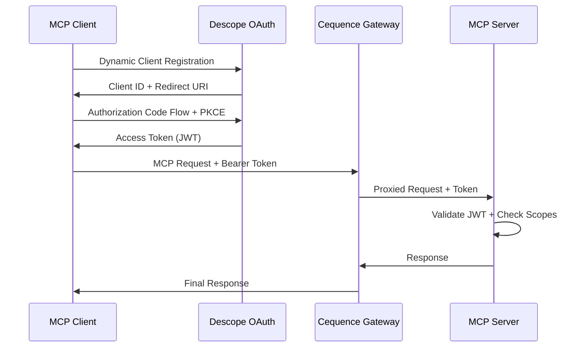

# 🔐 Descope Authentication Implementation

## 🎯 Objectives
- Implement production-grade OAuth 2.1 + PKCE authentication
- Configure Non-Human Identity for autonomous agents
- Define granular scopes for different MCP tool categories
- Integrate with FastAPI middleware for seamless authorization
- Enable enterprise-ready consent management

## 🏗️ Descope Architecture for MCP

### Authentication Flow Overview


### Non-Human Identity Setup
Non-Human Identities in Descope are specifically designed for AI agents and automated systems. They provide:
- Long-lived tokens suitable for agent operations
- Granular permission scoping
- Audit trails for all agent actions
- Integration with enterprise identity providers

## 🛠️ Descope Dashboard Configuration

### Step 1: Create Non-Human Identity
```markdown
- [ ] **Access Descope Console**
  - [ ] Log into https://app.descope.com
  - [ ] Navigate to "Access Control" → "Roles & Permissions"
  
- [ ] **Define Permission Scopes**
  - [ ] Create custom scopes for MCP operations:
    - `tools:ping` - Basic connectivity testing
    - `tools:generate` - Code generation capabilities
    - `tools:review` - Testing and quality analysis
    - `tools:fix` - Automated code correction
    - `tools:deploy` - Project deployment
    - `admin:logs` - Access system logs
    - `admin:config` - Modify configuration
  
- [ ] **Create Application in Descope**
  - [ ] Go to "Applications" → "Create Application"
  - [ ] Name: "Autonomous Software Foundry"
  - [ ] Type: "Machine to Machine" (for Non-Human Identity)
  - [ ] Enable OAuth 2.1 with PKCE
  - [ ] Configure allowed scopes from above list
  
- [ ] **Generate Non-Human Identity**
  - [ ] Navigate to "Users" → "Non-Human Identities"
  - [ ] Create new identity: "software-foundry-orchestrator"
  - [ ] Assign roles with appropriate scopes
  - [ ] Generate API credentials
```

### Step 2: OAuth Configuration
```json
{
  "client_id": "P2xxxxxxxxxxxxxxxxxxxxx",
  "client_secret": "your_client_secret_here",
  "redirect_uris": [
    "http://localhost:8000/auth/callback",
    "https://your-domain.fly.dev/auth/callback"
  ],
  "grant_types": [
    "authorization_code",
    "client_credentials",
    "refresh_token"
  ],
  "response_types": ["code"],
  "token_endpoint_auth_method": "client_secret_post",
  "scope": "tools:ping tools:generate tools:review tools:fix tools:deploy"
}
```

## 🔧 Python Implementation

### Enhanced Authentication Module
```python
# src/core/descope_auth.py
"""
Descope authentication integration for MCP server
"""
import asyncio
import json
import time
from typing import Dict, Any, List, Optional
from datetime import datetime, timedelta
import httpx
import jwt
from cryptography.hazmat.primitives import serialization
from cryptography.hazmat.primitives.asymmetric import rsa
import structlog

from src.core.config import settings

logger = structlog.get_logger()


class DescopeConfig:
    """Descope configuration constants"""
    BASE_URL = "https://api.descope.com"
    JWKS_URL = f"{BASE_URL}/v1/keys"
    TOKEN_URL = f"{BASE_URL}/v1/oauth2/token"
    USERINFO_URL = f"{BASE_URL}/v1/oauth2/userinfo"
    DCR_URL = f"{BASE_URL}/v1/oauth2/register"  # Dynamic Client Registration


class TokenValidationError(Exception):
    """Token validation specific errors"""
    pass


class ScopeValidationError(Exception):
    """Scope validation specific errors"""
    pass


class DescopeClient:
    """Enhanced Descope client with full OAuth 2.1 support"""
    
    def __init__(
        self, 
        project_id: str, 
        management_key: Optional[str] = None,
        cache_ttl: int = 3600
    ):
        self.project_id = project_id
        self.management_key = management_key
        self.cache_ttl = cache_ttl
        self._jwks_cache: Dict[str, Any] = {}
        self._jwks_cache_expiry = 0
        self.http_client = httpx.AsyncClient(timeout=30.0)
    
    async def __aenter__(self):
        return self
    
    async def __aexit__(self, exc_type, exc_val, exc_tb):
        await self.http_client.aclose()
    
    async def get_jwks(self) -> Dict[str, Any]:
        """Get JSON Web Key Set for token validation"""
        current_time = time.time()
        
        if current_time < self._jwks_cache_expiry and self._jwks_cache:
            return self._jwks_cache
        
        try:
            response = await self.http_client.get(
                f"{DescopeConfig.JWKS_URL}/{self.project_id}"
            )
            response.raise_for_status()
            
            self._jwks_cache = response.json()
            self._jwks_cache_expiry = current_time + self.cache_ttl
            
            logger.info(
                "jwks_refreshed",
                project_id=self.project_id,
                keys_count=len(self._jwks_cache.get("keys", []))
            )
            
            return self._jwks_cache
            
        except httpx.HTTPError as e:
            logger.error(
                "jwks_fetch_failed",
                project_id=self.project_id,
                error=str(e)
            )
            raise TokenValidationError(f"Failed to fetch JWKS: {str(e)}")
    
    async def validate_jwt_token(self, token: str) -> Dict[str, Any]:
        """Validate JWT token using Descope public keys"""
        try:
            # Decode header to get key ID
            unverified_header = jwt.get_unverified_header(token)
            kid = unverified_header.get("kid")
            
            if not kid:
                raise TokenValidationError("Token missing key ID")
            
            # Get public keys
            jwks = await self.get_jwks()
            
            # Find matching key
            public_key = None
            for key in jwks.get("keys", []):
                if key.get("kid") == kid:
                    public_key = jwt.algorithms.RSAAlgorithm.from_jwk(json.dumps(key))
                    break
            
            if not public_key:
                raise TokenValidationError(f"Public key not found for kid: {kid}")
            
            # Validate and decode token
            payload = jwt.decode(
                token,
                public_key,
                algorithms=["RS256"],
                audience=self.project_id,
                options={
                    "verify_exp": True,
                    "verify_aud": True,
                    "verify_iss": True,
                    "require": ["exp", "iat", "sub"]
                }
            )
            
            logger.info(
                "token_validated",
                subject=payload.get("sub"),
                scopes=payload.get("permissions", []),
                expires_at=payload.get("exp")
            )
            
            return payload
            
        except jwt.ExpiredSignatureError:
            raise TokenValidationError("Token has expired")
        except jwt.InvalidAudienceError:
            raise TokenValidationError("Invalid token audience")
        except jwt.InvalidIssuerError:
            raise TokenValidationError("Invalid token issuer")
        except jwt.InvalidTokenError as e:
            raise TokenValidationError(f"Invalid token: {str(e)}")
    
    async def create_machine_token(
        self, 
        client_id: str, 
        client_secret: str, 
        scopes: List[str]
    ) -> Dict[str, Any]:
        """Create machine-to-machine token for Non-Human Identity"""
        try:
            payload = {
                "grant_type": "client_credentials",
                "client_id": client_id,
                "client_secret": client_secret,
                "scope": " ".join(scopes)
            }
            
            response = await self.http_client.post(
                DescopeConfig.TOKEN_URL,
                data=payload,
                headers={"Content-Type": "application/x-www-form-urlencoded"}
            )
            response.raise_for_status()
            
            token_data = response.json()
            
            logger.info(
                "machine_token_created",
                client_id=client_id,
                scopes=scopes,
                expires_in=token_data.get("expires_in")
            )
            
            return token_data
            
        except httpx.HTTPError as e:
            logger.error(
                "machine_token_failed",
                client_id=client_id,
                error=str(e)
            )
            raise TokenValidationError(f"Failed to create machine token: {str(e)}")
    
    async def register_dynamic_client(
        self, 
        client_name: str, 
        redirect_uris: List[str],
        scopes: List[str]
    ) -> Dict[str, Any]:
        """Dynamic Client Registration for MCP clients"""
        if not self.management_key:
            raise ValueError("Management key required for dynamic client registration")
        
        try:
            payload = {
                "client_name": client_name,
                "redirect_uris": redirect_uris,
                "grant_types": ["authorization_code", "refresh_token"],
                "response_types": ["code"],
                "token_endpoint_auth_method": "client_secret_post",
                "scope": " ".join(scopes)
            }
            
            headers = {
                "Authorization": f"Bearer {self.management_key}",
                "Content-Type": "application/json"
            }
            
            response = await self.http_client.post(
                DescopeConfig.DCR_URL,
                json=payload,
                headers=headers
            )
            response.raise_for_status()
            
            client_data = response.json()
            
            logger.info(
                "dynamic_client_registered",
                client_id=client_data.get("client_id"),
                client_name=client_name,
                scopes=scopes
            )
            
            return client_data
            
        except httpx.HTTPError as e:
            logger.error(
                "dynamic_client_registration_failed",
                client_name=client_name,
                error=str(e)
            )
            raise TokenValidationError(f"Dynamic client registration failed: {str(e)}")


class AuthContext:
    """Enhanced authentication context with detailed claims"""
    
    def __init__(self, token_claims: Dict[str, Any]):
        self.token_claims = token_claims
        self.user_id = token_claims.get("sub", "unknown")
        self.scopes = token_claims.get("permissions", [])
        self.client_id = token_claims.get("aud", "unknown")
        self.issued_at = datetime.fromtimestamp(token_claims.get("iat", 0))
        self.expires_at = datetime.fromtimestamp(token_claims.get("exp", 0))
        self.correlation_id = token_claims.get("jti", "unknown")
        
        # Non-Human Identity specific claims
        self.is_machine = token_claims.get("type") == "machine"
        self.tenant_id = token_claims.get("tenantId")
        self.custom_claims = token_claims.get("customClaims", {})
    
    def has_scope(self, required_scope: str) -> bool:
        """Check if context has required scope"""
        return required_scope in self.scopes
    
    def has_any_scope(self, required_scopes: List[str]) -> bool:
        """Check if context has any of the required scopes"""
        return any(scope in self.scopes for scope in required_scopes)
    
    def has_all_scopes(self, required_scopes: List[str]) -> bool:
        """Check if context has all required scopes"""
        return all(scope in self.scopes for scope in required_scopes)
    
    def is_expired(self) -> bool:
        """Check if token is expired"""
        return datetime.utcnow() > self.expires_at
    
    def time_until_expiry(self) -> timedelta:
        """Get time until token expires"""
        return self.expires_at - datetime.utcnow()


# Global Descope client instance
descope_client: Optional[DescopeClient] = None


async def get_descope_client() -> DescopeClient:
    """Get singleton Descope client instance"""
    global descope_client
    
    if descope_client is None:
        descope_client = DescopeClient(
            project_id=settings.descope_project_id,
            management_key=settings.descope_management_key
        )
    
    return descope_client
```

### FastAPI Middleware Integration
```python
# src/middleware/auth_middleware.py
"""
FastAPI middleware for Descope authentication
"""
from typing import Callable, Optional
from fastapi import Request, Response, HTTPException
from fastapi.security import HTTPBearer
import structlog

from src.core.descope_auth import get_descope_client, AuthContext, TokenValidationError

logger = structlog.get_logger()
security = HTTPBearer()


class DescopeAuthMiddleware:
    """Middleware for automatic token validation and context injection"""
    
    def __init__(self, app: Callable, exclude_paths: Optional[list] = None):
        self.app = app
        self.exclude_paths = exclude_paths or ["/health", "/docs", "/openapi.json"]
    
    async def __call__(self, scope: dict, receive: Callable, send: Callable):
        if scope["type"] != "http":
            await self.app(scope, receive, send)
            return
        
        request = Request(scope, receive)
        path = request.url.path
        
        # Skip authentication for excluded paths
        if any(path.startswith(excluded) for excluded in self.exclude_paths):
            await self.app(scope, receive, send)
            return
        
        # Extract and validate token
        try:
            auth_header = request.headers.get("authorization")
            if not auth_header or not auth_header.startswith("Bearer "):
                raise HTTPException(status_code=401, detail="Missing or invalid authorization header")
            
            token = auth_header.split(" ", 1)[1]
            descope_client = await get_descope_client()
            token_claims = await descope_client.validate_jwt_token(token)
            
            # Create auth context
            auth_context = AuthContext(token_claims)
            
            # Check if token is expired
            if auth_context.is_expired():
                raise HTTPException(status_code=401, detail="Token has expired")
            
            # Add auth context to request state
            request.state.auth_context = auth_context
            
            logger.info(
                "request_authenticated",
                user_id=auth_context.user_id,
                scopes=auth_context.scopes,
                path=path,
                correlation_id=auth_context.correlation_id
            )
            
        except TokenValidationError as e:
            logger.warning(
                "authentication_failed",
                path=path,
                error=str(e)
            )
            
            response = Response(
                content=f'{{"detail": "Authentication failed: {str(e)}"}}',
                status_code=401,
                media_type="application/json"
            )
            await response(scope, receive, send)
            return
        
        except HTTPException as e:
            response = Response(
                content=f'{{"detail": "{e.detail}"}}',
                status_code=e.status_code,
                media_type="application/json"
            )
            await response(scope, receive, send)
            return
        
        await self.app(scope, receive, send)


async def get_auth_context(request: Request) -> AuthContext:
    """Dependency to get auth context from request"""
    if not hasattr(request.state, 'auth_context'):
        raise HTTPException(status_code=401, detail="Authentication required")
    
    return request.state.auth_context


def require_scopes(*required_scopes: str):
    """Dependency factory for scope-based authorization"""
    async def scope_checker(request: Request) -> AuthContext:
        auth_context = await get_auth_context(request)
        
        if not auth_context.has_all_scopes(list(required_scopes)):
            missing_scopes = set(required_scopes) - set(auth_context.scopes)
            logger.warning(
                "insufficient_scopes",
                user_id=auth_context.user_id,
                required_scopes=required_scopes,
                missing_scopes=list(missing_scopes),
                correlation_id=auth_context.correlation_id
            )
            
            raise HTTPException(
                status_code=403,
                detail=f"Insufficient permissions. Missing scopes: {', '.join(missing_scopes)}"
            )
        
        return auth_context
    
    return scope_checker
```

### Updated Tool Implementations
```python
# src/tools/authenticated_tools.py
"""
MCP tools with proper Descope authentication
"""
import uuid
from datetime import datetime
from typing import Dict, Any, List
from fastapi import APIRouter, Depends, Request
import structlog

from src.middleware.auth_middleware import get_auth_context, require_scopes
from src.core.descope_auth import AuthContext

logger = structlog.get_logger()
router = APIRouter()


@router.post("/tools/ping")
async def ping_tool(
    request: Request,
    auth: AuthContext = Depends(require_scopes("tools:ping"))
) -> Dict[str, Any]:
    """
    Enhanced ping tool with comprehensive authentication info
    
    Required scope: tools:ping
    """
    correlation_id = str(uuid.uuid4())
    
    logger.info(
        "ping_tool_called",
        user_id=auth.user_id,
        client_id=auth.client_id,
        is_machine=auth.is_machine,
        correlation_id=correlation_id,
        time_until_expiry=str(auth.time_until_expiry())
    )
    
    return {
        "message": "pong",
        "timestamp": datetime.utcnow().isoformat(),
        "correlation_id": correlation_id,
        "authentication": {
            "user_id": auth.user_id,
            "client_id": auth.client_id,
            "is_machine": auth.is_machine,
            "scopes": auth.scopes,
            "tenant_id": auth.tenant_id,
            "issued_at": auth.issued_at.isoformat(),
            "expires_at": auth.expires_at.isoformat(),
            "time_until_expiry": str(auth.time_until_expiry())
        }
    }


@router.post("/tools/generate_code")
async def generate_code_tool(
    project_description: str,
    project_type: str = "fullstack",
    auth: AuthContext = Depends(require_scopes("tools:generate"))
) -> Dict[str, Any]:
    """
    Code generation tool with proper authorization
    
    Required scope: tools:generate
    """
    correlation_id = str(uuid.uuid4())
    
    logger.info(
        "code_generation_requested",
        user_id=auth.user_id,
        project_type=project_type,
        description_length=len(project_description),
        correlation_id=correlation_id
    )
    
    # TODO: Implement actual code generation logic
    return {
        "status": "generation_started",
        "project_id": correlation_id,
        "project_type": project_type,
        "description": project_description[:100] + "..." if len(project_description) > 100 else project_description,
        "estimated_completion": "5 minutes",
        "correlation_id": correlation_id,
        "authorized_by": {
            "user_id": auth.user_id,
            "scopes": auth.scopes
        }
    }


@router.post("/tools/review_code")
async def review_code_tool(
    project_id: str,
    review_type: str = "comprehensive",
    auth: AuthContext = Depends(require_scopes("tools:review"))
) -> Dict[str, Any]:
    """
    Code review tool with authorization
    
    Required scope: tools:review
    """
    correlation_id = str(uuid.uuid4())
    
    logger.info(
        "code_review_requested",
        user_id=auth.user_id,
        project_id=project_id,
        review_type=review_type,
        correlation_id=correlation_id
    )
    
    # TODO: Implement actual code review logic
    return {
        "status": "review_started",
        "project_id": project_id,
        "review_type": review_type,
        "review_id": correlation_id,
        "estimated_completion": "2 minutes",
        "correlation_id": correlation_id,
        "authorized_by": {
            "user_id": auth.user_id,
            "scopes": auth.scopes
        }
    }


@router.post("/tools/admin/system_status")
async def system_status_tool(
    auth: AuthContext = Depends(require_scopes("admin:logs", "admin:config"))
) -> Dict[str, Any]:
    """
    Administrative tool requiring elevated permissions
    
    Required scopes: admin:logs AND admin:config
    """
    correlation_id = str(uuid.uuid4())
    
    logger.info(
        "admin_system_status_requested",
        user_id=auth.user_id,
        correlation_id=correlation_id
    )
    
    return {
        "system_status": "operational",
        "active_sessions": 42,
        "pending_generations": 3,
        "system_health": {
            "cpu_usage": "45%",
            "memory_usage": "62%",
            "disk_usage": "23%"
        },
        "correlation_id": correlation_id,
        "authorized_admin": auth.user_id
    }


@router.get("/auth/token_info")
async def token_info(
    auth: AuthContext = Depends(get_auth_context)
) -> Dict[str, Any]:
    """
    Get detailed information about the current token
    
    No specific scope required - any valid token
    """
    return {
        "token_info": {
            "user_id": auth.user_id,
            "client_id": auth.client_id,
            "is_machine": auth.is_machine,
            "tenant_id": auth.tenant_id,
            "scopes": auth.scopes,
            "issued_at": auth.issued_at.isoformat(),
            "expires_at": auth.expires_at.isoformat(),
            "time_until_expiry": str(auth.time_until_expiry()),
            "custom_claims": auth.custom_claims
        }
    }
```

## 🔄 Client Registration and Token Flow

### Dynamic Client Registration Example
```python
# scripts/register_mcp_client.py
"""
Script to register a new MCP client dynamically
"""
import asyncio
import json
from src.core.descope_auth import DescopeClient
from src.core.config import settings


async def register_mcp_client():
    """Register a new MCP client for testing"""
    async with DescopeClient(
        project_id=settings.descope_project_id,
        management_key=settings.descope_management_key
    ) as client:
        
        client_data = await client.register_dynamic_client(
            client_name="MCP Test Client",
            redirect_uris=[
                "http://localhost:8000/auth/callback",
                "https://your-domain.fly.dev/auth/callback"
            ],
            scopes=[
                "tools:ping",
                "tools:generate", 
                "tools:review",
                "tools:fix"
            ]
        )
        
        print("Client registered successfully!")
        print(json.dumps(client_data, indent=2))
        
        # Save client credentials for testing
        with open("client_credentials.json", "w") as f:
            json.dump(client_data, f, indent=2)


if __name__ == "__main__":
    asyncio.run(register_mcp_client())
```

### Machine Token Generation Example
```python
# scripts/create_machine_token.py
"""
Create machine-to-machine token for Non-Human Identity
"""
import asyncio
import json
from src.core.descope_auth import DescopeClient
from src.core.config import settings


async def create_machine_token():
    """Create machine token for testing"""
    # Load client credentials
    with open("client_credentials.json", "r") as f:
        client_data = json.load(f)
    
    async with DescopeClient(
        project_id=settings.descope_project_id
    ) as client:
        
        token_data = await client.create_machine_token(
            client_id=client_data["client_id"],
            client_secret=client_data["client_secret"],
            scopes=["tools:ping", "tools:generate"]
        )
        
        print("Machine token created!")
        print(f"Access Token: {token_data['access_token']}")
        print(f"Expires in: {token_data['expires_in']} seconds")
        
        # Test the token
        print("\nTesting token...")
        claims = await client.validate_jwt_token(token_data["access_token"])
        print(f"Token valid! Subject: {claims['sub']}")
        print(f"Scopes: {claims.get('permissions', [])}")


if __name__ == "__main__":
    asyncio.run(create_machine_token())
```

## 🧪 Testing Authentication

### Authentication Test Suite
```python
# tests/test_descope_auth.py
"""
Comprehensive tests for Descope authentication
"""
import pytest
import json
from unittest.mock import AsyncMock, patch
from datetime import datetime, timedelta

from src.core.descope_auth import DescopeClient, AuthContext, TokenValidationError


@pytest.fixture
def mock_jwt_token():
    """Mock JWT token for testing"""
    import jwt
    
    payload = {
        "sub": "test_user_123",
        "aud": "test_project_id",
        "iss": "https://api.descope.com",
        "iat": int(datetime.utcnow().timestamp()),
        "exp": int((datetime.utcnow() + timedelta(hours=1)).timestamp()),
        "jti": "test_correlation_id",
        "permissions": ["tools:ping", "tools:generate"],
        "type": "machine",
        "tenantId": "test_tenant",
        "customClaims": {"role": "software_foundry"}
    }
    
    return jwt.encode(payload, "test_secret", algorithm="HS256")


@pytest.fixture
def mock_jwks():
    """Mock JWKS response"""
    return {
        "keys": [
            {
                "kty": "RSA",
                "kid": "test_key_id",
                "use": "sig",
                "alg": "RS256",
                "n": "test_modulus",
                "e": "AQAB"
            }
        ]
    }


class TestDescopeClient:
    """Test Descope client functionality"""
    
    @pytest.mark.asyncio
    async def test_jwks_caching(self, mock_jwks):
        """Test JWKS caching mechanism"""
        client = DescopeClient("test_project")
        
        with patch.object(client.http_client, 'get') as mock_get:
            mock_response = AsyncMock()
            mock_response.json.return_value = mock_jwks
            mock_response.raise_for_status.return_value = None
            mock_get.return_value = mock_response
            
            # First call should fetch JWKS
            jwks1 = await client.get_jwks()
            assert jwks1 == mock_jwks
            mock_get.assert_called_once()
            
            # Second call should use cache
            jwks2 = await client.get_jwks()
            assert jwks2 == mock_jwks
            mock_get.assert_called_once()  # Still only one call
    
    @pytest.mark.asyncio
    async def test_dynamic_client_registration(self):
        """Test dynamic client registration"""
        client = DescopeClient("test_project", "test_management_key")
        
        expected_response = {
            "client_id": "test_client_id",
            "client_secret": "test_client_secret",
            "redirect_uris": ["http://localhost:8000/callback"]
        }
        
        with patch.object(client.http_client, 'post') as mock_post:
            mock_response = AsyncMock()
            mock_response.json.return_value = expected_response
            mock_response.raise_for_status.return_value = None
            mock_post.return_value = mock_response
            
            result = await client.register_dynamic_client(
                client_name="Test Client",
                redirect_uris=["http://localhost:8000/callback"],
                scopes=["tools:ping"]
            )
            
            assert result == expected_response
            mock_post.assert_called_once()


class TestAuthContext:
    """Test authentication context functionality"""
    
    def test_auth_context_creation(self):
        """Test AuthContext creation from token claims"""
        claims = {
            "sub": "test_user",
            "aud": "test_client",
            "iat": int(datetime.utcnow().timestamp()),
            "exp": int((datetime.utcnow() + timedelta(hours=1)).timestamp()),
            "jti": "test_correlation",
            "permissions": ["tools:ping", "tools:generate"],
            "type": "machine",
            "tenantId": "test_tenant"
        }
        
        context = AuthContext(claims)
        
        assert context.user_id == "test_user"
        assert context.client_id == "test_client"
        assert context.is_machine is True
        assert context.tenant_id == "test_tenant"
        assert "tools:ping" in context.scopes
    
    def test_scope_validation(self):
        """Test scope validation methods"""
        claims = {
            "sub": "test_user",
            "permissions": ["tools:ping", "tools:generate", "admin:logs"],
            "exp": int((datetime.utcnow() + timedelta(hours=1)).timestamp())
        }
        
        context = AuthContext(claims)
        
        # Test individual scope
        assert context.has_scope("tools:ping") is True
        assert context.has_scope("tools:deploy") is False
        
        # Test any scope
        assert context.has_any_scope(["tools:ping", "tools:deploy"]) is True
        assert context.has_any_scope(["tools:deploy", "tools:fix"]) is False
        
        # Test all scopes
        assert context.has_all_scopes(["tools:ping", "tools:generate"]) is True
        assert context.has_all_scopes(["tools:ping", "tools:deploy"]) is False
    
    def test_expiry_check(self):
        """Test token expiry validation"""
        # Expired token
        expired_claims = {
            "sub": "test_user",
            "exp": int((datetime.utcnow() - timedelta(hours=1)).timestamp())
        }
        expired_context = AuthContext(expired_claims)
        assert expired_context.is_expired() is True
        
        # Valid token
        valid_claims = {
            "sub": "test_user",
            "exp": int((datetime.utcnow() + timedelta(hours=1)).timestamp())
        }
        valid_context = AuthContext(valid_claims)
        assert valid_context.is_expired() is False


@pytest.mark.asyncio
async def test_middleware_integration(test_client, mock_jwt_token):
    """Test FastAPI middleware integration"""
    headers = {"Authorization": f"Bearer {mock_jwt_token}"}
    
    # Test authenticated request
    response = test_client.post("/mcp/v1/tools/ping", headers=headers)
    assert response.status_code == 200
    
    # Test unauthenticated request
    response = test_client.post("/mcp/v1/tools/ping")
    assert response.status_code == 401
    
    # Test invalid token
    invalid_headers = {"Authorization": "Bearer invalid_token"}
    response = test_client.post("/mcp/v1/tools/ping", headers=invalid_headers)
    assert response.status_code == 401
```

## 🚀 Production Deployment Configuration

### Environment Variables for Production
```bash
# Production .env additions
DESCOPE_PROJECT_ID=P2xxxxxxxxxxxxxxxxxxxxx
DESCOPE_MANAGEMENT_KEY=K2xxxxxxxxxxxxxxxxxxxxx

# JWT validation settings
JWT_ALGORITHM=RS256
JWT_VERIFY_EXPIRATION=true
JWT_REQUIRE_CLAIMS=exp,iat,sub,aud

# Security settings
TOKEN_CACHE_TTL=3600
MAX_TOKEN_AGE_HOURS=24
ENABLE_TOKEN_REFRESH=true
```

### Docker Configuration Updates
```dockerfile
# Add to Dockerfile
RUN pip install python-jose[cryptography] PyJWT[crypto]

# Health check with auth
HEALTHCHECK --interval=30s --timeout=10s --start-period=5s --retries=3 \
    CMD curl -f -H "Authorization: Bearer $HEALTH_CHECK_TOKEN" \
        http://localhost:8000/mcp/capabilities || exit 1
```

## ✅ Validation Checklist

```markdown
- [ ] **Descope Configuration**
  - [ ] Non-Human Identity created in Descope console
  - [ ] Custom scopes defined for all MCP tool categories
  - [ ] Machine-to-Machine application configured
  - [ ] Client credentials generated and secured

- [ ] **Authentication Implementation**
  - [ ] JWT validation using Descope public keys
  - [ ] JWKS caching implemented for performance
  - [ ] Token expiry validation working correctly
  - [ ] Scope-based authorization enforced

- [ ] **Middleware Integration**
  - [ ] FastAPI middleware intercepts all requests
  - [ ] Authentication context properly injected
  - [ ] Excluded paths (health, docs) work without auth
  - [ ] Error responses provide clear feedback

- [ ] **Tool Authorization**
  - [ ] Each tool requires appropriate scopes
  - [ ] Scope validation prevents unauthorized access
  - [ ] Admin tools require elevated permissions
  - [ ] Token information endpoint works

- [ ] **Testing Coverage**
  - [ ] Unit tests for all authentication components
  - [ ] Integration tests with real tokens
  - [ ] Error condition testing (expired, invalid tokens)
  - [ ] Scope validation testing

- [ ] **Security Validation**
  - [ ] No hardcoded secrets in code
  - [ ] JWT secrets properly validated
  - [ ] Token expiry properly enforced
  - [ ] Audit logging for all auth events
```

---

**Next Steps**: Proceed to `04-cequence-gateway.md` for Cequence AI Gateway integration and observability setup.