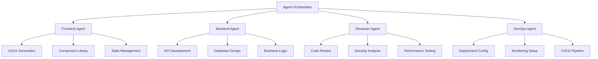

# 🤖 Multi-Agent Orchestration System

## 🎯 Objectives
- Implement specialized AI agents for different development phases
- Create intelligent task delegation and coordination system
- Build prompt engineering framework for consistent agent behavior
- Implement agent communication and state sharing protocols
- Enable autonomous workflow management with human oversight

## 🏗️ Agent Architecture Overview

### Agent Hierarchy & Specialization


### Core Agent Responsibilities
- **Frontend Agent**: React/Vue components, styling, user experience optimization
- **Backend Agent**: APIs, database models, business logic, security implementation  
- **Reviewer Agent**: Code quality, security auditing, performance analysis
- **DevOps Agent**: Deployment configuration, monitoring, infrastructure as code

## 🧠 Agent Orchestrator Implementation

### Core Orchestrator Class
```python
# src/agents/orchestrator.py
"""
Central agent orchestration system for autonomous software development
"""
import asyncio
import json
import uuid
from typing import Dict, Any, List, Optional, Union
from datetime import datetime, timedelta
from dataclasses import dataclass, asdict
from enum import Enum
import structlog

from src.agents.frontend_agent import FrontendAgent
from src.agents.backend_agent import BackendAgent
from src.agents.reviewer_agent import ReviewerAgent
from src.agents.devops_agent import DevOpsAgent
from src.core.llm_manager import LLMManager
from src.core.project_manager import ProjectManager
from src.core.file_manager import SecureFileManager
from src.middleware.cequence_analytics import CequenceAnalytics

logger = structlog.get_logger()


class TaskStatus(Enum):
    """Task execution status"""
    PENDING = "pending"
    IN_PROGRESS = "in_progress" 
    COMPLETED = "completed"
    FAILED = "failed"
    CANCELLED = "cancelled"


class AgentType(Enum):
    """Available agent types"""
    FRONTEND = "frontend"
    BACKEND = "backend"
    REVIEWER = "reviewer"
    DEVOPS = "devops"


@dataclass
class Task:
    """Individual task for agent execution"""
    id: str
    type: str
    description: str
    agent_type: AgentType
    priority: int
    dependencies: List[str]
    parameters: Dict[str, Any]
    status: TaskStatus = TaskStatus.PENDING
    assigned_agent_id: Optional[str] = None
    started_at: Optional[datetime] = None
    completed_at: Optional[datetime] = None
    result: Optional[Dict[str, Any]] = None
    error: Optional[str] = None


@dataclass
class AgentSession:
    """Active agent session"""
    agent_id: str
    agent_type: AgentType
    current_task_id: Optional[str] = None
    tasks_completed: int = 0
    tasks_failed: int = 0
    last_activity: Optional[datetime] = None
    performance_metrics: Dict[str, float] = None


class AgentOrchestrator:
    """Central orchestrator for multi-agent software development"""
    
    def __init__(self, correlation_id: Optional[str] = None):
        self.correlation_id = correlation_id or str(uuid.uuid4())
        self.project_manager = ProjectManager()
        self.file_manager = SecureFileManager()
        self.llm_manager = LLMManager()
        self.analytics = CequenceAnalytics()
        
        # Agent instances
        self.agents = {
            AgentType.FRONTEND: FrontendAgent(correlation_id=self.correlation_id),
            AgentType.BACKEND: BackendAgent(correlation_id=self.correlation_id),
            AgentType.REVIEWER: ReviewerAgent(correlation_id=self.correlation_id),
            AgentType.DEVOPS: DevOpsAgent(correlation_id=self.correlation_id)
        }
        
        # Task management
        self.tasks: Dict[str, Task] = {}
        self.task_queue: List[str] = []
        self.active_sessions: Dict[str, AgentSession] = {}
        
        # Orchestration state
        self.workflow_templates = self._initialize_workflow_templates()
        
        logger.info(
            "agent_orchestrator_initialized",
            correlation_id=self.correlation_id,
            agents_count=len(self.agents)
        )
    
    async def generate_complete_application(
        self,
        description: str,
        project_type: str = "fullstack",
        technology_stack: Optional[str] = None,
        user_context: Optional[Dict[str, Any]] = None
    ) -> Dict[str, Any]:
        """
        Generate complete application using coordinated agent workflow
        """
        start_time = datetime.utcnow()
        project_id = str(uuid.uuid4())
        
        try:
            # Log generation initiation
            await self.analytics.track_generation_started(
                project_id=project_id,
                project_type=project_type,
                description_length=len(description),
                user_context=user_context,
                correlation_id=self.correlation_id
            )
            
            # Analyze requirements and create task breakdown
            task_breakdown = await self._analyze_requirements(
                description=description,
                project_type=project_type,
                technology_stack=technology_stack
            )
            
            # Create project structure
            project_result = await self.project_manager.initialize_project(
                project_id=project_id,
                project_type=project_type,
                technology_stack=task_breakdown.get("recommended_stack"),
                user_context=user_context
            )
            
            # Generate task execution plan
            execution_plan = await self._create_execution_plan(
                task_breakdown=task_breakdown,
                project_id=project_id
            )
            
            # Execute tasks through agent coordination
            execution_result = await self._execute_coordinated_workflow(
                execution_plan=execution_plan,
                project_id=project_id
            )
            
            # Final quality review and optimization
            quality_result = await self._perform_final_quality_review(
                project_id=project_id,
                execution_result=execution_result
            )
            
            # Generate comprehensive summary
            generation_summary = await self._generate_completion_summary(
                project_id=project_id,
                task_breakdown=task_breakdown,
                execution_result=execution_result,
                quality_result=quality_result,
                start_time=start_time
            )
            
            # Track successful completion
            await self.analytics.track_generation_completed(
                project_id=project_id,
                success=True,
                metrics=generation_summary.get("metrics"),
                correlation_id=self.correlation_id
            )
            
            return generation_summary
            
        except Exception as e:
            # Track generation failure
            await self.analytics.track_generation_completed(
                project_id=project_id,
                success=False,
                error=str(e),
                correlation_id=self.correlation_id
            )
            
            logger.error(
                "application_generation_failed",
                project_id=project_id,
                error=str(e),
                correlation_id=self.correlation_id
            )
            raise
    
    async def _analyze_requirements(
        self,
        description: str,
        project_type: str,
        technology_stack: Optional[str] = None
    ) -> Dict[str, Any]:
        """
        Analyze project requirements using LLM to create detailed task breakdown
        """
        analysis_prompt = f"""
        Analyze the following project requirements and create a comprehensive technical breakdown:

        Project Description: {description}
        Project Type: {project_type}
        Preferred Technology Stack: {technology_stack or "Auto-select best fit"}

        Please provide:
        1. Recommended technology stack with justification
        2. Core features breakdown with priorities
        3. Technical architecture recommendations
        4. Database schema requirements
        5. API endpoints needed
        6. Frontend components required
        7. Security considerations
        8. Performance requirements
        9. Testing strategy
        10. Deployment considerations

        Format the response as structured JSON for programmatic processing.
        """
        
        analysis_result = await self.llm_manager.generate_completion(
            prompt=analysis_prompt,
            model="claude-3-sonnet",
            temperature=0.1,
            max_tokens=4000,
            metadata={
                "operation": "requirements_analysis",
                "correlation_id": self.correlation_id
            }
        )
        
        try:
            parsed_analysis = json.loads(analysis_result.content)
            
            logger.info(
                "requirements_analysis_completed",
                recommended_stack=parsed_analysis.get("recommended_technology_stack"),
                features_count=len(parsed_analysis.get("core_features", [])),
                correlation_id=self.correlation_id
            )
            
            return parsed_analysis
            
        except json.JSONDecodeError as e:
            logger.error(
                "requirements_analysis_parsing_failed",
                error=str(e),
                raw_response=analysis_result.content[:500],
                correlation_id=self.correlation_id
            )
            
            # Fallback to basic structure
            return {
                "recommended_technology_stack": technology_stack or "react-node-postgres",
                "core_features": [{"name": "Basic Implementation", "priority": 1}],
                "technical_architecture": "Standard 3-tier architecture",
                "error": "Failed to parse detailed analysis"
            }
    
    async def _create_execution_plan(
        self,
        task_breakdown: Dict[str, Any],
        project_id: str
    ) -> Dict[str, Any]:
        """
        Create detailed execution plan with task dependencies and agent assignments
        """
        tasks = []
        
        # Backend foundation tasks (highest priority)
        backend_tasks = [
            {
                "type": "database_schema",
                "description": "Design and implement database schema",
                "agent_type": AgentType.BACKEND,
                "priority": 1,
                "dependencies": [],
                "estimated_duration": 30
            },
            {
                "type": "api_structure",
                "description": "Create API structure and routing",
                "agent_type": AgentType.BACKEND,
                "priority": 2,
                "dependencies": ["database_schema"],
                "estimated_duration": 45
            },
            {
                "type": "authentication",
                "description": "Implement authentication system",
                "agent_type": AgentType.BACKEND,
                "priority": 2,
                "dependencies": ["database_schema"],
                "estimated_duration": 40
            },
            {
                "type": "business_logic",
                "description": "Implement core business logic",
                "agent_type": AgentType.BACKEND,
                "priority": 3,
                "dependencies": ["api_structure", "authentication"],
                "estimated_duration": 60
            }
        ]
        
        # Frontend development tasks
        frontend_tasks = [
            {
                "type": "ui_components",
                "description": "Create reusable UI components",
                "agent_type": AgentType.FRONTEND,
                "priority": 2,
                "dependencies": [],
                "estimated_duration": 35
            },
            {
                "type": "page_layouts",
                "description": "Implement main page layouts",
                "agent_type": AgentType.FRONTEND,
                "priority": 3,
                "dependencies": ["ui_components"],
                "estimated_duration": 50
            },
            {
                "type": "state_management",
                "description": "Set up state management system",
                "agent_type": AgentType.FRONTEND,
                "priority": 3,
                "dependencies": ["ui_components"],
                "estimated_duration": 30
            },
            {
                "type": "api_integration",
                "description": "Integrate with backend APIs", 
                "agent_type": AgentType.FRONTEND,
                "priority": 4,
                "dependencies": ["page_layouts", "state_management", "business_logic"],
                "estimated_duration": 40
            }
        ]
        
        # DevOps and deployment tasks
        devops_tasks = [
            {
                "type": "environment_config",
                "description": "Set up development and production environments",
                "agent_type": AgentType.DEVOPS,
                "priority": 1,
                "dependencies": [],
                "estimated_duration": 25
            },
            {
                "type": "ci_cd_pipeline",
                "description": "Configure CI/CD pipeline",
                "agent_type": AgentType.DEVOPS,
                "priority": 4,
                "dependencies": ["environment_config"],
                "estimated_duration": 35
            },
            {
                "type": "monitoring_setup",
                "description": "Set up monitoring and logging",
                "agent_type": AgentType.DEVOPS,
                "priority": 5,
                "dependencies": ["ci_cd_pipeline"],
                "estimated_duration": 30
            }
        ]
        
        # Quality assurance tasks
        qa_tasks = [
            {
                "type": "code_review",
                "description": "Comprehensive code review and optimization",
                "agent_type": AgentType.REVIEWER,
                "priority": 5,
                "dependencies": ["business_logic", "api_integration"],
                "estimated_duration": 45
            },
            {
                "type": "security_audit",
                "description": "Security vulnerability assessment",
                "agent_type": AgentType.REVIEWER,
                "priority": 5,
                "dependencies": ["authentication", "business_logic"],
                "estimated_duration": 35
            },
            {
                "type": "performance_testing",
                "description": "Performance testing and optimization",
                "agent_type": AgentType.REVIEWER,
                "priority": 6,
                "dependencies": ["code_review"],
                "estimated_duration": 40
            }
        ]
        
        # Combine all tasks
        all_tasks = backend_tasks + frontend_tasks + devops_tasks + qa_tasks
        
        # Create task objects with unique IDs
        for task_data in all_tasks:
            task_id = str(uuid.uuid4())
            task = Task(
                id=task_id,
                type=task_data["type"],
                description=task_data["description"],
                agent_type=task_data["agent_type"],
                priority=task_data["priority"],
                dependencies=task_data["dependencies"],
                parameters={
                    "project_id": project_id,
                    "estimated_duration": task_data["estimated_duration"],
                    "task_breakdown": task_breakdown
                }
            )
            tasks.append(task)
            self.tasks[task_id] = task
        
        # Calculate execution phases based on dependencies
        execution_phases = self._calculate_execution_phases(tasks)
        
        return {
            "tasks": tasks,
            "execution_phases": execution_phases,
            "estimated_total_duration": sum(task.parameters["estimated_duration"] for task in tasks),
            "parallel_execution_duration": self._calculate_parallel_duration(execution_phases)
        }
    
    async def _execute_coordinated_workflow(
        self,
        execution_plan: Dict[str, Any],
        project_id: str
    ) -> Dict[str, Any]:
        """
        Execute tasks through coordinated agent workflow with dependency management
        """
        execution_phases = execution_plan["execution_phases"]
        results = {}
        
        logger.info(
            "coordinated_workflow_started",
            project_id=project_id,
            phases_count=len(execution_phases),
            total_tasks=len(execution_plan["tasks"]),
            correlation_id=self.correlation_id
        )
        
        for phase_num, phase_tasks in execution_phases.items():
            logger.info(
                "execution_phase_started",
                phase=phase_num,
                tasks_count=len(phase_tasks),
                correlation_id=self.correlation_id
            )
            
            # Execute tasks in parallel within phase
            phase_results = await asyncio.gather(
                *[self._execute_single_task(task) for task in phase_tasks],
                return_exceptions=True
            )
            
            # Process phase results
            for i, result in enumerate(phase_results):
                task = phase_tasks[i]
                if isinstance(result, Exception):
                    logger.error(
                        "task_execution_failed",
                        task_id=task.id,
                        task_type=task.type,
                        error=str(result),
                        correlation_id=self.correlation_id
                    )
                    task.status = TaskStatus.FAILED
                    task.error = str(result)
                else:
                    logger.info(
                        "task_execution_completed",
                        task_id=task.id,
                        task_type=task.type,
                        correlation_id=self.correlation_id
                    )
                    task.status = TaskStatus.COMPLETED
                    task.result = result
                
                results[task.id] = {
                    "status": task.status.value,
                    "result": task.result,
                    "error": task.error
                }
            
            # Check if any critical tasks failed
            critical_failures = [
                task for task in phase_tasks 
                if task.status == TaskStatus.FAILED and task.priority <= 2
            ]
            
            if critical_failures:
                logger.error(
                    "critical_tasks_failed",
                    failed_tasks=[task.type for task in critical_failures],
                    correlation_id=self.correlation_id
                )
                # Attempt recovery for critical failures
                await self._attempt_task_recovery(critical_failures, project_id)
        
        return {
            "task_results": results,
            "execution_summary": {
                "total_tasks": len(execution_plan["tasks"]),
                "completed_tasks": len([r for r in results.values() if r["status"] == "completed"]),
                "failed_tasks": len([r for r in results.values() if r["status"] == "failed"]),
                "success_rate": len([r for r in results.values() if r["status"] == "completed"]) / len(results)
            }
        }
    
    async def _execute_single_task(self, task: Task) -> Dict[str, Any]:
        """
        Execute individual task through appropriate agent
        """
        task.status = TaskStatus.IN_PROGRESS
        task.started_at = datetime.utcnow()
        
        try:
            # Get appropriate agent
            agent = self.agents[task.agent_type]
            
            # Create agent session if needed
            session_id = f"{task.agent_type.value}_{task.id}"
            if session_id not in self.active_sessions:
                self.active_sessions[session_id] = AgentSession(
                    agent_id=session_id,
                    agent_type=task.agent_type,
                    performance_metrics={}
                )
            
            session = self.active_sessions[session_id]
            session.current_task_id = task.id
            session.last_activity = datetime.utcnow()
            
            # Execute task based on type and agent
            if task.agent_type == AgentType.BACKEND:
                result = await self._execute_backend_task(agent, task)
            elif task.agent_type == AgentType.FRONTEND:
                result = await self._execute_frontend_task(agent, task)
            elif task.agent_type == AgentType.REVIEWER:
                result = await self._execute_reviewer_task(agent, task)
            elif task.agent_type == AgentType.DEVOPS:
                result = await self._execute_devops_task(agent, task)
            else:
                raise ValueError(f"Unknown agent type: {task.agent_type}")
            
            # Update session metrics
            session.tasks_completed += 1
            session.current_task_id = None
            
            task.completed_at = datetime.utcnow()
            task.status = TaskStatus.COMPLETED
            task.result = result
            
            return result
            
        except Exception as e:
            task.status = TaskStatus.FAILED
            task.error = str(e)
            task.completed_at = datetime.utcnow()
            
            # Update session metrics
            if session_id in self.active_sessions:
                self.active_sessions[session_id].tasks_failed += 1
                self.active_sessions[session_id].current_task_id = None
            
            raise
    
    async def _execute_backend_task(self, agent: 'BackendAgent', task: Task) -> Dict[str, Any]:
        """Execute backend-specific tasks"""
        if task.type == "database_schema":
            return await agent.design_database_schema(
                requirements=task.parameters["task_breakdown"],
                project_id=task.parameters["project_id"]
            )
        elif task.type == "api_structure":
            return await agent.create_api_structure(
                schema_result=self._get_dependency_result(task, "database_schema"),
                project_id=task.parameters["project_id"]
            )
        elif task.type == "authentication":
            return await agent.implement_authentication(
                project_id=task.parameters["project_id"]
            )
        elif task.type == "business_logic":
            return await agent.implement_business_logic(
                api_structure=self._get_dependency_result(task, "api_structure"),
                auth_system=self._get_dependency_result(task, "authentication"),
                project_id=task.parameters["project_id"]
            )
        else:
            raise ValueError(f"Unknown backend task type: {task.type}")
    
    async def _execute_frontend_task(self, agent: 'FrontendAgent', task: Task) -> Dict[str, Any]:
        """Execute frontend-specific tasks"""
        if task.type == "ui_components":
            return await agent.create_ui_components(
                requirements=task.parameters["task_breakdown"],
                project_id=task.parameters["project_id"]
            )
        elif task.type == "page_layouts":
            return await agent.create_page_layouts(
                components=self._get_dependency_result(task, "ui_components"),
                project_id=task.parameters["project_id"]
            )
        elif task.type == "state_management":
            return await agent.setup_state_management(
                project_id=task.parameters["project_id"]
            )
        elif task.type == "api_integration":
            return await agent.integrate_apis(
                backend_apis=self._get_dependency_result(task, "business_logic"),
                frontend_structure=self._get_dependency_result(task, "page_layouts"),
                project_id=task.parameters["project_id"]
            )
        else:
            raise ValueError(f"Unknown frontend task type: {task.type}")
    
    async def _execute_reviewer_task(self, agent: 'ReviewerAgent', task: Task) -> Dict[str, Any]:
        """Execute review and quality assurance tasks"""
        if task.type == "code_review":
            return await agent.perform_comprehensive_review(
                project_id=task.parameters["project_id"],
                focus_areas=["code_quality", "maintainability", "best_practices"]
            )
        elif task.type == "security_audit":
            return await agent.perform_security_audit(
                project_id=task.parameters["project_id"]
            )
        elif task.type == "performance_testing":
            return await agent.perform_performance_testing(
                project_id=task.parameters["project_id"]
            )
        else:
            raise ValueError(f"Unknown reviewer task type: {task.type}")
    
    async def _execute_devops_task(self, agent: 'DevOpsAgent', task: Task) -> Dict[str, Any]:
        """Execute DevOps and deployment tasks"""
        if task.type == "environment_config":
            return await agent.setup_environments(
                project_id=task.parameters["project_id"]
            )
        elif task.type == "ci_cd_pipeline":
            return await agent.setup_ci_cd_pipeline(
                project_id=task.parameters["project_id"]
            )
        elif task.type == "monitoring_setup":
            return await agent.setup_monitoring(
                project_id=task.parameters["project_id"]
            )
        else:
            raise ValueError(f"Unknown devops task type: {task.type}")
    
    def _get_dependency_result(self, task: Task, dependency_type: str) -> Optional[Dict[str, Any]]:
        """Get result from dependency task"""
        for dependency_id in task.dependencies:
            if dependency_id in self.tasks:
                dependency_task = self.tasks[dependency_id]
                if dependency_task.type == dependency_type and dependency_task.result:
                    return dependency_task.result
        return None
    
    def _calculate_execution_phases(self, tasks: List[Task]) -> Dict[int, List[Task]]:
        """Calculate task execution phases based on dependencies and priorities"""
        phases = {}
        task_lookup = {task.id: task for task in tasks}
        
        # Sort tasks by priority first
        sorted_tasks = sorted(tasks, key=lambda t: (t.priority, t.type))
        
        # Assign tasks to phases based on dependencies
        for task in sorted_tasks:
            min_phase = 1
            
            # Check dependency phases
            for dep_id in task.dependencies:
                dep_task = task_lookup.get(dep_id)
                if dep_task:
                    # Find which phase the dependency is in
                    for phase_num, phase_tasks in phases.items():
                        if dep_task in phase_tasks:
                            min_phase = max(min_phase, phase_num + 1)
                            break
            
            # Assign to calculated phase
            if min_phase not in phases:
                phases[min_phase] = []
            phases[min_phase].append(task)
        
        return phases
    
    def _calculate_parallel_duration(self, execution_phases: Dict[int, List[Task]]) -> int:
        """Calculate total duration with parallel execution"""
        total_duration = 0
        
        for phase_tasks in execution_phases.values():
            # Phase duration is the maximum task duration in the phase
            phase_duration = max(
                task.parameters.get("estimated_duration", 30) 
                for task in phase_tasks
            )
            total_duration += phase_duration
        
        return total_duration
    
    def _initialize_workflow_templates(self) -> Dict[str, Any]:
        """Initialize workflow templates for different project types"""
        return {
            "fullstack": {
                "phases": ["foundation", "backend", "frontend", "integration", "quality"],
                "critical_tasks": ["database_schema", "authentication", "api_structure"]
            },
            "frontend": {
                "phases": ["setup", "components", "pages", "integration", "optimization"],
                "critical_tasks": ["ui_components", "state_management"]
            },
            "backend": {
                "phases": ["architecture", "database", "apis", "business_logic", "security"],
                "critical_tasks": ["database_schema", "api_structure", "authentication"]
            },
            "api": {
                "phases": ["design", "implementation", "documentation", "testing"],
                "critical_tasks": ["api_structure", "authentication", "business_logic"]
            }
        }
```

### Agent Base Class
```python
# src/agents/base_agent.py
"""
Base agent class with common functionality
"""
import asyncio
import uuid
from abc import ABC, abstractmethod
from typing import Dict, Any, List, Optional
from datetime import datetime
import structlog

from src.core.llm_manager import LLMManager
from src.core.file_manager import SecureFileManager
from src.middleware.cequence_analytics import CequenceAnalytics

logger = structlog.get_logger()


class BaseAgent(ABC):
    """Base class for all specialized agents"""
    
    def __init__(self, agent_type: str, correlation_id: Optional[str] = None):
        self.agent_type = agent_type
        self.correlation_id = correlation_id or str(uuid.uuid4())
        self.llm_manager = LLMManager()
        self.file_manager = SecureFileManager()
        self.analytics = CequenceAnalytics()
        
        # Agent-specific configuration
        self.model_preferences = self._get_model_preferences()
        self.prompt_templates = self._initialize_prompt_templates()
        
        logger.info(
            "agent_initialized",
            agent_type=agent_type,
            correlation_id=self.correlation_id
        )
    
    @abstractmethod
    def _get_model_preferences(self) -> Dict[str, str]:
        """Get LLM model preferences for this agent type"""
        pass
    
    @abstractmethod
    def _initialize_prompt_templates(self) -> Dict[str, str]:
        """Initialize agent-specific prompt templates"""
        pass
    
    async def generate_code(
        self,
        prompt: str,
        context: Dict[str, Any],
        code_type: str = "implementation",
        temperature: float = 0.1
    ) -> Dict[str, Any]:
        """
        Generate code using LLM with agent-specific optimizations
        """
        # Select optimal model for code generation
        model = self.model_preferences.get("code_generation", "claude-3-sonnet")
        
        # Enhance prompt with agent-specific context
        enhanced_prompt = self._enhance_prompt_with_context(prompt, context, code_type)
        
        # Track generation start
        generation_start = datetime.utcnow()
        
        try:
            result = await self.llm_manager.generate_completion(
                prompt=enhanced_prompt,
                model=model,
                temperature=temperature,
                max_tokens=8000,
                metadata={
                    "agent_type": self.agent_type,
                    "code_type": code_type,
                    "correlation_id": self.correlation_id
                }
            )
            
            # Parse and validate generated code
            parsed_result = await self._parse_and_validate_code(result.content, code_type)
            
            # Track successful generation
            generation_duration = (datetime.utcnow() - generation_start).total_seconds()
            await self.analytics.track_code_generation(
                agent_type=self.agent_type,
                code_type=code_type,
                success=True,
                duration_seconds=generation_duration,
                tokens_used=result.usage.total_tokens if result.usage else 0,
                correlation_id=self.correlation_id
            )
            
            return parsed_result
            
        except Exception as e:
            # Track failed generation
            generation_duration = (datetime.utcnow() - generation_start).total_seconds()
            await self.analytics.track_code_generation(
                agent_type=self.agent_type,
                code_type=code_type,
                success=False,
                duration_seconds=generation_duration,
                error=str(e),
                correlation_id=self.correlation_id
            )
            
            logger.error(
                "code_generation_failed",
                agent_type=self.agent_type,
                code_type=code_type,
                error=str(e),
                correlation_id=self.correlation_id
            )
            raise
    
    async def _parse_and_validate_code(
        self,
        generated_content: str,
        code_type: str
    ) -> Dict[str, Any]:
        """
        Parse and validate generated code
        """
        try:
            # Try to extract code blocks from markdown
            import re
            
            code_blocks = re.findall(r'```(\w+)?\n(.*?)\n```', generated_content, re.DOTALL)
            
            if code_blocks:
                parsed_code = {}
                for language, code in code_blocks:
                    language = language or "text"
                    parsed_code[language] = code.strip()
                
                return {
                    "success": True,
                    "code_blocks": parsed_code,
                    "full_content": generated_content,
                    "validation_status": "parsed"
                }
            else:
                # No code blocks found, return as plain text
                return {
                    "success": True,
                    "plain_content": generated_content,
                    "validation_status": "no_code_blocks"
                }
                
        except Exception as e:
            logger.warning(
                "code_parsing_failed",
                error=str(e),
                correlation_id=self.correlation_id
            )
            
            return {
                "success": False,
                "error": str(e),
                "raw_content": generated_content
            }
    
    def _enhance_prompt_with_context(
        self,
        prompt: str,
        context: Dict[str, Any],
        code_type: str
    ) -> str:
        """
        Enhance prompt with agent-specific context and best practices
        """
        # Get base template for code type
        template = self.prompt_templates.get(code_type, self.prompt_templates.get("default", ""))
        
        # Build context section
        context_section = self._build_context_section(context)
        
        # Combine template, context, and prompt
        enhanced_prompt = f"""
{template}

CONTEXT:
{context_section}

SPECIFIC REQUEST:
{prompt}

RESPONSE REQUIREMENTS:
- Provide complete, production-ready code
- Include comprehensive error handling
- Add detailed comments explaining key logic
- Follow industry best practices and patterns
- Ensure code is secure and performant
- Include necessary imports and dependencies
- Format code properly with markdown code blocks
"""
        
        return enhanced_prompt
    
    def _build_context_section(self, context: Dict[str, Any]) -> str:
        """Build context section for prompt enhancement"""
        context_lines = []
        
        if context.get("project_type"):
            context_lines.append(f"Project Type: {context['project_type']}")
        
        if context.get("technology_stack"):
            context_lines.append(f"Technology Stack: {context['technology_stack']}")
        
        if context.get("existing_code"):
            context_lines.append(f"Existing Code Context: {context['existing_code'][:500]}...")
        
        if context.get("requirements"):
            context_lines.append(f"Requirements: {context['requirements']}")
        
        if context.get("constraints"):
            context_lines.append(f"Constraints: {context['constraints']}")
        
        return "\n".join(context_lines) if context_lines else "No additional context provided"
    
    async def save_generated_files(
        self,
        project_id: str,
        generated_code: Dict[str, Any],
        file_mappings: Dict[str, str]
    ) -> Dict[str, Any]:
        """
        Save generated code to appropriate project files
        """
        saved_files = []
        
        try:
            for file_type, file_path in file_mappings.items():
                if file_type in generated_code.get("code_blocks", {}):
                    code_content = generated_code["code_blocks"][file_type]
                    
                    await self.file_manager.write_project_file(
                        project_id=project_id,
                        file_path=file_path,
                        content=code_content,
                        created_by=self.agent_type
                    )
                    
                    saved_files.append({
                        "file_path": file_path,
                        "file_type": file_type,
                        "size_bytes": len(code_content.encode('utf-8'))
                    })
            
            logger.info(
                "files_saved_successfully",
                agent_type=self.agent_type,
                project_id=project_id,
                files_count=len(saved_files),
                correlation_id=self.correlation_id
            )
            
            return {
                "success": True,
                "saved_files": saved_files,
                "total_files": len(saved_files)
            }
            
        except Exception as e:
            logger.error(
                "file_saving_failed",
                agent_type=self.agent_type,
                project_id=project_id,
                error=str(e),
                correlation_id=self.correlation_id
            )
            raise
```

## ✅ Validation Checklist

```markdown
- [ ] **Agent Orchestrator**
  - [ ] Multi-agent coordination working correctly
  - [ ] Task dependency resolution functional
  - [ ] Parallel execution within phases working
  - [ ] Error handling and recovery mechanisms
  - [ ] Performance tracking and analytics

- [ ] **Task Management**
  - [ ] Task creation and assignment working
  - [ ] Dependency tracking accurate
  - [ ] Status updates propagating correctly
  - [ ] Phase-based execution ordering
  - [ ] Critical task failure detection

- [ ] **Agent Communication**
  - [ ] Inter-agent data sharing working
  - [ ] Session management functional
  - [ ] Result caching and retrieval
  - [ ] Agent performance monitoring
  - [ ] Resource conflict resolution

- [ ] **Base Agent Functionality**
  - [ ] Code generation with LLM integration
  - [ ] Prompt template system working
  - [ ] Context enhancement functional
  - [ ] Code parsing and validation
  - [ ] File saving and management

- [ ] **Workflow Templates**
  - [ ] Project type-specific workflows
  - [ ] Critical task identification
  - [ ] Phase progression logic
  - [ ] Customizable execution plans
  - [ ] Recovery and retry mechanisms
```

---

**Next Steps**: Proceed to `07-self-healing-loop.md` for the core innovation - autonomous error detection, analysis, and correction system.