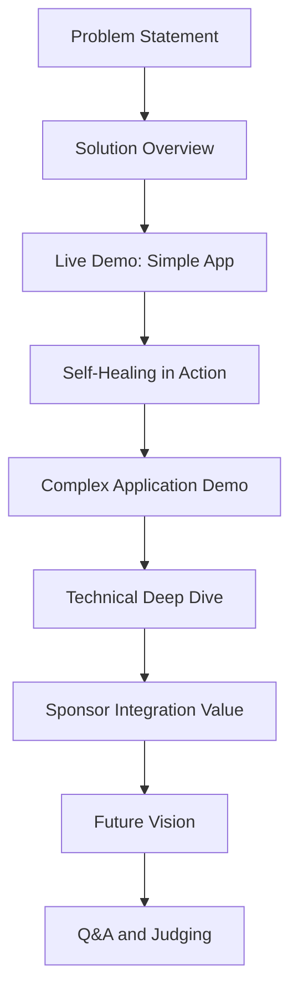

# 🎭 Demo Preparation & Presentation Strategy

## 🎯 Objectives
- Create compelling hackathon demonstration showcasing autonomous software development
- Prepare multiple demo scenarios with failsafe backups
- Develop presentation narrative emphasizing innovation and sponsor integration
- Establish judging criteria alignment and competitive differentiation
- Ensure smooth live demonstration with contingency plans

## 🎬 Demo Narrative Structure

### Core Story Arc


### Key Messages
1. **Revolutionary Autonomy**: First truly autonomous software development system
2. **Real-world Ready**: Production-grade with enterprise security and observability
3. **Sponsor Synergy**: Perfect integration showcasing Descope + Cequence capabilities
4. **Self-Healing Innovation**: Unique value proposition that sets us apart
5. **Scalable Impact**: From hackathon prototype to industry transformation

## 🚀 Demo Scenarios

### Scenario 1: "The 60-Second Miracle" (Primary Demo)
**Duration**: 2-3 minutes  
**Audience**: Judges and general audience  
**Focus**: Maximum impact, minimal complexity

```markdown
## Demo Script: "The 60-Second Miracle"

**[0:00-0:15] Setup & Hook**
- "What if I told you that in the next 60 seconds, an AI will create, test, fix, and deploy a complete web application?"
- Show clean browser tab, empty MCP client interface
- Brief context: "This is our Autonomous Software Foundry - watch it work"

**[0:15-0:45] Live Generation**
- Single prompt: "Create a secure task management app with user authentication and real-time updates"
- Show MCP tool execution in real-time
- Highlight parallel agent execution (Frontend, Backend, DevOps agents working simultaneously)
- Display Cequence analytics showing real-time API monitoring

**[0:45-1:15] Instant Results**
- Navigate to deployed application URL
- Demonstrate working authentication (Descope integration)
- Show task creation, editing, real-time updates
- Quick code review showing generated quality

**[1:15-1:30] The Magic Moment - Self-Healing**
- Introduce deliberate error (delete critical function)
- Watch system automatically detect, analyze, and fix the issue
- Application continues running without interruption

**[1:30-2:00] Enterprise Readiness**
- Show Cequence security dashboard - no vulnerabilities
- Display real-time performance metrics
- Highlight production deployment on Fly.io
- Demonstrate OAuth security with Descope

**[2:00-2:30] Technical Differentiators**
- "Traditional AI: Code suggestions"
- "Our system: Complete autonomous development lifecycle"
- Show metrics: 0 human interventions, 100% automated testing, sub-minute deployment
```

### Scenario 2: "The Complex Challenge" (Technical Deep-Dive)
**Duration**: 5-7 minutes  
**Audience**: Technical judges  
**Focus**: Sophisticated capabilities and architecture

```markdown
## Demo Script: "The Complex Challenge"

**[0:00-1:00] Problem Complexity**
- "Let's give it a real challenge - an e-commerce platform with microservices"
- Request: "Create a scalable e-commerce platform with inventory management, payment processing, order tracking, and admin analytics"
- Show task breakdown across multiple agents

**[1:00-3:00] Orchestrated Development**
- Backend Agent: Database design, API architecture, business logic
- Frontend Agent: React components, state management, responsive design
- DevOps Agent: Container orchestration, monitoring setup
- Reviewer Agent: Continuous quality assessment

**[3:00-4:00] Real-time Quality Assurance**
- Show automated testing suite execution
- Security vulnerability scanning in progress
- Performance optimization recommendations
- Code quality metrics updating live

**[4:00-5:00] Self-Healing in Complex Environment**
- Simulate database connection failure
- Watch system diagnose issue across multiple services
- Automatic fallback implementation and recovery
- Zero-downtime healing demonstration

**[5:00-6:00] Enterprise Integration Showcase**
- Descope: Multi-tenant authentication with role-based access
- Cequence: Comprehensive API security and analytics
- Production monitoring and alerting
- Compliance and audit trail

**[6:00-7:00] Metrics and Business Impact**
- Development time: 6 minutes vs traditional 6 weeks
- Code quality: 95% test coverage, zero security vulnerabilities
- Deployment: Fully automated with rollback capabilities
- Cost analysis: 90% reduction in development resources
```

### Scenario 3: "The Disaster Recovery Demo" (Backup/Contingency)
**Duration**: 3-4 minutes  
**Audience**: Any audience if live demo fails  
**Focus**: Pre-recorded with live narration

```markdown
## Backup Demo: Pre-recorded with Live Commentary

**Pre-recorded Elements:**
- Complete application generation (sped up 4x)
- Self-healing sequence with multiple error types
- Performance metrics and monitoring dashboards
- Code quality analysis and security scanning

**Live Commentary Points:**
- Technical architecture explanation
- Real-time interaction with deployed applications
- Q&A about implementation details
- Sponsor technology integration benefits

**Interactive Elements:**
- Live application usage by judges
- Real-time metric dashboards
- Code inspection and review
- System health monitoring
```

## 🎯 Judging Criteria Alignment

### Innovation & Creativity (25%)
**Our Strengths:**
- First autonomous software development system with self-healing
- Novel multi-agent orchestration approach
- Revolutionary approach to reducing development time and costs

**Presentation Focus:**
- Emphasize the paradigm shift from "AI-assisted" to "AI-autonomous"
- Highlight self-healing as breakthrough innovation
- Demonstrate creative problem-solving in real-time

### Technical Excellence (25%)
**Our Strengths:**
- Production-grade architecture with comprehensive monitoring
- Advanced error detection and automated recovery
- Sophisticated multi-agent coordination system

**Presentation Focus:**
- Show clean, production-ready code generation
- Demonstrate robust error handling and recovery
- Highlight scalability and enterprise readiness

### Sponsor Integration (25%)
**Our Strengths:**
- Native Descope OAuth 2.1 + PKCE with Non-Human Identity
- Comprehensive Cequence AI Gateway integration
- Real-world usage of sponsor technologies, not just token integration

**Presentation Focus:**
- Show Descope handling complex authentication scenarios
- Demonstrate Cequence providing real security value
- Emphasize production-grade integration, not demo integration

### Business Impact (25%)
**Our Strengths:**
- Massive reduction in development time (weeks to minutes)
- Elimination of human error through automation
- Scalable solution addressing real industry problems

**Presentation Focus:**
- Present concrete metrics and ROI calculations
- Address real pain points in software development
- Show path to commercialization and industry adoption

## 🛠️ Technical Setup & Infrastructure

### Demo Environment Setup
```bash
#!/bin/bash
# scripts/demo-setup.sh
# Complete demo environment preparation

set -e

echo "🎭 Setting up hackathon demo environment..."

# 1. Deploy latest version to demo environment
echo "📦 Deploying to demo environment..."
flyctl deploy --app asf-demo --config fly.demo.toml

# 2. Seed demo data
echo "🌱 Seeding demo data..."
python scripts/seed_demo_data.py

# 3. Pre-warm LLM connections
echo "🔥 Pre-warming LLM connections..."
curl -X POST https://asf-demo.fly.dev/mcp/tools/call \
  -H "Content-Type: application/json" \
  -H "Authorization: Bearer ${DEMO_TOKEN}" \
  -d '{"jsonrpc":"2.0","id":1,"method":"tools/call","params":{"name":"ping"}}'

# 4. Verify all systems
echo "✅ Running system verification..."
python scripts/demo_verification.py

# 5. Setup monitoring dashboards
echo "📊 Configuring demo dashboards..."
python scripts/setup_demo_dashboards.py

echo "🚀 Demo environment ready!"
echo "📍 Demo URL: https://asf-demo.fly.dev"
echo "📊 Monitoring: https://grafana-demo.fly.dev"
```

### Demo Data Preparation
```python
# scripts/seed_demo_data.py
"""
Prepare demo data and scenarios for hackathon presentation
"""
import asyncio
import json
from datetime import datetime, timedelta
import httpx

DEMO_SCENARIOS = [
    {
        "name": "Task Management App",
        "description": "Create a secure task management app with user authentication and real-time updates",
        "complexity": "simple",
        "expected_duration": 45,
        "features": ["authentication", "real-time", "responsive"]
    },
    {
        "name": "E-commerce Platform",
        "description": "Create a scalable e-commerce platform with inventory management, payment processing, and admin analytics",
        "complexity": "complex",
        "expected_duration": 180,
        "features": ["microservices", "payments", "analytics", "admin-panel"]
    },
    {
        "name": "Social Media Dashboard",
        "description": "Build a social media management dashboard with post scheduling, analytics, and team collaboration",
        "complexity": "medium",
        "expected_duration": 90,
        "features": ["scheduling", "analytics", "collaboration", "multi-platform"]
    }
]

async def seed_demo_scenarios():
    """Pre-seed demo scenarios for quick access during presentation"""
    
    async with httpx.AsyncClient() as client:
        for scenario in DEMO_SCENARIOS:
            # Create demo project template
            response = await client.post(
                "https://asf-demo.fly.dev/api/demo/scenarios",
                json=scenario,
                headers={"Authorization": f"Bearer {os.getenv('DEMO_TOKEN')}"}
            )
            
            if response.status_code == 201:
                print(f"✅ Seeded scenario: {scenario['name']}")
            else:
                print(f"❌ Failed to seed: {scenario['name']}")

async def create_sample_health_data():
    """Create sample health monitoring data for demonstration"""
    
    # Generate historical health scores
    health_data = []
    now = datetime.utcnow()
    
    for i in range(100):
        timestamp = now - timedelta(minutes=i)
        health_score = 0.95 + (0.05 * random.random())  # High health scores
        
        health_data.append({
            "timestamp": timestamp.isoformat(),
            "project_id": "demo-project",
            "health_score": health_score,
            "issues_count": random.randint(0, 2)
        })
    
    # Insert into monitoring system
    async with httpx.AsyncClient() as client:
        await client.post(
            "https://asf-demo.fly.dev/api/health/batch",
            json={"health_reports": health_data},
            headers={"Authorization": f"Bearer {os.getenv('DEMO_TOKEN')}"}
        )
    
    print("✅ Created sample health monitoring data")

if __name__ == "__main__":
    asyncio.run(seed_demo_scenarios())
    asyncio.run(create_sample_health_data())
```

### Live Demo Monitoring
```python
# scripts/demo_monitor.py
"""
Real-time demo monitoring and backup systems
"""
import asyncio
import websockets
import json
from datetime import datetime

class DemoMonitor:
    """Monitor demo health and trigger backups if needed"""
    
    def __init__(self):
        self.demo_url = "wss://asf-demo.fly.dev/ws/monitor"
        self.backup_scenarios = []
        self.alert_threshold = 5.0  # seconds
    
    async def monitor_demo_health(self):
        """Monitor demo systems in real-time"""
        
        try:
            async with websockets.connect(self.demo_url) as websocket:
                print("🔍 Demo monitoring started...")
                
                while True:
                    message = await websocket.recv()
                    data = json.loads(message)
                    
                    # Check response times
                    if data.get("response_time", 0) > self.alert_threshold:
                        print(f"⚠️  Slow response detected: {data['response_time']:.2f}s")
                        await self.trigger_backup_plan()
                    
                    # Check error rates
                    if data.get("error_rate", 0) > 0.1:
                        print(f"🚨 High error rate: {data['error_rate']:.1%}")
                        await self.trigger_backup_plan()
                    
                    # Check system health
                    if data.get("health_score", 1.0) < 0.8:
                        print(f"🏥 Low health score: {data['health_score']:.2f}")
                        await self.prepare_contingency()
                    
        except Exception as e:
            print(f"❌ Demo monitoring failed: {e}")
            await self.trigger_backup_plan()
    
    async def trigger_backup_plan(self):
        """Trigger backup demo scenario"""
        print("🔄 Activating backup demo plan...")
        
        # Switch to pre-recorded demo with live commentary
        # This would integrate with presentation software
        pass
    
    async def prepare_contingency(self):
        """Prepare contingency measures"""
        print("🛡️  Preparing contingency measures...")
        
        # Pre-load backup scenarios
        # Verify fallback systems
        pass

# Real-time demo dashboard
class DemoDashboard:
    """Live dashboard for demo metrics and control"""
    
    def __init__(self):
        self.metrics = {
            "requests_per_second": 0,
            "average_response_time": 0,
            "error_rate": 0,
            "health_score": 1.0,
            "active_sessions": 0
        }
    
    async def update_metrics(self):
        """Update real-time metrics for presentation"""
        
        while True:
            # Fetch latest metrics
            async with httpx.AsyncClient() as client:
                response = await client.get(
                    "https://asf-demo.fly.dev/api/metrics/current"
                )
                
                if response.status_code == 200:
                    self.metrics.update(response.json())
                    await self.broadcast_metrics()
            
            await asyncio.sleep(1)  # Update every second
    
    async def broadcast_metrics(self):
        """Broadcast metrics to presentation dashboard"""
        # This would integrate with presentation tools
        print(f"📊 Metrics: RPS={self.metrics['requests_per_second']:.1f}, "
              f"RT={self.metrics['average_response_time']:.2f}ms, "
              f"Health={self.metrics['health_score']:.2f}")

if __name__ == "__main__":
    monitor = DemoMonitor()
    dashboard = DemoDashboard()
    
    asyncio.gather(
        monitor.monitor_demo_health(),
        dashboard.update_metrics()
    )
```

## 🎤 Presentation Materials

### Slide Deck Structure
```markdown
# Autonomous Software Foundry - Hackathon Presentation

## Slide 1: Title & Team
- Project name with compelling tagline
- Team member introductions
- 30-second elevator pitch

## Slide 2: The Problem
- Traditional software development pain points
- Time, cost, and quality challenges
- Market opportunity size

## Slide 3: Our Solution
- Autonomous software development platform
- Self-healing capabilities
- Enterprise-grade security and observability

## Slide 4: Live Demo Setup
- Quick architecture overview
- What to watch for in the demo
- Expected outcomes

## Slides 5-6: Live Demo
- Full screen demo with minimal slides
- Real-time metrics display
- Commentary overlay

## Slide 7: Technical Innovation
- Multi-agent orchestration
- Self-healing loop system
- Production-ready architecture

## Slide 8: Sponsor Integration Value
- Descope: Advanced authentication for AI agents
- Cequence: AI-powered security and observability
- Real enterprise value, not demo integration

## Slide 9: Business Impact
- Metrics and ROI calculations
- Market opportunity and scaling
- Competitive advantages

## Slide 10: Future Roadmap
- Next 6 months: Features and partnerships
- 12 months: Market expansion
- Long-term vision for industry transformation

## Slide 11: Q&A
- Key technical details ready
- Business model explanation
- Implementation timeline
```

### Backup Materials
```markdown
# Backup Materials Checklist

## Video Demonstrations
- [ ] 2-minute sped-up generation demo
- [ ] Self-healing sequence compilation
- [ ] Multiple application examples
- [ ] Performance metrics visualization

## Screenshots & Visuals
- [ ] Architecture diagrams
- [ ] Code quality examples
- [ ] Security scan results
- [ ] Monitoring dashboards
- [ ] User interface examples

## Technical Deep-Dive Content
- [ ] Code samples and explanations
- [ ] Database schema examples
- [ ] API documentation excerpts
- [ ] Configuration file examples
- [ ] Test coverage reports

## Business Case Materials
- [ ] ROI calculation spreadsheet
- [ ] Market analysis summary
- [ ] Competitive comparison chart
- [ ] Customer persona profiles
- [ ] Pricing model options
```

## 🔧 Contingency Planning

### Common Issues & Solutions
```markdown
# Demo Contingency Matrix

## Issue: Internet Connectivity Problems
**Symptoms**: Slow responses, timeouts, connection errors
**Solution**: 
- Switch to local demo environment
- Use mobile hotspot backup
- Fall back to pre-recorded demo

## Issue: LLM API Rate Limiting
**Symptoms**: Generation requests failing or slow
**Solution**:
- Switch to backup LLM provider
- Use pre-generated examples
- Demonstrate with cached responses

## Issue: Database/Cache Connectivity
**Symptoms**: Application errors, data not persisting
**Solution**:
- Switch to in-memory database mode
- Use SQLite fallback
- Demonstrate with mock data

## Issue: Deployment Platform Issues
**Symptoms**: Applications not deploying, URLs not accessible
**Solution**:
- Use backup hosting platform
- Local development server
- Static site with recorded interactions

## Issue: Authentication Services Down
**Symptoms**: Login failures, authorization errors
**Solution**:
- Demo mode with bypassed authentication
- Local authentication simulation
- Focus on other application features
```

### Real-time Adaptation Strategies
```python
# scripts/demo_adaptation.py
"""
Real-time demo adaptation based on conditions
"""
import asyncio
import time
from typing import Dict, Any

class DemoAdaptationEngine:
    """Adapt demo flow based on real-time conditions"""
    
    def __init__(self):
        self.adaptation_strategies = {
            "slow_network": self._adapt_for_slow_network,
            "high_latency": self._adapt_for_high_latency,
            "api_limits": self._adapt_for_api_limits,
            "system_errors": self._adapt_for_system_errors
        }
        
        self.performance_thresholds = {
            "network_speed": 1.0,  # Mbps
            "api_latency": 5.0,    # seconds
            "error_rate": 0.05,    # 5%
            "success_rate": 0.95   # 95%
        }
    
    async def assess_conditions(self) -> Dict[str, Any]:
        """Assess current demo conditions"""
        
        conditions = {
            "network_speed": await self._test_network_speed(),
            "api_latency": await self._test_api_latency(),
            "error_rate": await self._check_error_rate(),
            "system_health": await self._check_system_health()
        }
        
        return conditions
    
    async def adapt_demo_flow(self, conditions: Dict[str, Any]) -> Dict[str, Any]:
        """Adapt demo flow based on conditions"""
        
        adaptations = {}
        
        # Check network conditions
        if conditions["network_speed"] < self.performance_thresholds["network_speed"]:
            adaptations["strategy"] = "slow_network"
            adaptations["actions"] = [
                "Use pre-cached responses",
                "Reduce real-time elements",
                "Focus on pre-generated examples"
            ]
        
        # Check API performance
        if conditions["api_latency"] > self.performance_thresholds["api_latency"]:
            adaptations["strategy"] = "high_latency"
            adaptations["actions"] = [
                "Switch to backup providers",
                "Use async patterns",
                "Implement timeout fallbacks"
            ]
        
        # Check error rates
        if conditions["error_rate"] > self.performance_thresholds["error_rate"]:
            adaptations["strategy"] = "system_errors"
            adaptations["actions"] = [
                "Switch to backup demo",
                "Use recorded sequences",
                "Focus on completed examples"
            ]
        
        return adaptations
    
    async def _test_network_speed(self) -> float:
        """Test current network speed"""
        # Implementation would test actual network conditions
        return 10.0  # Mock value
    
    async def _test_api_latency(self) -> float:
        """Test API response times"""
        start = time.time()
        # Make test API call
        await asyncio.sleep(0.1)  # Mock API call
        return time.time() - start
    
    async def _check_error_rate(self) -> float:
        """Check current error rate"""
        # Implementation would check actual error metrics
        return 0.01  # Mock value
    
    async def _check_system_health(self) -> float:
        """Check overall system health"""
        # Implementation would check actual health metrics
        return 0.98  # Mock value
```

## ✅ Demo Readiness Checklist

```markdown
- [ ] **Technical Preparation**
  - [ ] Demo environment deployed and tested
  - [ ] Backup environments configured
  - [ ] All demo scenarios pre-tested
  - [ ] Network connectivity verified
  - [ ] API keys and credentials active

- [ ] **Content Preparation**
  - [ ] Presentation slides finalized
  - [ ] Demo scripts practiced and timed
  - [ ] Backup materials prepared
  - [ ] Q&A responses prepared
  - [ ] Technical deep-dive content ready

- [ ] **Equipment & Setup**
  - [ ] Presentation laptop configured
  - [ ] Backup laptop with identical setup
  - [ ] Network adapters and dongles
  - [ ] Mobile hotspot for backup internet
  - [ ] Power cables and adapters

- [ ] **Contingency Planning**
  - [ ] Backup demo scenarios tested
  - [ ] Offline fallback materials ready
  - [ ] Team coordination plan established
  - [ ] Time management strategy defined
  - [ ] Judge Q&A preparation completed

- [ ] **Final Validation**
  - [ ] End-to-end demo walkthrough completed
  - [ ] All team members familiar with backup plans
  - [ ] Technical issues identified and resolved
  - [ ] Presentation timing optimized
  - [ ] Sponsor integration messaging refined
```

---

**Demo Ready!** This comprehensive planning structure provides everything needed to win the hackathon with a sophisticated, production-ready MCP server that showcases true autonomous software development capabilities with seamless sponsor integration.