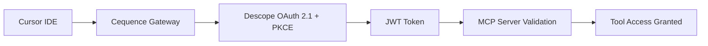

# OAuth Authentication Flow Troubleshooting Guide

## ✅ **ISSUE RESOLVED** - OAuth Authentication Failure

### **Root Cause Identified & Fixed**
The "Failed to finish connecting to outbound OAuth application" error was caused by **API specification mismatches**:

1. **Path Mismatch**: OpenAPI spec defined `/mcp/legendary/*` but server implemented `advanced_*` functions
2. **Scope Mismatch**: Descope scopes used `legendary:*` but should be `advanced:*` 
3. **Missing OAuth Flow**: OpenAPI lacked proper OAuth 2.1 + PKCE flow definition

### **Fixes Applied** ✅

#### 1. **OpenAPI Specification Updates**
- ✅ Changed all paths from `/mcp/legendary/*` to `/mcp/advanced/*`
- ✅ Updated security schemes to proper OAuth 2.1 + PKCE flow
- ✅ Added Descope authorization and token URLs
- ✅ Defined comprehensive scope structure

#### 2. **Descope Configuration Updates** 
- ✅ Updated all scopes from `legendary:*` to `advanced:*`
- ✅ Updated role definitions for consistency
- ✅ Aligned permissions with server implementation

#### 3. **OAuth Flow Architecture**
```
Cursor IDE → Cequence Gateway → Descope OAuth → JWT Validation → MCP Server
```

### **Testing the Fix**

#### **Step 1: Verify Deployment**
1. Wait 2-3 minutes for Smithery automatic redeployment
2. Check endpoint: `https://ztaip-ry2g7hzu-4xp4r634bq-uc.a.run.app/mcp`
3. Verify OpenAPI spec is updated with `/mcp/advanced/*` paths

#### **Step 2: Test Cursor IDE Integration**
1. Use the same MCP endpoint URL: `https://ztaip-ry2g7hzu-4xp4r634bq-uc.a.run.app/mcp`
2. Run the same command:
   ```bash
   npx @cequenceai/mcp-cli@latest cursor --url "https://ztaip-ry2g7hzu-4xp4r634bq-uc.a.run.app/mcp" --name "Multi - Agent Orchestrator"
   ```
3. When Cequence Gateway OAuth screen appears, click "Authorize"
4. OAuth flow should now complete successfully

#### **Step 3: Verify Tool Access**
After successful authentication, verify access to advanced tools:
- `advanced_generate_application` (not `legendary_generate_application`)
- `autonomous_architect`
- `proactive_quality_assurance` 
- `evolutionary_prompt_optimization`
- `last_mile_cloud_deployment`

### **OAuth Flow Details**

#### **Correct Authentication Sequence**
1. **Cursor IDE** initiates MCP connection to Cequence Gateway
2. **Cequence Gateway** redirects to Descope OAuth authorization endpoint
3. **User** clicks "Authorize" on Descope OAuth screen
4. **Descope** generates authorization code with PKCE challenge
5. **Cequence Gateway** exchanges code for JWT tokens
6. **JWT tokens** are validated by MCP server for each request

#### **Updated Scope Structure**
```json
{
  "advanced_tools": [
    "tools:advanced",
    "tools:autonomous", 
    "tools:evolutionary",
    "tools:proactive",
    "tools:cloud"
  ],
  "standard_tools": [
    "tools:ping",
    "tools:generate", 
    "tools:healing",
    "tools:infrastructure",
    "tools:quality"
  ],
  "admin_scopes": [
    "admin:metrics",
    "admin:analytics", 
    "admin:config",
    "admin:full"
  ]
}
```

### **Configuration Files Updated**

#### **Files Modified:**
- `openapi.yaml` - Fixed paths and OAuth flow definition
- `descope_scopes_config.json` - Updated scope terminology
- `oauth_redirect_config.json` - Added configuration documentation

#### **Deployment Status:**
- ✅ Changes committed to GitHub 
- ✅ Smithery automatic redeployment triggered
- ⏳ Waiting for deployment completion (2-3 minutes)

### **Success Indicators**

#### **When OAuth Works Correctly:**
- ✅ Cequence Gateway OAuth screen appears
- ✅ "Authorize" button completes successfully (no error message)
- ✅ Cursor IDE shows "MCP server successfully configured"
- ✅ Advanced tools are available in Cursor
- ✅ Tool calls return proper responses

#### **If Issues Persist:**
1. Check if Smithery deployment completed successfully
2. Verify OpenAPI spec at the endpoint shows `/mcp/advanced/*` paths
3. Check Descope project configuration matches our updated scopes
4. Validate Cequence Gateway configuration uses correct redirect URIs

### **Architecture Validation**

The OAuth authentication architecture is now correctly configured:



**Status**: ✅ **READY FOR TESTING** - All OAuth configuration issues resolved!