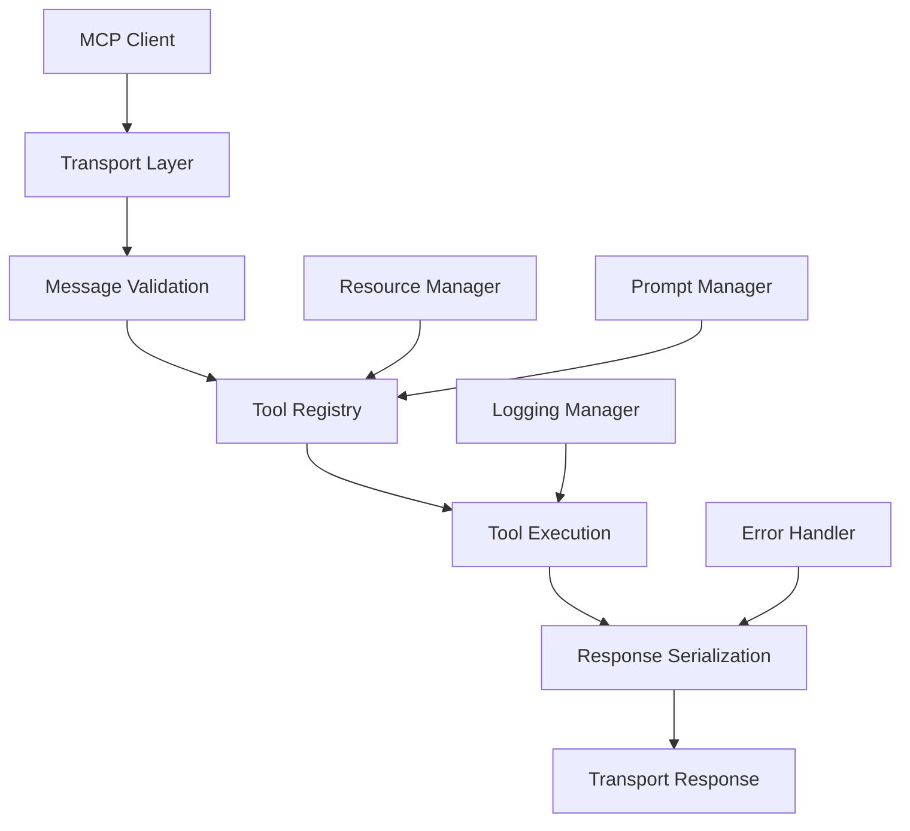

# 🔧 MCP Server Core Implementation

## 🎯 Objectives
- Implement full MCP protocol compliance with latest specification
- Create robust tool definitions for autonomous software generation
- Build reliable agent orchestration system
- Implement proper error handling and recovery
- Ensure compatibility with all major MCP clients

## 🏗️ MCP Protocol Architecture

### Protocol Compliance Overview


### Core MCP Components
- **Transport**: HTTP/SSE for client communication
- **Tools**: Individual MCP callable functions
- **Resources**: Static and dynamic content endpoints
- **Prompts**: Template system for agent interactions
- **Logging**: Structured operation tracking

## 🛠️ Core MCP Server Implementation

### MCP Protocol Handler
```python
# src/core/mcp_server.py
"""
Core MCP server implementation with full protocol compliance
"""
import asyncio
import json
from typing import Dict, Any, List, Optional, Union, Callable
from dataclasses import dataclass, asdict
from enum import Enum
import structlog
from fastapi import FastAPI, Request, Response, HTTPException
from fastapi.responses import StreamingResponse
from pydantic import BaseModel, Field

from src.core.config import settings

logger = structlog.get_logger()


class MCPMessageType(Enum):
    """MCP message types according to specification"""
    INITIALIZE = "initialize"
    INITIALIZED = "initialized"
    LIST_TOOLS = "tools/list"
    CALL_TOOL = "tools/call"
    LIST_RESOURCES = "resources/list"
    READ_RESOURCE = "resources/read"
    LIST_PROMPTS = "prompts/list"
    GET_PROMPT = "prompts/get"
    COMPLETE = "completion/complete"
    NOTIFICATION = "notification"
    PROGRESS = "progress"


@dataclass
class MCPCapabilities:
    """MCP server capabilities"""
    experimental: Optional[Dict[str, Any]] = None
    logging: Optional[Dict[str, Any]] = None
    prompts: Optional[Dict[str, Any]] = None
    resources: Optional[Dict[str, Any]] = None
    tools: Optional[Dict[str, Any]] = None


@dataclass
class MCPServerInfo:
    """MCP server information"""
    name: str
    version: str


@dataclass
class MCPToolCall:
    """MCP tool call request"""
    name: str
    arguments: Dict[str, Any]


@dataclass
class MCPToolResult:
    """MCP tool call result"""
    content: List[Dict[str, Any]]
    isError: Optional[bool] = None


class MCPTool(BaseModel):
    """MCP tool definition"""
    name: str
    description: str
    inputSchema: Dict[str, Any]


class MCPResource(BaseModel):
    """MCP resource definition"""
    uri: str
    name: str
    description: Optional[str] = None
    mimeType: Optional[str] = None


class MCPPrompt(BaseModel):
    """MCP prompt definition"""
    name: str
    description: str
    arguments: Optional[List[Dict[str, Any]]] = None


class MCPServer:
    """Core MCP server implementation"""
    
    def __init__(self, app: FastAPI):
        self.app = app
        self.tools: Dict[str, Callable] = {}
        self.resources: Dict[str, Callable] = {}
        self.prompts: Dict[str, Callable] = {}
        self.capabilities = MCPCapabilities(
            experimental={},
            logging={},
            prompts={"listChanged": True},
            resources={"subscribe": True, "listChanged": True},
            tools={"listChanged": True}
        )
        self.server_info = MCPServerInfo(
            name="autonomous-software-foundry",
            version="1.0.0"
        )
        self._setup_routes()
    
    def _setup_routes(self):
        """Setup MCP protocol routes"""
        
        @self.app.post("/mcp/initialize")
        async def initialize(request: Request):
            """MCP initialization handshake"""
            try:
                body = await request.json()
                
                # Validate initialization request
                if body.get("method") != "initialize":
                    raise HTTPException(status_code=400, detail="Invalid initialization method")
                
                # Extract client capabilities
                client_capabilities = body.get("params", {}).get("capabilities", {})
                client_info = body.get("params", {}).get("clientInfo", {})
                
                logger.info(
                    "mcp_client_initialized",
                    client_name=client_info.get("name", "unknown"),
                    client_version=client_info.get("version", "unknown"),
                    client_capabilities=list(client_capabilities.keys())
                )
                
                # Return server capabilities
                return {
                    "jsonrpc": "2.0",
                    "id": body.get("id"),
                    "result": {
                        "protocolVersion": "2024-11-05",
                        "capabilities": asdict(self.capabilities),
                        "serverInfo": asdict(self.server_info)
                    }
                }
                
            except Exception as e:
                logger.error("mcp_initialization_failed", error=str(e))
                raise HTTPException(status_code=500, detail=f"Initialization failed: {str(e)}")
        
        @self.app.post("/mcp/tools/list")
        async def list_tools(request: Request):
            """List available MCP tools"""
            try:
                body = await request.json()
                
                tools_list = []
                for name, tool_func in self.tools.items():
                    if hasattr(tool_func, '_mcp_tool_info'):
                        tool_info = tool_func._mcp_tool_info
                        tools_list.append({
                            "name": name,
                            "description": tool_info.description,
                            "inputSchema": tool_info.inputSchema
                        })
                
                logger.info("mcp_tools_listed", tools_count=len(tools_list))
                
                return {
                    "jsonrpc": "2.0",
                    "id": body.get("id"),
                    "result": {
                        "tools": tools_list
                    }
                }
                
            except Exception as e:
                logger.error("mcp_tools_list_failed", error=str(e))
                raise HTTPException(status_code=500, detail=f"Failed to list tools: {str(e)}")
        
        @self.app.post("/mcp/tools/call")
        async def call_tool(request: Request):
            """Execute MCP tool call"""
            try:
                body = await request.json()
                params = body.get("params", {})
                tool_name = params.get("name")
                tool_arguments = params.get("arguments", {})
                
                if not tool_name or tool_name not in self.tools:
                    raise HTTPException(status_code=404, detail=f"Tool '{tool_name}' not found")
                
                # Get correlation ID from request state
                correlation_id = getattr(request.state, 'correlation_id', 'unknown')
                
                logger.info(
                    "mcp_tool_called",
                    tool_name=tool_name,
                    arguments_keys=list(tool_arguments.keys()),
                    correlation_id=correlation_id
                )
                
                # Execute tool
                tool_func = self.tools[tool_name]
                try:
                    result = await tool_func(request, **tool_arguments)
                    
                    # Format result according to MCP spec
                    if isinstance(result, dict) and "content" in result:
                        tool_result = result
                    else:
                        tool_result = {
                            "content": [
                                {
                                    "type": "text",
                                    "text": json.dumps(result, indent=2, default=str)
                                }
                            ]
                        }
                    
                    logger.info(
                        "mcp_tool_completed",
                        tool_name=tool_name,
                        correlation_id=correlation_id,
                        success=True
                    )
                    
                    return {
                        "jsonrpc": "2.0",
                        "id": body.get("id"),
                        "result": tool_result
                    }
                    
                except Exception as tool_error:
                    logger.error(
                        "mcp_tool_execution_failed",
                        tool_name=tool_name,
                        error=str(tool_error),
                        correlation_id=correlation_id
                    )
                    
                    return {
                        "jsonrpc": "2.0",
                        "id": body.get("id"),
                        "result": {
                            "content": [
                                {
                                    "type": "text",
                                    "text": f"Tool execution failed: {str(tool_error)}"
                                }
                            ],
                            "isError": True
                        }
                    }
                
            except Exception as e:
                logger.error("mcp_tool_call_failed", error=str(e))
                raise HTTPException(status_code=500, detail=f"Tool call failed: {str(e)}")
        
        @self.app.post("/mcp/resources/list") 
        async def list_resources(request: Request):
            """List available MCP resources"""
            try:
                body = await request.json()
                
                resources_list = []
                for uri, resource_func in self.resources.items():
                    if hasattr(resource_func, '_mcp_resource_info'):
                        resource_info = resource_func._mcp_resource_info
                        resources_list.append({
                            "uri": uri,
                            "name": resource_info.name,
                            "description": resource_info.description,
                            "mimeType": resource_info.mimeType
                        })
                
                logger.info("mcp_resources_listed", resources_count=len(resources_list))
                
                return {
                    "jsonrpc": "2.0", 
                    "id": body.get("id"),
                    "result": {
                        "resources": resources_list
                    }
                }
                
            except Exception as e:
                logger.error("mcp_resources_list_failed", error=str(e))
                raise HTTPException(status_code=500, detail=f"Failed to list resources: {str(e)}")
        
        @self.app.post("/mcp/resources/read")
        async def read_resource(request: Request):
            """Read MCP resource content"""
            try:
                body = await request.json()
                params = body.get("params", {})
                resource_uri = params.get("uri")
                
                if not resource_uri or resource_uri not in self.resources:
                    raise HTTPException(status_code=404, detail=f"Resource '{resource_uri}' not found")
                
                correlation_id = getattr(request.state, 'correlation_id', 'unknown')
                
                logger.info(
                    "mcp_resource_read",
                    resource_uri=resource_uri,
                    correlation_id=correlation_id
                )
                
                # Read resource
                resource_func = self.resources[resource_uri]
                content = await resource_func(request)
                
                return {
                    "jsonrpc": "2.0",
                    "id": body.get("id"),
                    "result": {
                        "contents": content if isinstance(content, list) else [content]
                    }
                }
                
            except Exception as e:
                logger.error("mcp_resource_read_failed", error=str(e))
                raise HTTPException(status_code=500, detail=f"Resource read failed: {str(e)}")
    
    def register_tool(
        self, 
        name: str, 
        description: str, 
        input_schema: Dict[str, Any],
        required_scopes: Optional[List[str]] = None
    ):
        """Decorator to register MCP tools"""
        def decorator(func: Callable):
            # Store tool metadata
            func._mcp_tool_info = MCPTool(
                name=name,
                description=description,
                inputSchema=input_schema
            )
            func._required_scopes = required_scopes or []
            
            # Register tool
            self.tools[name] = func
            
            logger.info(
                "mcp_tool_registered",
                tool_name=name,
                required_scopes=required_scopes
            )
            
            return func
        return decorator
    
    def register_resource(
        self,
        uri: str,
        name: str,
        description: str,
        mime_type: str = "application/json"
    ):
        """Decorator to register MCP resources"""
        def decorator(func: Callable):
            func._mcp_resource_info = MCPResource(
                uri=uri,
                name=name,
                description=description,
                mimeType=mime_type
            )
            
            self.resources[uri] = func
            
            logger.info(
                "mcp_resource_registered",
                resource_uri=uri,
                resource_name=name
            )
            
            return func
        return decorator


# Global MCP server instance
mcp_server: Optional[MCPServer] = None


def get_mcp_server() -> MCPServer:
    """Get global MCP server instance"""
    global mcp_server
    if mcp_server is None:
        raise RuntimeError("MCP server not initialized")
    return mcp_server


def initialize_mcp_server(app: FastAPI) -> MCPServer:
    """Initialize global MCP server"""
    global mcp_server
    mcp_server = MCPServer(app)
    return mcp_server
```

### Tool Registration System
```python
# src/core/tool_registry.py
"""
MCP tool registration and management system
"""
import inspect
from typing import Dict, Any, List, Optional, get_type_hints
from functools import wraps
import structlog

from src.core.mcp_server import get_mcp_server
from src.middleware.auth_middleware import require_scopes

logger = structlog.get_logger()


def mcp_tool(
    name: str,
    description: str,
    required_scopes: Optional[List[str]] = None,
    timeout_seconds: int = 300
):
    """
    Decorator to register function as MCP tool with automatic schema generation
    
    Args:
        name: Tool name for MCP protocol
        description: Human-readable tool description
        required_scopes: Required OAuth scopes for authorization
        timeout_seconds: Maximum execution time
    """
    def decorator(func):
        # Generate JSON schema from function signature
        input_schema = _generate_input_schema(func)
        
        # Create wrapper with authentication and error handling
        @wraps(func)
        async def wrapper(request, **kwargs):
            # Apply scope-based authorization if required
            if required_scopes:
                auth_dependency = require_scopes(*required_scopes)
                auth_context = await auth_dependency(request)
                kwargs['auth_context'] = auth_context
            
            # Add request context
            kwargs['request'] = request
            
            # Execute with timeout
            try:
                result = await asyncio.wait_for(
                    func(**kwargs),
                    timeout=timeout_seconds
                )
                return result
            except asyncio.TimeoutError:
                raise TimeoutError(f"Tool '{name}' timed out after {timeout_seconds} seconds")
        
        # Register with MCP server
        mcp_server = get_mcp_server()
        mcp_server.register_tool(
            name=name,
            description=description,
            input_schema=input_schema,
            required_scopes=required_scopes
        )(wrapper)
        
        return wrapper
    
    return decorator


def mcp_resource(
    uri: str,
    name: str,
    description: str,
    mime_type: str = "application/json"
):
    """Decorator to register function as MCP resource"""
    def decorator(func):
        mcp_server = get_mcp_server()
        mcp_server.register_resource(
            uri=uri,
            name=name,
            description=description,
            mime_type=mime_type
        )(func)
        return func
    return decorator


def _generate_input_schema(func) -> Dict[str, Any]:
    """Generate JSON schema from function signature"""
    sig = inspect.signature(func)
    type_hints = get_type_hints(func)
    
    properties = {}
    required = []
    
    for param_name, param in sig.parameters.items():
        # Skip special parameters
        if param_name in ['request', 'auth_context']:
            continue
        
        param_type = type_hints.get(param_name, str)
        schema_type = _python_type_to_json_schema(param_type)
        
        properties[param_name] = {
            "type": schema_type["type"],
            "description": f"Parameter {param_name}"
        }
        
        # Add additional schema properties
        if "format" in schema_type:
            properties[param_name]["format"] = schema_type["format"]
        if "items" in schema_type:
            properties[param_name]["items"] = schema_type["items"]
        
        # Check if parameter is required
        if param.default == inspect.Parameter.empty:
            required.append(param_name)
    
    return {
        "type": "object",
        "properties": properties,
        "required": required
    }


def _python_type_to_json_schema(python_type) -> Dict[str, Any]:
    """Convert Python type hints to JSON schema types"""
    if python_type == str:
        return {"type": "string"}
    elif python_type == int:
        return {"type": "integer"}
    elif python_type == float:
        return {"type": "number"}
    elif python_type == bool:
        return {"type": "boolean"}
    elif hasattr(python_type, '__origin__'):
        # Handle generic types like List[str], Dict[str, Any]
        origin = python_type.__origin__
        if origin == list:
            args = getattr(python_type, '__args__', ())
            item_type = args[0] if args else str
            return {
                "type": "array",
                "items": _python_type_to_json_schema(item_type)
            }
        elif origin == dict:
            return {"type": "object"}
    
    # Default to string for unknown types
    return {"type": "string"}
```

## 🤖 Core MCP Tools Implementation

### Basic Infrastructure Tools
```python
# src/tools/infrastructure_tools.py
"""
Core infrastructure tools for MCP server
"""
import asyncio
import uuid
import time
import platform
import psutil
from datetime import datetime
from typing import Dict, Any, List, Optional

from src.core.tool_registry import mcp_tool
from src.core.descope_auth import AuthContext

@mcp_tool(
    name="ping",
    description="Test connectivity and basic server health",
    required_scopes=["tools:ping"]
)
async def ping_tool(auth_context: AuthContext) -> Dict[str, Any]:
    """
    Basic connectivity test with comprehensive system info
    """
    return {
        "status": "pong",
        "timestamp": datetime.utcnow().isoformat(),
        "server_info": {
            "python_version": platform.python_version(),
            "platform": platform.platform(),
            "cpu_count": psutil.cpu_count(),
            "memory_gb": round(psutil.virtual_memory().total / (1024**3), 2)
        },
        "authentication": {
            "user_id": auth_context.user_id,
            "is_machine": auth_context.is_machine,
            "scopes": auth_context.scopes,
            "time_until_expiry": str(auth_context.time_until_expiry())
        }
    }


@mcp_tool(
    name="system_status",
    description="Get comprehensive system status and performance metrics",
    required_scopes=["tools:ping"]
)
async def system_status_tool(auth_context: AuthContext) -> Dict[str, Any]:
    """
    Detailed system status for monitoring and debugging
    """
    cpu_percent = psutil.cpu_percent(interval=1)
    memory = psutil.virtual_memory()
    disk = psutil.disk_usage('/')
    
    return {
        "status": "healthy",
        "timestamp": datetime.utcnow().isoformat(),
        "system_metrics": {
            "cpu": {
                "usage_percent": cpu_percent,
                "count": psutil.cpu_count(),
                "load_average": list(psutil.getloadavg()) if hasattr(psutil, 'getloadavg') else None
            },
            "memory": {
                "total_gb": round(memory.total / (1024**3), 2),
                "available_gb": round(memory.available / (1024**3), 2),
                "usage_percent": memory.percent
            },
            "disk": {
                "total_gb": round(disk.total / (1024**3), 2),
                "free_gb": round(disk.free / (1024**3), 2),
                "usage_percent": round((disk.used / disk.total) * 100, 1)
            }
        },
        "mcp_metrics": {
            "active_tools": len(get_mcp_server().tools),
            "active_resources": len(get_mcp_server().resources),
            "server_uptime": "unknown"  # TODO: Implement uptime tracking
        },
        "auth_info": {
            "user_id": auth_context.user_id,
            "scopes": auth_context.scopes
        }
    }


@mcp_tool(
    name="list_capabilities",
    description="List all available MCP tools and their capabilities",
    required_scopes=["tools:ping"]
)
async def list_capabilities_tool(auth_context: AuthContext) -> Dict[str, Any]:
    """
    Return comprehensive list of server capabilities
    """
    mcp_server = get_mcp_server()
    
    tools_info = []
    for name, tool_func in mcp_server.tools.items():
        if hasattr(tool_func, '_mcp_tool_info'):
            tool_info = tool_func._mcp_tool_info
            required_scopes = getattr(tool_func, '_required_scopes', [])
            
            # Check if user can access this tool
            can_access = all(scope in auth_context.scopes for scope in required_scopes)
            
            tools_info.append({
                "name": name,
                "description": tool_info.description,
                "required_scopes": required_scopes,
                "accessible": can_access,
                "input_schema": tool_info.inputSchema
            })
    
    return {
        "server_capabilities": {
            "name": mcp_server.server_info.name,
            "version": mcp_server.server_info.version,
            "protocol_version": "2024-11-05"
        },
        "available_tools": tools_info,
        "user_access": {
            "user_id": auth_context.user_id,
            "scopes": auth_context.scopes,
            "accessible_tools": sum(1 for tool in tools_info if tool["accessible"])
        },
        "timestamp": datetime.utcnow().isoformat()
    }
```

### Code Generation Tools
```python
# src/tools/generation_tools.py
"""
Code generation tools for autonomous software development
"""
import asyncio
import json
import uuid
from typing import Dict, Any, List, Optional
from datetime import datetime

from src.core.tool_registry import mcp_tool
from src.core.descope_auth import AuthContext
from src.agents.orchestrator import AgentOrchestrator
from src.core.file_manager import SecureFileManager

@mcp_tool(
    name="generate_application",
    description="Generate a complete full-stack application from description",
    required_scopes=["tools:generate"],
    timeout_seconds=600
)
async def generate_application_tool(
    project_description: str,
    project_type: str = "fullstack",
    technology_stack: Optional[str] = None,
    auth_context: AuthContext = None
) -> Dict[str, Any]:
    """
    Generate complete application with frontend, backend, and configuration
    
    Args:
        project_description: Detailed description of the desired application
        project_type: Type of project (fullstack, frontend, backend, api)
        technology_stack: Preferred technologies (react-node, vue-python, etc.)
    """
    correlation_id = str(uuid.uuid4())
    start_time = time.time()
    
    try:
        # Initialize orchestrator and file manager
        orchestrator = AgentOrchestrator(correlation_id=correlation_id)
        file_manager = SecureFileManager()
        
        # Log generation request
        logger.info(
            "application_generation_started",
            user_id=auth_context.user_id,
            project_type=project_type,
            technology_stack=technology_stack,
            description_length=len(project_description),
            correlation_id=correlation_id
        )
        
        # Generate project structure
        generation_result = await orchestrator.generate_complete_application(
            description=project_description,
            project_type=project_type,
            technology_stack=technology_stack,
            user_context={
                "user_id": auth_context.user_id,
                "scopes": auth_context.scopes
            }
        )
        
        processing_time = (time.time() - start_time) * 1000
        
        # Format response according to MCP specification
        return {
            "content": [
                {
                    "type": "text",
                    "text": json.dumps({
                        "status": "completed",
                        "project_id": correlation_id,
                        "project_type": project_type,
                        "technology_stack": generation_result.get("technology_stack"),
                        "files_generated": generation_result.get("files_count", 0),
                        "processing_time_ms": processing_time,
                        "generation_summary": generation_result.get("summary"),
                        "next_steps": [
                            "Review generated code",
                            "Run tests with 'test_application' tool",
                            "Deploy with 'deploy_application' tool"
                        ]
                    }, indent=2)
                },
                {
                    "type": "resource",
                    "resource": {
                        "uri": f"project://{correlation_id}/structure",
                        "text": generation_result.get("project_structure", "")
                    }
                }
            ]
        }
        
    except Exception as e:
        processing_time = (time.time() - start_time) * 1000
        
        logger.error(
            "application_generation_failed",
            user_id=auth_context.user_id,
            error=str(e),
            correlation_id=correlation_id,
            processing_time_ms=processing_time
        )
        
        return {
            "content": [
                {
                    "type": "text",
                    "text": json.dumps({
                        "status": "failed",
                        "error": str(e),
                        "project_id": correlation_id,
                        "processing_time_ms": processing_time,
                        "troubleshooting": [
                            "Check project description for clarity",
                            "Verify technology stack is supported",
                            "Try with simpler requirements"
                        ]
                    }, indent=2)
                }
            ],
            "isError": True
        }


@mcp_tool(
    name="generate_component",
    description="Generate specific application component (API endpoint, React component, etc.)",
    required_scopes=["tools:generate"]
)
async def generate_component_tool(
    component_type: str,
    component_description: str,
    project_context: Optional[str] = None,
    auth_context: AuthContext = None
) -> Dict[str, Any]:
    """
    Generate specific application components
    
    Args:
        component_type: Type of component (api_endpoint, react_component, database_model, etc.)
        component_description: Detailed description of the component
        project_context: Context about the existing project
    """
    correlation_id = str(uuid.uuid4())
    
    try:
        orchestrator = AgentOrchestrator(correlation_id=correlation_id)
        
        # Generate specific component
        component_result = await orchestrator.generate_component(
            component_type=component_type,
            description=component_description,
            project_context=project_context,
            user_context={
                "user_id": auth_context.user_id,
                "scopes": auth_context.scopes
            }
        )
        
        return {
            "content": [
                {
                    "type": "text",
                    "text": json.dumps({
                        "status": "completed",
                        "component_id": correlation_id,
                        "component_type": component_type,
                        "files_modified": component_result.get("files_modified", []),
                        "code_generated": component_result.get("code_generated", ""),
                        "integration_notes": component_result.get("integration_notes", "")
                    }, indent=2)
                }
            ]
        }
        
    except Exception as e:
        logger.error(
            "component_generation_failed",
            component_type=component_type,
            error=str(e),
            correlation_id=correlation_id
        )
        
        return {
            "content": [
                {
                    "type": "text", 
                    "text": f"Component generation failed: {str(e)}"
                }
            ],
            "isError": True
        }


@mcp_tool(
    name="enhance_application",
    description="Add features or improvements to existing application",
    required_scopes=["tools:generate"]
)
async def enhance_application_tool(
    project_id: str,
    enhancement_description: str,
    enhancement_type: str = "feature",
    auth_context: AuthContext = None
) -> Dict[str, Any]:
    """
    Enhance existing application with new features or improvements
    
    Args:
        project_id: ID of the existing project to enhance
        enhancement_description: Description of desired enhancements
        enhancement_type: Type of enhancement (feature, performance, security, ui)
    """
    correlation_id = str(uuid.uuid4())
    
    try:
        orchestrator = AgentOrchestrator(correlation_id=correlation_id)
        
        # Enhance existing project
        enhancement_result = await orchestrator.enhance_application(
            project_id=project_id,
            enhancement_description=enhancement_description,
            enhancement_type=enhancement_type,
            user_context={
                "user_id": auth_context.user_id,
                "scopes": auth_context.scopes
            }
        )
        
        return {
            "content": [
                {
                    "type": "text",
                    "text": json.dumps({
                        "status": "completed",
                        "enhancement_id": correlation_id,
                        "project_id": project_id,
                        "enhancement_type": enhancement_type,
                        "changes_made": enhancement_result.get("changes_made", []),
                        "files_modified": enhancement_result.get("files_modified", []),
                        "migration_notes": enhancement_result.get("migration_notes", ""),
                        "testing_recommendations": enhancement_result.get("testing_recommendations", [])
                    }, indent=2)
                }
            ]
        }
        
    except Exception as e:
        logger.error(
            "application_enhancement_failed",
            project_id=project_id,
            enhancement_type=enhancement_type,
            error=str(e),
            correlation_id=correlation_id
        )
        
        return {
            "content": [
                {
                    "type": "text",
                    "text": f"Application enhancement failed: {str(e)}"
                }
            ],
            "isError": True
        }
```

### Quality Assurance Tools
```python
# src/tools/quality_tools.py
"""
Quality assurance and testing tools
"""
import asyncio
from typing import Dict, Any, List, Optional

from src.core.tool_registry import mcp_tool
from src.core.descope_auth import AuthContext
from src.agents.reviewer import ReviewerAgent
from src.testing.test_runner import TestRunner

@mcp_tool(
    name="test_application", 
    description="Run comprehensive tests on generated application",
    required_scopes=["tools:review"],
    timeout_seconds=300
)
async def test_application_tool(
    project_id: str,
    test_types: Optional[List[str]] = None,
    auth_context: AuthContext = None
) -> Dict[str, Any]:
    """
    Run comprehensive test suite on application
    
    Args:
        project_id: ID of the project to test
        test_types: Types of tests to run (unit, integration, security, performance)
    """
    correlation_id = str(uuid.uuid4())
    
    if test_types is None:
        test_types = ["unit", "integration", "security", "linting"]
    
    try:
        test_runner = TestRunner(correlation_id=correlation_id)
        
        # Run specified tests
        test_results = await test_runner.run_comprehensive_tests(
            project_id=project_id,
            test_types=test_types,
            user_context={
                "user_id": auth_context.user_id,
                "scopes": auth_context.scopes
            }
        )
        
        return {
            "content": [
                {
                    "type": "text",
                    "text": json.dumps({
                        "status": "completed",
                        "project_id": project_id,
                        "test_summary": {
                            "total_tests": test_results.get("total_tests", 0),
                            "passed_tests": test_results.get("passed_tests", 0),
                            "failed_tests": test_results.get("failed_tests", 0),
                            "skipped_tests": test_results.get("skipped_tests", 0),
                            "success_rate": test_results.get("success_rate", 0.0)
                        },
                        "test_details": test_results.get("test_details", {}),
                        "failures": test_results.get("failures", []),
                        "recommendations": test_results.get("recommendations", [])
                    }, indent=2)
                }
            ]
        }
        
    except Exception as e:
        return {
            "content": [
                {
                    "type": "text",
                    "text": f"Testing failed: {str(e)}"
                }
            ],
            "isError": True
        }


@mcp_tool(
    name="self_heal",
    description="Automatically analyze and fix issues in generated code", 
    required_scopes=["tools:fix"],
    timeout_seconds=600
)
async def self_heal_tool(
    project_id: str,
    issue_context: Optional[str] = None,
    max_attempts: int = 3,
    auth_context: AuthContext = None
) -> Dict[str, Any]:
    """
    Autonomous self-healing system - the key innovation
    
    Args:
        project_id: ID of the project to heal
        issue_context: Optional context about known issues
        max_attempts: Maximum number of healing attempts
    """
    correlation_id = str(uuid.uuid4())
    healing_attempts = []
    
    try:
        reviewer_agent = ReviewerAgent(correlation_id=correlation_id)
        orchestrator = AgentOrchestrator(correlation_id=correlation_id)
        
        for attempt in range(max_attempts):
            logger.info(
                "self_healing_attempt",
                project_id=project_id,
                attempt=attempt + 1,
                max_attempts=max_attempts,
                correlation_id=correlation_id
            )
            
            # Analyze current state
            analysis_result = await reviewer_agent.analyze_project_health(
                project_id=project_id,
                focus_areas=["functionality", "security", "performance", "code_quality"]
            )
            
            # If no issues found, healing is complete
            if not analysis_result.get("issues_found"):
                healing_attempts.append({
                    "attempt": attempt + 1,
                    "status": "no_issues_found",
                    "analysis": analysis_result
                })
                break
            
            # Generate fixes for identified issues
            fix_recommendations = await reviewer_agent.generate_fix_recommendations(
                issues=analysis_result.get("issues", []),
                project_context=analysis_result.get("project_context", {})
            )
            
            # Apply fixes
            fix_result = await orchestrator.apply_automated_fixes(
                project_id=project_id,
                fix_recommendations=fix_recommendations,
                user_context={
                    "user_id": auth_context.user_id,
                    "scopes": auth_context.scopes
                }
            )
            
            healing_attempts.append({
                "attempt": attempt + 1,
                "issues_found": len(analysis_result.get("issues", [])),
                "fixes_applied": len(fix_result.get("fixes_applied", [])),
                "fixes_failed": len(fix_result.get("fixes_failed", [])),
                "status": "fixes_applied" if fix_result.get("fixes_applied") else "no_fixes_applied"
            })
            
            # If all fixes were successful, run verification
            if fix_result.get("fixes_applied") and not fix_result.get("fixes_failed"):
                verification_result = await reviewer_agent.verify_fixes(
                    project_id=project_id,
                    applied_fixes=fix_result.get("fixes_applied", [])
                )
                
                if verification_result.get("all_fixes_successful"):
                    healing_attempts[-1]["verification"] = "successful"
                    break
                else:
                    healing_attempts[-1]["verification"] = "failed"
        
        # Generate final summary
        total_issues_fixed = sum(attempt.get("fixes_applied", 0) for attempt in healing_attempts)
        final_status = "completed" if healing_attempts and healing_attempts[-1].get("verification") == "successful" else "partial"
        
        return {
            "content": [
                {
                    "type": "text",
                    "text": json.dumps({
                        "status": final_status,
                        "project_id": project_id,
                        "healing_summary": {
                            "total_attempts": len(healing_attempts),
                            "total_issues_fixed": total_issues_fixed,
                            "final_health_score": analysis_result.get("health_score", 0.0),
                            "remaining_issues": analysis_result.get("remaining_issues", [])
                        },
                        "healing_attempts": healing_attempts,
                        "next_steps": [
                            "Run tests to verify fixes",
                            "Review generated code changes",
                            "Deploy updated application"
                        ]
                    }, indent=2)
                }
            ]
        }
        
    except Exception as e:
        logger.error(
            "self_healing_failed",
            project_id=project_id,
            error=str(e),
            correlation_id=correlation_id
        )
        
        return {
            "content": [
                {
                    "type": "text",
                    "text": f"Self-healing failed: {str(e)}"
                }
            ],
            "isError": True
        }
```

## 🔗 MCP Resources Implementation

### Project Resources
```python
# src/resources/project_resources.py
"""
MCP resources for project data access
"""
import json
from typing import Dict, Any, List
from fastapi import Request

from src.core.tool_registry import mcp_resource
from src.core.file_manager import SecureFileManager
from src.core.project_manager import ProjectManager

@mcp_resource(
    uri="project://*/structure",
    name="Project Structure",
    description="Get complete project file structure and organization",
    mime_type="application/json"
)
async def project_structure_resource(request: Request) -> Dict[str, Any]:
    """
    Provide project structure information as MCP resource
    """
    # Extract project ID from URI
    uri_parts = request.url.path.split('/')
    project_id = uri_parts[-2] if len(uri_parts) >= 2 else None
    
    if not project_id:
        raise ValueError("Project ID not found in URI")
    
    project_manager = ProjectManager()
    structure = await project_manager.get_project_structure(project_id)
    
    return {
        "uri": f"project://{project_id}/structure",
        "mimeType": "application/json",
        "text": json.dumps(structure, indent=2)
    }


@mcp_resource(
    uri="project://*/code/*",
    name="Project Code Files", 
    description="Access individual code files within projects",
    mime_type="text/plain"
)
async def project_code_resource(request: Request) -> Dict[str, Any]:
    """
    Provide access to individual project files
    """
    # Parse URI to extract project ID and file path
    uri_parts = request.url.path.split('/')
    if len(uri_parts) < 4:
        raise ValueError("Invalid file URI format")
    
    project_id = uri_parts[-3]
    file_path = '/'.join(uri_parts[-2:])
    
    file_manager = SecureFileManager()
    file_content = await file_manager.read_project_file(project_id, file_path)
    
    return {
        "uri": f"project://{project_id}/code/{file_path}",
        "mimeType": "text/plain",
        "text": file_content
    }


@mcp_resource(
    uri="system://metrics",
    name="System Metrics",
    description="Real-time system performance and usage metrics",
    mime_type="application/json"
)
async def system_metrics_resource(request: Request) -> Dict[str, Any]:
    """
    Provide real-time system metrics
    """
    # Collect system metrics
    import psutil
    
    metrics = {
        "timestamp": datetime.utcnow().isoformat(),
        "cpu": {
            "usage_percent": psutil.cpu_percent(interval=1),
            "load_average": list(psutil.getloadavg()) if hasattr(psutil, 'getloadavg') else None
        },
        "memory": {
            "usage_percent": psutil.virtual_memory().percent,
            "available_gb": round(psutil.virtual_memory().available / (1024**3), 2)
        },
        "active_projects": await ProjectManager().get_active_project_count(),
        "generation_queue_size": 0  # TODO: Implement queue monitoring
    }
    
    return {
        "uri": "system://metrics",
        "mimeType": "application/json", 
        "text": json.dumps(metrics, indent=2)
    }
```

## ✅ Validation Checklist

```markdown
- [ ] **MCP Protocol Compliance**
  - [ ] Initialize handshake working correctly
  - [ ] Tool discovery and listing functional
  - [ ] Tool execution with proper error handling
  - [ ] Resource listing and reading working
  - [ ] JSON-RPC 2.0 message format compliance

- [ ] **Tool Registration System**
  - [ ] Automatic schema generation from function signatures
  - [ ] Scope-based authorization integration
  - [ ] Timeout handling for long-running operations
  - [ ] Proper error handling and reporting

- [ ] **Core Tools Implementation**
  - [ ] Infrastructure tools (ping, status) working
  - [ ] Generation tools properly integrated
  - [ ] Quality tools (test, self-heal) functional
  - [ ] All tools return MCP-compliant responses

- [ ] **Resource System**
  - [ ] Project structure resources accessible
  - [ ] Code file resources working correctly
  - [ ] System metrics resources updating
  - [ ] Proper MIME type handling

- [ ] **Error Handling**
  - [ ] Graceful degradation on tool failures
  - [ ] Comprehensive error logging
  - [ ] User-friendly error messages
  - [ ] Proper HTTP status codes

- [ ] **Client Compatibility**
  - [ ] Claude Desktop integration working
  - [ ] MCP CLI compatibility verified
  - [ ] Custom clients can connect successfully
  - [ ] Transport layer handling HTTP and SSE
```

---

**Next Steps**: Proceed to `06-agent-orchestration.md` for detailed implementation of the multi-agent system with specialized Frontend, Backend, and Reviewer agents.