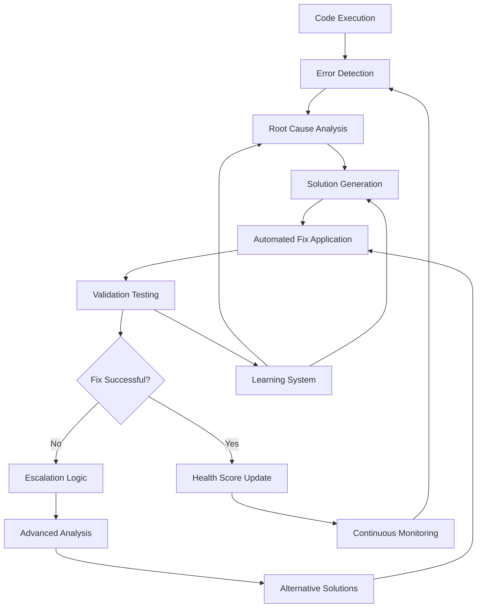

# 🔄 Self-Healing Loop System

## 🎯 Objectives
- Implement autonomous error detection and analysis system
- Build intelligent code repair and optimization mechanisms
- Create continuous improvement feedback loops
- Enable zero-human-intervention error resolution
- Establish comprehensive health monitoring and recovery

## 🧠 Self-Healing Architecture

### Healing Loop Overview


### Core Components
- **Health Monitor**: Continuous system health assessment
- **Error Analyzer**: Intelligent error classification and root cause analysis
- **Solution Generator**: AI-powered fix generation and optimization
- **Validation Engine**: Automated testing and verification
- **Learning System**: Continuous improvement from past fixes

## 🛠️ Core Self-Healing Implementation

### Health Monitoring System
```python
# src/healing/health_monitor.py
"""
Comprehensive system health monitoring and assessment
"""
import asyncio
import json
import uuid
from typing import Dict, Any, List, Optional, Tuple
from datetime import datetime, timedelta
from dataclasses import dataclass, asdict
from enum import Enum
import structlog

from src.core.llm_manager import LLMManager
from src.core.project_manager import ProjectManager
from src.core.file_manager import SecureFileManager
from src.testing.test_runner import TestRunner
from src.middleware.cequence_analytics import CequenceAnalytics

logger = structlog.get_logger()


class HealthStatus(Enum):
    """System health status levels"""
    EXCELLENT = "excellent"
    GOOD = "good"
    WARNING = "warning"
    CRITICAL = "critical"
    FAILING = "failing"


class IssueType(Enum):
    """Types of issues that can be detected"""
    SYNTAX_ERROR = "syntax_error"
    RUNTIME_ERROR = "runtime_error"
    LOGIC_ERROR = "logic_error"
    PERFORMANCE_ISSUE = "performance_issue"
    SECURITY_VULNERABILITY = "security_vulnerability"
    DEPENDENCY_ISSUE = "dependency_issue"
    CONFIGURATION_ERROR = "configuration_error"
    API_ERROR = "api_error"
    DATABASE_ERROR = "database_error"
    INTEGRATION_ERROR = "integration_error"


@dataclass
class HealthIssue:
    """Individual health issue detection"""
    id: str
    type: IssueType
    severity: int  # 1-10 scale
    description: str
    location: str
    error_message: Optional[str] = None
    stack_trace: Optional[str] = None
    context: Optional[Dict[str, Any]] = None
    first_detected: Optional[datetime] = None
    last_occurrence: Optional[datetime] = None
    occurrence_count: int = 1
    suggested_fixes: List[str] = None


@dataclass
class HealthReport:
    """Comprehensive health assessment report"""
    project_id: str
    timestamp: datetime
    overall_status: HealthStatus
    health_score: float  # 0.0 - 1.0
    issues: List[HealthIssue]
    metrics: Dict[str, Any]
    recommendations: List[str]
    correlation_id: str


class HealthMonitor:
    """Continuous health monitoring and issue detection system"""
    
    def __init__(self, correlation_id: Optional[str] = None):
        self.correlation_id = correlation_id or str(uuid.uuid4())
        self.project_manager = ProjectManager()
        self.file_manager = SecureFileManager()
        self.test_runner = TestRunner()
        self.llm_manager = LLMManager()
        self.analytics = CequenceAnalytics()
        
        # Health monitoring state
        self.active_monitors: Dict[str, asyncio.Task] = {}
        self.health_history: Dict[str, List[HealthReport]] = {}
        self.issue_patterns: Dict[str, Dict[str, Any]] = {}
        
        logger.info(
            "health_monitor_initialized",
            correlation_id=self.correlation_id
        )
    
    async def start_continuous_monitoring(self, project_id: str, interval_seconds: int = 60):
        """
        Start continuous health monitoring for a project
        """
        if project_id in self.active_monitors:
            logger.warning(
                "monitoring_already_active",
                project_id=project_id,
                correlation_id=self.correlation_id
            )
            return
        
        logger.info(
            "continuous_monitoring_started",
            project_id=project_id,
            interval_seconds=interval_seconds,
            correlation_id=self.correlation_id
        )
        
        # Start monitoring task
        monitor_task = asyncio.create_task(
            self._continuous_monitoring_loop(project_id, interval_seconds)
        )
        
        self.active_monitors[project_id] = monitor_task
        
        return monitor_task
    
    async def stop_monitoring(self, project_id: str):
        """Stop continuous monitoring for a project"""
        if project_id in self.active_monitors:
            self.active_monitors[project_id].cancel()
            del self.active_monitors[project_id]
            
            logger.info(
                "monitoring_stopped",
                project_id=project_id,
                correlation_id=self.correlation_id
            )
    
    async def _continuous_monitoring_loop(self, project_id: str, interval_seconds: int):
        """Main continuous monitoring loop"""
        try:
            while True:
                try:
                    # Perform comprehensive health check
                    health_report = await self.perform_comprehensive_health_check(project_id)
                    
                    # Store health report
                    if project_id not in self.health_history:
                        self.health_history[project_id] = []
                    
                    self.health_history[project_id].append(health_report)
                    
                    # Keep only recent history (last 100 reports)
                    if len(self.health_history[project_id]) > 100:
                        self.health_history[project_id] = self.health_history[project_id][-100:]
                    
                    # Check for critical issues requiring immediate attention
                    critical_issues = [
                        issue for issue in health_report.issues 
                        if issue.severity >= 8
                    ]
                    
                    if critical_issues:
                        logger.warning(
                            "critical_issues_detected",
                            project_id=project_id,
                            critical_count=len(critical_issues),
                            correlation_id=self.correlation_id
                        )
                        
                        # Trigger immediate healing for critical issues
                        asyncio.create_task(
                            self._trigger_emergency_healing(project_id, critical_issues)
                        )
                    
                    # Track health metrics
                    await self.analytics.track_health_metrics(
                        project_id=project_id,
                        health_score=health_report.health_score,
                        issues_count=len(health_report.issues),
                        correlation_id=self.correlation_id
                    )
                    
                except Exception as e:
                    logger.error(
                        "monitoring_loop_error",
                        project_id=project_id,
                        error=str(e),
                        correlation_id=self.correlation_id
                    )
                
                # Wait for next monitoring cycle
                await asyncio.sleep(interval_seconds)
                
        except asyncio.CancelledError:
            logger.info(
                "monitoring_loop_cancelled",
                project_id=project_id,
                correlation_id=self.correlation_id
            )
    
    async def perform_comprehensive_health_check(self, project_id: str) -> HealthReport:
        """
        Perform comprehensive health assessment of a project
        """
        check_start = datetime.utcnow()
        issues = []
        
        try:
            logger.info(
                "health_check_started",
                project_id=project_id,
                correlation_id=self.correlation_id
            )
            
            # 1. Static Code Analysis
            static_issues = await self._perform_static_analysis(project_id)
            issues.extend(static_issues)
            
            # 2. Runtime Testing
            runtime_issues = await self._perform_runtime_testing(project_id)
            issues.extend(runtime_issues)
            
            # 3. Security Scan
            security_issues = await self._perform_security_scan(project_id)
            issues.extend(security_issues)
            
            # 4. Performance Analysis
            performance_issues = await self._perform_performance_analysis(project_id)
            issues.extend(performance_issues)
            
            # 5. Dependency Check
            dependency_issues = await self._check_dependencies(project_id)
            issues.extend(dependency_issues)
            
            # 6. Configuration Validation
            config_issues = await self._validate_configuration(project_id)
            issues.extend(config_issues)
            
            # Calculate overall health score
            health_score = self._calculate_health_score(issues)
            overall_status = self._determine_health_status(health_score, issues)
            
            # Generate recommendations
            recommendations = await self._generate_health_recommendations(issues, project_id)
            
            # Collect metrics
            metrics = await self._collect_health_metrics(project_id, check_start)
            
            health_report = HealthReport(
                project_id=project_id,
                timestamp=datetime.utcnow(),
                overall_status=overall_status,
                health_score=health_score,
                issues=issues,
                metrics=metrics,
                recommendations=recommendations,
                correlation_id=self.correlation_id
            )
            
            logger.info(
                "health_check_completed",
                project_id=project_id,
                health_score=health_score,
                issues_count=len(issues),
                duration_ms=(datetime.utcnow() - check_start).total_seconds() * 1000,
                correlation_id=self.correlation_id
            )
            
            return health_report
            
        except Exception as e:
            logger.error(
                "health_check_failed",
                project_id=project_id,
                error=str(e),
                correlation_id=self.correlation_id
            )
            
            # Return minimal health report with error
            return HealthReport(
                project_id=project_id,
                timestamp=datetime.utcnow(),
                overall_status=HealthStatus.FAILING,
                health_score=0.0,
                issues=[
                    HealthIssue(
                        id=str(uuid.uuid4()),
                        type=IssueType.RUNTIME_ERROR,
                        severity=9,
                        description="Health check system failure",
                        location="health_monitor",
                        error_message=str(e)
                    )
                ],
                metrics={},
                recommendations=["Investigate health monitoring system"],
                correlation_id=self.correlation_id
            )
    
    async def _perform_static_analysis(self, project_id: str) -> List[HealthIssue]:
        """Perform static code analysis to detect issues"""
        issues = []
        
        try:
            # Get all project files
            project_files = await self.file_manager.list_project_files(project_id)
            
            for file_path in project_files:
                if not file_path.endswith(('.py', '.js', '.ts', '.jsx', '.tsx')):
                    continue
                
                # Read file content
                content = await self.file_manager.read_project_file(project_id, file_path)
                
                # Analyze code for common issues
                file_issues = await self._analyze_code_file(file_path, content)
                issues.extend(file_issues)
            
            logger.info(
                "static_analysis_completed",
                project_id=project_id,
                files_analyzed=len([f for f in project_files if f.endswith(('.py', '.js', '.ts', '.jsx', '.tsx'))]),
                issues_found=len(issues),
                correlation_id=self.correlation_id
            )
            
        except Exception as e:
            logger.error(
                "static_analysis_failed",
                project_id=project_id,
                error=str(e),
                correlation_id=self.correlation_id
            )
            
            issues.append(HealthIssue(
                id=str(uuid.uuid4()),
                type=IssueType.RUNTIME_ERROR,
                severity=5,
                description="Static analysis failed",
                location="static_analyzer",
                error_message=str(e)
            ))
        
        return issues
    
    async def _analyze_code_file(self, file_path: str, content: str) -> List[HealthIssue]:
        """Analyze individual code file for issues"""
        issues = []
        
        # Use LLM for intelligent code analysis
        analysis_prompt = f"""
        Analyze the following code file for potential issues:
        
        File: {file_path}
        
        Code:
        ```
        {content}
        ```
        
        Please identify:
        1. Syntax errors
        2. Logic errors or bugs
        3. Security vulnerabilities
        4. Performance issues
        5. Code quality problems
        6. Missing error handling
        7. Potential runtime errors
        
        For each issue found, provide:
        - Issue type
        - Severity (1-10)
        - Description
        - Line number if applicable
        - Suggested fix
        
        Return the analysis as structured JSON.
        """
        
        try:
            analysis_result = await self.llm_manager.generate_completion(
                prompt=analysis_prompt,
                model="claude-3-sonnet",
                temperature=0.1,
                max_tokens=4000,
                metadata={
                    "operation": "static_code_analysis",
                    "file_path": file_path,
                    "correlation_id": self.correlation_id
                }
            )
            
            # Parse LLM analysis
            analysis_data = json.loads(analysis_result.content)
            
            for issue_data in analysis_data.get("issues", []):
                issue = HealthIssue(
                    id=str(uuid.uuid4()),
                    type=IssueType(issue_data.get("type", "logic_error")),
                    severity=issue_data.get("severity", 5),
                    description=issue_data.get("description", ""),
                    location=f"{file_path}:{issue_data.get('line_number', 'unknown')}",
                    suggested_fixes=issue_data.get("suggested_fixes", []),
                    first_detected=datetime.utcnow()
                )
                issues.append(issue)
                
        except json.JSONDecodeError:
            # Fallback to basic pattern matching
            issues.extend(self._basic_pattern_analysis(file_path, content))
            
        except Exception as e:
            logger.warning(
                "code_analysis_failed",
                file_path=file_path,
                error=str(e),
                correlation_id=self.correlation_id
            )
        
        return issues
    
    async def _perform_runtime_testing(self, project_id: str) -> List[HealthIssue]:
        """Perform runtime testing to detect execution issues"""
        issues = []
        
        try:
            # Run comprehensive test suite
            test_results = await self.test_runner.run_comprehensive_tests(
                project_id=project_id,
                test_types=["unit", "integration", "api"],
                correlation_id=self.correlation_id
            )
            
            # Convert test failures to health issues
            for failure in test_results.get("failures", []):
                issue = HealthIssue(
                    id=str(uuid.uuid4()),
                    type=IssueType.RUNTIME_ERROR,
                    severity=self._determine_test_failure_severity(failure),
                    description=f"Test failure: {failure.get('test_name')}",
                    location=failure.get("location", "unknown"),
                    error_message=failure.get("error_message"),
                    stack_trace=failure.get("stack_trace"),
                    first_detected=datetime.utcnow()
                )
                issues.append(issue)
            
        except Exception as e:
            logger.error(
                "runtime_testing_failed",
                project_id=project_id,
                error=str(e),
                correlation_id=self.correlation_id
            )
            
            issues.append(HealthIssue(
                id=str(uuid.uuid4()),
                type=IssueType.RUNTIME_ERROR,
                severity=7,
                description="Runtime testing system failure",
                location="test_runner",
                error_message=str(e)
            ))
        
        return issues
    
    def _calculate_health_score(self, issues: List[HealthIssue]) -> float:
        """Calculate overall health score based on detected issues"""
        if not issues:
            return 1.0
        
        # Weight issues by severity
        total_severity = sum(issue.severity for issue in issues)
        max_possible_severity = len(issues) * 10
        
        # Calculate score (inverted severity)
        base_score = 1.0 - (total_severity / max_possible_severity)
        
        # Apply penalties for critical issues
        critical_issues = [issue for issue in issues if issue.severity >= 8]
        if critical_issues:
            base_score *= (1.0 - (len(critical_issues) * 0.1))
        
        return max(0.0, min(1.0, base_score))
    
    def _determine_health_status(self, health_score: float, issues: List[HealthIssue]) -> HealthStatus:
        """Determine overall health status"""
        critical_issues = [issue for issue in issues if issue.severity >= 8]
        
        if critical_issues:
            return HealthStatus.CRITICAL
        elif health_score < 0.3:
            return HealthStatus.FAILING
        elif health_score < 0.6:
            return HealthStatus.WARNING
        elif health_score < 0.8:
            return HealthStatus.GOOD
        else:
            return HealthStatus.EXCELLENT
```

### Intelligent Error Analysis System
```python
# src/healing/error_analyzer.py
"""
Advanced error analysis and root cause identification
"""
import asyncio
import json
import re
from typing import Dict, Any, List, Optional, Tuple
from datetime import datetime
import structlog

from src.core.llm_manager import LLMManager
from src.healing.health_monitor import HealthIssue, IssueType

logger = structlog.get_logger()


class ErrorPattern:
    """Common error pattern for matching and analysis"""
    def __init__(self, pattern: str, issue_type: IssueType, severity_range: Tuple[int, int]):
        self.pattern = re.compile(pattern, re.IGNORECASE)
        self.issue_type = issue_type
        self.severity_range = severity_range


class ErrorAnalyzer:
    """Advanced error analysis and root cause identification"""
    
    def __init__(self, correlation_id: str):
        self.correlation_id = correlation_id
        self.llm_manager = LLMManager()
        
        # Initialize error patterns
        self.error_patterns = self._initialize_error_patterns()
        
        # Error classification model
        self.classification_model = self._initialize_classification_model()
    
    def _initialize_error_patterns(self) -> List[ErrorPattern]:
        """Initialize common error patterns for quick classification"""
        return [
            # Python errors
            ErrorPattern(r"SyntaxError", IssueType.SYNTAX_ERROR, (6, 8)),
            ErrorPattern(r"IndentationError", IssueType.SYNTAX_ERROR, (5, 7)),
            ErrorPattern(r"NameError.*not defined", IssueType.LOGIC_ERROR, (6, 8)),
            ErrorPattern(r"TypeError.*object", IssueType.LOGIC_ERROR, (6, 8)),
            ErrorPattern(r"AttributeError.*no attribute", IssueType.LOGIC_ERROR, (6, 8)),
            ErrorPattern(r"KeyError", IssueType.LOGIC_ERROR, (5, 7)),
            ErrorPattern(r"IndexError", IssueType.LOGIC_ERROR, (5, 7)),
            ErrorPattern(r"ValueError", IssueType.LOGIC_ERROR, (5, 7)),
            ErrorPattern(r"ImportError|ModuleNotFoundError", IssueType.DEPENDENCY_ISSUE, (7, 9)),
            ErrorPattern(r"ConnectionError|TimeoutError", IssueType.API_ERROR, (6, 8)),
            
            # JavaScript/TypeScript errors
            ErrorPattern(r"ReferenceError.*not defined", IssueType.LOGIC_ERROR, (6, 8)),
            ErrorPattern(r"TypeError.*undefined", IssueType.LOGIC_ERROR, (6, 8)),
            ErrorPattern(r"SyntaxError.*Unexpected", IssueType.SYNTAX_ERROR, (6, 8)),
            ErrorPattern(r"Cannot read property.*undefined", IssueType.LOGIC_ERROR, (5, 7)),
            ErrorPattern(r"Module not found", IssueType.DEPENDENCY_ISSUE, (7, 9)),
            ErrorPattern(r"Network Error|Failed to fetch", IssueType.API_ERROR, (6, 8)),
            
            # Database errors
            ErrorPattern(r"connection.*refused", IssueType.DATABASE_ERROR, (8, 9)),
            ErrorPattern(r"authentication.*failed", IssueType.SECURITY_VULNERABILITY, (8, 9)),
            ErrorPattern(r"table.*doesn't exist", IssueType.DATABASE_ERROR, (7, 8)),
            ErrorPattern(r"SQL.*syntax.*error", IssueType.SYNTAX_ERROR, (6, 8)),
            
            # Security issues
            ErrorPattern(r"SQL injection", IssueType.SECURITY_VULNERABILITY, (9, 10)),
            ErrorPattern(r"XSS|Cross.*site.*scripting", IssueType.SECURITY_VULNERABILITY, (8, 10)),
            ErrorPattern(r"CSRF", IssueType.SECURITY_VULNERABILITY, (8, 9)),
            ErrorPattern(r"unauthorized|forbidden", IssueType.SECURITY_VULNERABILITY, (7, 9)),
            
            # Performance issues
            ErrorPattern(r"timeout|slow.*query", IssueType.PERFORMANCE_ISSUE, (5, 7)),
            ErrorPattern(r"memory.*leak|out.*of.*memory", IssueType.PERFORMANCE_ISSUE, (7, 9)),
            ErrorPattern(r"high.*cpu|performance.*degradation", IssueType.PERFORMANCE_ISSUE, (6, 8)),
        ]
    
    def _initialize_classification_model(self) -> Dict[str, Any]:
        """Initialize error classification model parameters"""
        return {
            "confidence_threshold": 0.7,
            "max_context_length": 2000,
            "analysis_temperature": 0.1,
            "root_cause_depth": 3
        }
    
    async def analyze_error(
        self,
        error_message: str,
        stack_trace: Optional[str] = None,
        code_context: Optional[str] = None,
        project_context: Optional[Dict[str, Any]] = None
    ) -> Dict[str, Any]:
        """
        Perform comprehensive error analysis with root cause identification
        """
        analysis_start = datetime.utcnow()
        
        try:
            # 1. Quick pattern matching for known errors
            pattern_match = self._match_error_patterns(error_message, stack_trace)
            
            # 2. Advanced LLM-based analysis
            llm_analysis = await self._perform_llm_analysis(
                error_message=error_message,
                stack_trace=stack_trace,
                code_context=code_context,
                project_context=project_context,
                pattern_match=pattern_match
            )
            
            # 3. Root cause identification
            root_causes = await self._identify_root_causes(
                error_message=error_message,
                stack_trace=stack_trace,
                llm_analysis=llm_analysis,
                project_context=project_context
            )
            
            # 4. Impact assessment
            impact_assessment = await self._assess_error_impact(
                error_analysis=llm_analysis,
                root_causes=root_causes,
                project_context=project_context
            )
            
            # 5. Generate fix recommendations
            fix_recommendations = await self._generate_fix_recommendations(
                error_analysis=llm_analysis,
                root_causes=root_causes,
                impact_assessment=impact_assessment
            )
            
            analysis_duration = (datetime.utcnow() - analysis_start).total_seconds()
            
            comprehensive_analysis = {
                "analysis_id": f"analysis_{datetime.utcnow().strftime('%Y%m%d_%H%M%S')}",
                "error_classification": {
                    "primary_type": llm_analysis.get("primary_type", "unknown"),
                    "secondary_types": llm_analysis.get("secondary_types", []),
                    "severity": llm_analysis.get("severity", 5),
                    "confidence": llm_analysis.get("confidence", 0.5)
                },
                "root_causes": root_causes,
                "impact_assessment": impact_assessment,
                "fix_recommendations": fix_recommendations,
                "pattern_match": pattern_match,
                "analysis_metadata": {
                    "duration_seconds": analysis_duration,
                    "correlation_id": self.correlation_id,
                    "timestamp": datetime.utcnow().isoformat()
                }
            }
            
            logger.info(
                "error_analysis_completed",
                error_type=llm_analysis.get("primary_type"),
                severity=llm_analysis.get("severity"),
                root_causes_count=len(root_causes),
                duration_seconds=analysis_duration,
                correlation_id=self.correlation_id
            )
            
            return comprehensive_analysis
            
        except Exception as e:
            logger.error(
                "error_analysis_failed",
                error=str(e),
                correlation_id=self.correlation_id
            )
            
            # Return minimal analysis on failure
            return {
                "analysis_id": f"failed_analysis_{datetime.utcnow().strftime('%Y%m%d_%H%M%S')}",
                "error_classification": {
                    "primary_type": "analysis_failure",
                    "severity": 8,
                    "confidence": 0.0
                },
                "root_causes": [{"cause": "Error analysis system failure", "confidence": 1.0}],
                "fix_recommendations": [{"action": "Investigate error analysis system"}],
                "analysis_error": str(e)
            }
    
    def _match_error_patterns(
        self,
        error_message: str,
        stack_trace: Optional[str] = None
    ) -> Optional[Dict[str, Any]]:
        """Match error against known patterns for quick classification"""
        search_text = f"{error_message} {stack_trace or ''}"
        
        for pattern in self.error_patterns:
            if pattern.pattern.search(search_text):
                severity = (pattern.severity_range[0] + pattern.severity_range[1]) // 2
                
                return {
                    "matched_pattern": pattern.pattern.pattern,
                    "issue_type": pattern.issue_type.value,
                    "estimated_severity": severity,
                    "confidence": 0.8
                }
        
        return None
    
    async def _perform_llm_analysis(
        self,
        error_message: str,
        stack_trace: Optional[str],
        code_context: Optional[str],
        project_context: Optional[Dict[str, Any]],
        pattern_match: Optional[Dict[str, Any]]
    ) -> Dict[str, Any]:
        """Perform advanced LLM-based error analysis"""
        
        analysis_prompt = f"""
        Perform comprehensive error analysis for the following error:

        ERROR MESSAGE:
        {error_message}

        STACK TRACE:
        {stack_trace or "Not provided"}

        CODE CONTEXT:
        {code_context or "Not provided"}

        PROJECT CONTEXT:
        {json.dumps(project_context or {}, indent=2)}

        PATTERN MATCH (if available):
        {json.dumps(pattern_match or {}, indent=2)}

        Please provide detailed analysis including:

        1. ERROR CLASSIFICATION:
           - Primary error type (syntax_error, runtime_error, logic_error, etc.)
           - Secondary error types (if applicable)
           - Severity rating (1-10 scale)
           - Confidence in classification (0.0-1.0)

        2. TECHNICAL ANALYSIS:
           - Specific cause of the error
           - Code location and context
           - Related components affected
           - Error propagation path

        3. CONTEXT ANALYSIS:
           - How this error fits in the project architecture
           - Dependencies and integrations involved
           - Potential cascading effects

        4. URGENCY ASSESSMENT:
           - Immediate impact on functionality
           - Long-term consequences
           - Risk to system stability

        Provide response as structured JSON for programmatic processing.
        """
        
        try:
            result = await self.llm_manager.generate_completion(
                prompt=analysis_prompt,
                model="claude-3-opus",  # Use most advanced model for analysis
                temperature=self.classification_model["analysis_temperature"],
                max_tokens=4000,
                metadata={
                    "operation": "error_analysis",
                    "correlation_id": self.correlation_id
                }
            )
            
            return json.loads(result.content)
            
        except json.JSONDecodeError as e:
            logger.warning(
                "llm_analysis_parsing_failed",
                error=str(e),
                correlation_id=self.correlation_id
            )
            
            # Return basic analysis based on pattern match
            if pattern_match:
                return {
                    "primary_type": pattern_match["issue_type"],
                    "severity": pattern_match["estimated_severity"],
                    "confidence": 0.6,
                    "analysis_source": "pattern_match_fallback"
                }
            else:
                return {
                    "primary_type": "unknown",
                    "severity": 5,
                    "confidence": 0.1,
                    "analysis_source": "minimal_fallback"
                }
    
    async def _identify_root_causes(
        self,
        error_message: str,
        stack_trace: Optional[str],
        llm_analysis: Dict[str, Any],
        project_context: Optional[Dict[str, Any]]
    ) -> List[Dict[str, Any]]:
        """Identify potential root causes of the error"""
        
        root_cause_prompt = f"""
        Based on the following error analysis, identify the most likely root causes:

        ERROR: {error_message}
        STACK TRACE: {stack_trace or "Not provided"}
        ANALYSIS: {json.dumps(llm_analysis, indent=2)}
        PROJECT CONTEXT: {json.dumps(project_context or {}, indent=2)}

        For each potential root cause, provide:
        1. Description of the root cause
        2. Confidence level (0.0-1.0)
        3. Evidence supporting this cause
        4. How to verify this cause
        5. Dependencies or prerequisites

        Focus on actionable root causes that can be programmatically addressed.
        Return as structured JSON array.
        """
        
        try:
            result = await self.llm_manager.generate_completion(
                prompt=root_cause_prompt,
                model="claude-3-sonnet",
                temperature=0.05,  # Very low temperature for factual analysis
                max_tokens=3000,
                metadata={
                    "operation": "root_cause_analysis",
                    "correlation_id": self.correlation_id
                }
            )
            
            root_causes = json.loads(result.content)
            
            # Sort by confidence and return top causes
            if isinstance(root_causes, list):
                return sorted(
                    root_causes,
                    key=lambda x: x.get("confidence", 0.0),
                    reverse=True
                )[:self.classification_model["root_cause_depth"]]
            else:
                return [root_causes]
                
        except Exception as e:
            logger.warning(
                "root_cause_analysis_failed",
                error=str(e),
                correlation_id=self.correlation_id
            )
            
            # Return basic root cause based on error type
            return [{
                "cause": f"Error type: {llm_analysis.get('primary_type', 'unknown')}",
                "confidence": 0.5,
                "evidence": error_message,
                "verification": "Manual code review required"
            }]
```

### Automated Solution Generator
```python
# src/healing/solution_generator.py
"""
AI-powered solution generation and fix recommendations
"""
import asyncio
import json
import uuid
from typing import Dict, Any, List, Optional
from datetime import datetime
import structlog

from src.core.llm_manager import LLMManager
from src.core.file_manager import SecureFileManager
from src.healing.error_analyzer import ErrorAnalyzer

logger = structlog.get_logger()


class SolutionType:
    """Types of automated solutions"""
    CODE_FIX = "code_fix"
    CONFIGURATION_CHANGE = "configuration_change"
    DEPENDENCY_UPDATE = "dependency_update"
    ARCHITECTURAL_CHANGE = "architectural_change"
    SECURITY_PATCH = "security_patch"
    PERFORMANCE_OPTIMIZATION = "performance_optimization"


class Solution:
    """Individual solution recommendation"""
    def __init__(
        self,
        solution_id: str,
        solution_type: str,
        description: str,
        confidence: float,
        implementation_complexity: int,
        estimated_time_minutes: int,
        files_to_modify: List[str],
        implementation_steps: List[Dict[str, Any]],
        rollback_plan: List[Dict[str, Any]],
        verification_steps: List[str],
        risk_assessment: Dict[str, Any]
    ):
        self.solution_id = solution_id
        self.solution_type = solution_type
        self.description = description
        self.confidence = confidence
        self.implementation_complexity = implementation_complexity
        self.estimated_time_minutes = estimated_time_minutes
        self.files_to_modify = files_to_modify
        self.implementation_steps = implementation_steps
        self.rollback_plan = rollback_plan
        self.verification_steps = verification_steps
        self.risk_assessment = risk_assessment


class SolutionGenerator:
    """Advanced solution generation for automated problem resolution"""
    
    def __init__(self, correlation_id: str):
        self.correlation_id = correlation_id
        self.llm_manager = LLMManager()
        self.file_manager = SecureFileManager()
        self.error_analyzer = ErrorAnalyzer(correlation_id)
        
        # Solution generation parameters
        self.generation_config = {
            "max_solutions": 5,
            "min_confidence": 0.6,
            "complexity_limit": 8,  # 1-10 scale
            "time_limit_minutes": 60
        }
    
    async def generate_solutions(
        self,
        error_analysis: Dict[str, Any],
        project_id: str,
        project_context: Optional[Dict[str, Any]] = None
    ) -> List[Solution]:
        """
        Generate comprehensive solution recommendations for identified issues
        """
        generation_start = datetime.utcnow()
        
        try:
            logger.info(
                "solution_generation_started",
                project_id=project_id,
                error_type=error_analysis.get("error_classification", {}).get("primary_type"),
                correlation_id=self.correlation_id
            )
            
            # 1. Gather additional project context
            enhanced_context = await self._gather_project_context(project_id, project_context)
            
            # 2. Generate solution candidates
            solution_candidates = await self._generate_solution_candidates(
                error_analysis=error_analysis,
                project_context=enhanced_context
            )
            
            # 3. Evaluate and rank solutions
            evaluated_solutions = await self._evaluate_solutions(
                candidates=solution_candidates,
                error_analysis=error_analysis,
                project_context=enhanced_context
            )
            
            # 4. Create detailed implementation plans
            detailed_solutions = await self._create_implementation_plans(
                solutions=evaluated_solutions,
                project_id=project_id,
                project_context=enhanced_context
            )
            
            # 5. Filter and rank final solutions
            final_solutions = self._filter_and_rank_solutions(detailed_solutions)
            
            generation_duration = (datetime.utcnow() - generation_start).total_seconds()
            
            logger.info(
                "solution_generation_completed",
                project_id=project_id,
                solutions_count=len(final_solutions),
                duration_seconds=generation_duration,
                correlation_id=self.correlation_id
            )
            
            return final_solutions
            
        except Exception as e:
            logger.error(
                "solution_generation_failed",
                project_id=project_id,
                error=str(e),
                correlation_id=self.correlation_id
            )
            raise
    
    async def _generate_solution_candidates(
        self,
        error_analysis: Dict[str, Any],
        project_context: Dict[str, Any]
    ) -> List[Dict[str, Any]]:
        """Generate initial solution candidates using LLM"""
        
        candidate_prompt = f"""
        Generate comprehensive solution candidates for the following error analysis:

        ERROR ANALYSIS:
        {json.dumps(error_analysis, indent=2)}

        PROJECT CONTEXT:
        {json.dumps(project_context, indent=2)}

        For each solution candidate, provide:

        1. SOLUTION OVERVIEW:
           - Solution type (code_fix, configuration_change, dependency_update, etc.)
           - Brief description
           - Confidence level (0.0-1.0)
           - Implementation complexity (1-10)
           - Estimated time in minutes

        2. TECHNICAL DETAILS:
           - Root cause addressed
           - Files that need modification
           - Key implementation points
           - Potential side effects

        3. APPROACH:
           - Step-by-step approach outline
           - Required tools or frameworks
           - Testing requirements
           - Rollback considerations

        Generate {self.generation_config["max_solutions"]} diverse solution candidates.
        Prioritize solutions that are:
        - Automated and programmatically implementable
        - Low risk with clear rollback paths
        - Well-tested approaches for similar issues
        - Minimal impact on existing functionality

        Return as structured JSON array.
        """
        
        try:
            result = await self.llm_manager.generate_completion(
                prompt=candidate_prompt,
                model="claude-3-opus",
                temperature=0.3,  # Some creativity for solution diversity
                max_tokens=6000,
                metadata={
                    "operation": "solution_candidate_generation",
                    "correlation_id": self.correlation_id
                }
            )
            
            candidates = json.loads(result.content)
            
            if isinstance(candidates, list):
                return candidates
            else:
                return [candidates]
                
        except json.JSONDecodeError as e:
            logger.warning(
                "solution_candidate_parsing_failed",
                error=str(e),
                correlation_id=self.correlation_id
            )
            
            # Return basic solution candidate
            return [{
                "solution_type": "manual_review",
                "description": "Manual code review and fix required",
                "confidence": 0.3,
                "implementation_complexity": 8,
                "estimated_time_minutes": 120
            }]
    
    async def _create_implementation_plans(
        self,
        solutions: List[Dict[str, Any]],
        project_id: str,
        project_context: Dict[str, Any]
    ) -> List[Solution]:
        """Create detailed implementation plans for evaluated solutions"""
        
        detailed_solutions = []
        
        for solution_data in solutions:
            try:
                # Generate detailed implementation plan
                implementation_plan = await self._generate_implementation_plan(
                    solution_data=solution_data,
                    project_id=project_id,
                    project_context=project_context
                )
                
                # Create Solution object
                solution = Solution(
                    solution_id=str(uuid.uuid4()),
                    solution_type=solution_data.get("solution_type", "unknown"),
                    description=solution_data.get("description", ""),
                    confidence=solution_data.get("confidence", 0.5),
                    implementation_complexity=solution_data.get("implementation_complexity", 5),
                    estimated_time_minutes=solution_data.get("estimated_time_minutes", 30),
                    files_to_modify=implementation_plan.get("files_to_modify", []),
                    implementation_steps=implementation_plan.get("implementation_steps", []),
                    rollback_plan=implementation_plan.get("rollback_plan", []),
                    verification_steps=implementation_plan.get("verification_steps", []),
                    risk_assessment=implementation_plan.get("risk_assessment", {})
                )
                
                detailed_solutions.append(solution)
                
            except Exception as e:
                logger.warning(
                    "implementation_plan_creation_failed",
                    solution_type=solution_data.get("solution_type"),
                    error=str(e),
                    correlation_id=self.correlation_id
                )
        
        return detailed_solutions
    
    async def _generate_implementation_plan(
        self,
        solution_data: Dict[str, Any],
        project_id: str,
        project_context: Dict[str, Any]
    ) -> Dict[str, Any]:
        """Generate detailed implementation plan for a solution"""
        
        implementation_prompt = f"""
        Create a detailed, step-by-step implementation plan for the following solution:

        SOLUTION:
        {json.dumps(solution_data, indent=2)}

        PROJECT ID: {project_id}
        PROJECT CONTEXT:
        {json.dumps(project_context, indent=2)}

        Provide a comprehensive implementation plan with:

        1. FILES TO MODIFY:
           - List of specific files that need changes
           - Type of change for each file (modify, create, delete)
           - Backup requirements

        2. IMPLEMENTATION STEPS:
           - Detailed step-by-step instructions
           - Order of operations
           - Code changes with exact file paths
           - Configuration updates
           - Command line operations

        3. ROLLBACK PLAN:
           - Steps to undo changes if implementation fails
           - Backup restoration procedures
           - Verification of rollback success

        4. VERIFICATION STEPS:
           - How to test that the fix works
           - Specific tests to run
           - Success criteria
           - Performance impact checks

        5. RISK ASSESSMENT:
           - Potential risks and mitigation strategies
           - Impact on system stability
           - Dependencies affected
           - User impact assessment

        Make the plan specific enough for autonomous execution by an AI agent.
        Return as structured JSON.
        """
        
        try:
            result = await self.llm_manager.generate_completion(
                prompt=implementation_prompt,
                model="claude-3-sonnet",
                temperature=0.1,  # Low temperature for precise implementation details
                max_tokens=5000,
                metadata={
                    "operation": "implementation_plan_generation",
                    "solution_type": solution_data.get("solution_type"),
                    "correlation_id": self.correlation_id
                }
            )
            
            return json.loads(result.content)
            
        except json.JSONDecodeError as e:
            logger.warning(
                "implementation_plan_parsing_failed",
                error=str(e),
                correlation_id=self.correlation_id
            )
            
            # Return minimal implementation plan
            return {
                "files_to_modify": [],
                "implementation_steps": [
                    {"step": "Manual implementation required", "type": "manual"}
                ],
                "rollback_plan": [
                    {"step": "Restore from backup", "type": "restore"}
                ],
                "verification_steps": ["Manual verification required"],
                "risk_assessment": {"risk_level": "medium", "mitigation": "Manual oversight"}
            }
```

## ✅ Validation Checklist

```markdown
- [ ] **Health Monitoring System**
  - [ ] Continuous monitoring working correctly
  - [ ] Issue detection and classification accurate
  - [ ] Health score calculation properly weighted
  - [ ] Real-time alerts for critical issues
  - [ ] Historical health tracking functional

- [ ] **Error Analysis Engine**
  - [ ] Pattern matching for common errors
  - [ ] LLM-based deep analysis working
  - [ ] Root cause identification accurate
  - [ ] Impact assessment comprehensive
  - [ ] Analysis confidence scoring

- [ ] **Solution Generation**
  - [ ] Multiple solution candidates generated
  - [ ] Implementation plans detailed and actionable
  - [ ] Risk assessment comprehensive
  - [ ] Rollback procedures defined
  - [ ] Verification steps clear

- [ ] **Automated Healing Loop**
  - [ ] End-to-end healing process functional
  - [ ] Error detection triggers healing
  - [ ] Solution application working
  - [ ] Validation and verification accurate
  - [ ] Learning system improving over time

- [ ] **Integration Points**
  - [ ] Integration with agent orchestrator
  - [ ] File management system compatible
  - [ ] Test runner integration working
  - [ ] Analytics tracking functional
  - [ ] LLM manager integration stable
```

---

**Next Steps**: Proceed to `08-deployment-strategy.md` for production deployment configuration, monitoring, and scaling considerations.