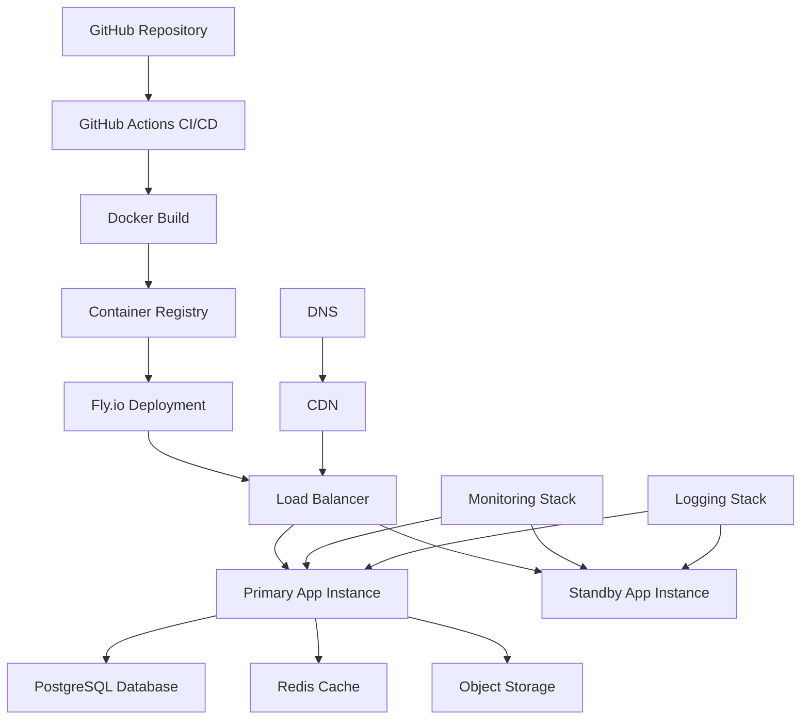

# 🚀 Production Deployment Strategy

## 🎯 Objectives
- Deploy robust, scalable MCP server to production environment
- Implement comprehensive monitoring and observability
- Establish CI/CD pipeline for automated deployments
- Configure auto-scaling and load balancing
- Ensure high availability and disaster recovery

## 🏗️ Infrastructure Architecture

### Deployment Overview


### Technology Stack
- **Platform**: Fly.io for global edge deployment
- **Container**: Docker with multi-stage builds
- **Database**: PostgreSQL with connection pooling
- **Cache**: Redis for session and response caching
- **Monitoring**: Prometheus + Grafana + Fly.io metrics
- **Logging**: Structured logging with Fly.io log aggregation
- **CI/CD**: GitHub Actions with automated testing

## 🐳 Container Configuration

### Multi-Stage Dockerfile
```dockerfile
# Dockerfile
# Multi-stage build for production-optimized MCP server

# Build stage
FROM python:3.11-slim as builder

# Set build arguments
ARG BUILD_ENV=production
ARG VERSION=1.0.0

# Install system dependencies for building
RUN apt-get update && apt-get install -y \
    build-essential \
    gcc \
    g++ \
    libpq-dev \
    libcurl4-openssl-dev \
    libssl-dev \
    && rm -rf /var/lib/apt/lists/*

# Set up Python environment
WORKDIR /app
COPY requirements.txt requirements-dev.txt ./

# Install Python dependencies
RUN pip install --no-cache-dir --upgrade pip && \
    pip install --no-cache-dir -r requirements.txt

# Copy source code
COPY . .

# Install application in development mode for testing
RUN pip install -e .

# Run tests to ensure build quality
RUN python -m pytest tests/ --tb=short --disable-warnings

# Production stage
FROM python:3.11-slim as production

# Set environment variables
ENV PYTHONUNBUFFERED=1
ENV PYTHONDONTWRITEBYTECODE=1
ENV APP_ENV=production
ENV PORT=8080

# Create non-root user for security
RUN groupadd -r appuser && useradd -r -g appuser appuser

# Install runtime dependencies
RUN apt-get update && apt-get install -y \
    libpq5 \
    curl \
    && rm -rf /var/lib/apt/lists/*

# Set up application directory
WORKDIR /app
RUN chown appuser:appuser /app

# Copy Python dependencies from builder
COPY --from=builder /usr/local/lib/python3.11/site-packages/ /usr/local/lib/python3.11/site-packages/
COPY --from=builder /usr/local/bin/ /usr/local/bin/

# Copy application code
COPY --chown=appuser:appuser . .

# Switch to non-root user
USER appuser

# Health check
HEALTHCHECK --interval=30s --timeout=10s --start-period=60s --retries=3 \
    CMD curl -f http://localhost:${PORT}/health || exit 1

# Expose port
EXPOSE 8080

# Start application
CMD ["python", "-m", "src.main"]
```

### Container Optimization
```bash
# .dockerignore
# Optimize build context and image size

# Version control
.git
.gitignore

# Development files
.vscode/
.idea/
*.pyc
__pycache__/
.pytest_cache/
.coverage
.env.local
.env.development

# Documentation
README.md
docs/
planning/

# CI/CD
.github/
Makefile

# Dependencies
node_modules/
venv/
env/

# Logs and temporary files
*.log
tmp/
temp/

# OS files
.DS_Store
Thumbs.db
```

## ☁️ Fly.io Deployment Configuration

### Application Configuration
```toml
# fly.toml
# Fly.io application configuration for MCP server

app = "autonomous-software-foundry"
primary_region = "ord"  # Chicago - central US location

[build]
  dockerfile = "Dockerfile"

[env]
  APP_ENV = "production"
  PORT = "8080"
  PYTHONUNBUFFERED = "1"
  
  # Application settings
  MAX_WORKERS = "4"
  WORKER_TIMEOUT = "300"
  KEEPALIVE = "2"
  
  # Logging
  LOG_LEVEL = "INFO"
  STRUCTURED_LOGGING = "true"

[experimental]
  auto_rollback = true
  enable_consul = true

[[services]]
  http_checks = []
  internal_port = 8080
  processes = ["app"]
  protocol = "tcp"
  script_checks = []

  [services.concurrency]
    hard_limit = 100
    soft_limit = 80
    type = "connections"

  [[services.ports]]
    force_https = true
    handlers = ["http"]
    port = 80

  [[services.ports]]
    handlers = ["tls", "http"]
    port = 443

  [[services.tcp_checks]]
    grace_period = "1s"
    interval = "15s"
    restart_limit = 0
    timeout = "2s"

  [[services.http_checks]]
    interval = "10s"
    grace_period = "5s"
    method = "get"
    path = "/health"
    protocol = "http"
    timeout = "2s"
    tls_skip_verify = false

[[vm]]
  cpu_kind = "performance"
  cpus = 2
  memory_mb = 2048
  size = "performance-2x"
```

### Multi-Region Deployment
```bash
#!/bin/bash
# scripts/deploy-multi-region.sh
# Deploy to multiple regions for global availability

set -e

echo "🌍 Deploying to multiple regions for global availability..."

# Primary region (Chicago)
echo "📍 Deploying to primary region (ord)..."
flyctl deploy --region ord

# European region (Amsterdam)
echo "📍 Scaling to European region (ams)..."
flyctl scale count --region ams 1

# Asian region (Singapore)
echo "📍 Scaling to Asian region (sin)..."
flyctl scale count --region sin 1

# West Coast US (Los Angeles)
echo "📍 Scaling to West Coast US (lax)..."
flyctl scale count --region lax 1

echo "✅ Multi-region deployment completed!"
echo "🔍 Checking status..."
flyctl status

echo "🌐 Applications running in regions:"
flyctl regions list
```

## 🗄️ Database Configuration

### PostgreSQL Setup
```python
# src/database/config.py
"""
Production database configuration with connection pooling
"""
import os
from typing import Optional
from sqlalchemy import create_engine, text
from sqlalchemy.pool import QueuePool
from sqlalchemy.orm import sessionmaker
import structlog

logger = structlog.get_logger()


class DatabaseConfig:
    """Production database configuration"""
    
    def __init__(self):
        self.database_url = os.getenv("DATABASE_URL")
        if not self.database_url:
            raise ValueError("DATABASE_URL environment variable is required")
        
        # Parse connection parameters
        self.pool_size = int(os.getenv("DB_POOL_SIZE", "10"))
        self.max_overflow = int(os.getenv("DB_MAX_OVERFLOW", "20"))
        self.pool_timeout = int(os.getenv("DB_POOL_TIMEOUT", "30"))
        self.pool_recycle = int(os.getenv("DB_POOL_RECYCLE", "3600"))
        
        # Create engine with connection pooling
        self.engine = create_engine(
            self.database_url,
            poolclass=QueuePool,
            pool_size=self.pool_size,
            max_overflow=self.max_overflow,
            pool_timeout=self.pool_timeout,
            pool_recycle=self.pool_recycle,
            pool_pre_ping=True,  # Validate connections before use
            echo=os.getenv("DB_ECHO", "false").lower() == "true"
        )
        
        # Create session factory
        self.SessionLocal = sessionmaker(
            autocommit=False,
            autoflush=False,
            bind=self.engine
        )
        
        logger.info(
            "database_configured",
            pool_size=self.pool_size,
            max_overflow=self.max_overflow,
            pool_timeout=self.pool_timeout
        )
    
    async def health_check(self) -> bool:
        """Check database connectivity and health"""
        try:
            with self.engine.connect() as connection:
                result = connection.execute(text("SELECT 1"))
                return result.scalar() == 1
        except Exception as e:
            logger.error("database_health_check_failed", error=str(e))
            return False
    
    def get_session(self):
        """Get database session"""
        return self.SessionLocal()


# Database initialization script
async def initialize_database():
    """Initialize database with required tables and indexes"""
    from src.database.models import Base
    
    db_config = DatabaseConfig()
    
    # Create all tables
    Base.metadata.create_all(bind=db_config.engine)
    
    # Create indexes for performance
    with db_config.engine.connect() as connection:
        # Project files index
        connection.execute(text("""
            CREATE INDEX CONCURRENTLY IF NOT EXISTS idx_project_files_project_id 
            ON project_files(project_id);
        """))
        
        # Health reports index
        connection.execute(text("""
            CREATE INDEX CONCURRENTLY IF NOT EXISTS idx_health_reports_timestamp 
            ON health_reports(timestamp DESC);
        """))
        
        # Agent sessions index
        connection.execute(text("""
            CREATE INDEX CONCURRENTLY IF NOT EXISTS idx_agent_sessions_last_activity 
            ON agent_sessions(last_activity DESC);
        """))
        
        connection.commit()
    
    logger.info("database_initialized")
```

### Redis Cache Configuration
```python
# src/cache/redis_config.py
"""
Redis cache configuration for production
"""
import os
import json
from typing import Any, Optional, Union
import redis.asyncio as redis
from redis.asyncio.connection import ConnectionPool
import structlog

logger = structlog.get_logger()


class RedisCache:
    """Production Redis cache configuration"""
    
    def __init__(self):
        self.redis_url = os.getenv("REDIS_URL", "redis://localhost:6379")
        
        # Connection pool configuration
        self.pool = ConnectionPool.from_url(
            self.redis_url,
            max_connections=20,
            retry_on_timeout=True,
            socket_timeout=5,
            socket_connect_timeout=5,
            health_check_interval=30
        )
        
        self.redis_client = redis.Redis(connection_pool=self.pool)
        
        # Cache configuration
        self.default_ttl = int(os.getenv("CACHE_DEFAULT_TTL", "3600"))  # 1 hour
        self.key_prefix = os.getenv("CACHE_KEY_PREFIX", "asf:")
        
        logger.info(
            "redis_cache_initialized",
            redis_url=self.redis_url.split('@')[-1],  # Hide credentials
            default_ttl=self.default_ttl
        )
    
    async def get(self, key: str) -> Optional[Any]:
        """Get value from cache"""
        try:
            full_key = f"{self.key_prefix}{key}"
            value = await self.redis_client.get(full_key)
            
            if value:
                return json.loads(value)
            return None
            
        except Exception as e:
            logger.warning("cache_get_failed", key=key, error=str(e))
            return None
    
    async def set(
        self, 
        key: str, 
        value: Any, 
        ttl: Optional[int] = None
    ) -> bool:
        """Set value in cache"""
        try:
            full_key = f"{self.key_prefix}{key}"
            ttl = ttl or self.default_ttl
            
            serialized_value = json.dumps(value, default=str)
            await self.redis_client.setex(full_key, ttl, serialized_value)
            
            return True
            
        except Exception as e:
            logger.warning("cache_set_failed", key=key, error=str(e))
            return False
    
    async def delete(self, key: str) -> bool:
        """Delete key from cache"""
        try:
            full_key = f"{self.key_prefix}{key}"
            result = await self.redis_client.delete(full_key)
            return result > 0
            
        except Exception as e:
            logger.warning("cache_delete_failed", key=key, error=str(e))
            return False
    
    async def health_check(self) -> bool:
        """Check Redis connectivity and health"""
        try:
            await self.redis_client.ping()
            return True
        except Exception as e:
            logger.error("redis_health_check_failed", error=str(e))
            return False
    
    async def close(self):
        """Close Redis connection"""
        await self.redis_client.close()
```

## 🔄 CI/CD Pipeline

### GitHub Actions Workflow
```yaml
# .github/workflows/deploy.yml
# Comprehensive CI/CD pipeline for MCP server deployment

name: Build, Test, and Deploy

on:
  push:
    branches: [main, staging]
  pull_request:
    branches: [main]

env:
  FLY_API_TOKEN: ${{ secrets.FLY_API_TOKEN }}
  REGISTRY: ghcr.io
  IMAGE_NAME: ${{ github.repository }}

jobs:
  lint-and-test:
    runs-on: ubuntu-latest
    
    steps:
    - name: Checkout code
      uses: actions/checkout@v4
    
    - name: Set up Python
      uses: actions/setup-python@v4
      with:
        python-version: '3.11'
        cache: 'pip'
    
    - name: Install dependencies
      run: |
        python -m pip install --upgrade pip
        pip install -r requirements.txt
        pip install -r requirements-dev.txt
    
    - name: Lint with flake8
      run: |
        flake8 src/ --count --select=E9,F63,F7,F82 --show-source --statistics
        flake8 src/ --count --exit-zero --max-complexity=10 --max-line-length=127 --statistics
    
    - name: Type check with mypy
      run: mypy src/
    
    - name: Security scan with bandit
      run: bandit -r src/ -f json -o bandit-report.json
    
    - name: Run tests with pytest
      run: |
        pytest tests/ --tb=short --cov=src --cov-report=xml --cov-report=html
    
    - name: Upload coverage to Codecov
      uses: codecov/codecov-action@v3
      with:
        file: ./coverage.xml
        fail_ci_if_error: true

  security-scan:
    runs-on: ubuntu-latest
    
    steps:
    - name: Checkout code
      uses: actions/checkout@v4
    
    - name: Run Trivy vulnerability scanner
      uses: aquasecurity/trivy-action@master
      with:
        scan-type: 'fs'
        scan-ref: '.'
        format: 'sarif'
        output: 'trivy-results.sarif'
    
    - name: Upload Trivy scan results
      uses: github/codeql-action/upload-sarif@v2
      with:
        sarif_file: 'trivy-results.sarif'

  build-and-push:
    needs: [lint-and-test, security-scan]
    runs-on: ubuntu-latest
    
    permissions:
      contents: read
      packages: write
    
    steps:
    - name: Checkout code
      uses: actions/checkout@v4
    
    - name: Set up Docker Buildx
      uses: docker/setup-buildx-action@v3
    
    - name: Log in to Container Registry
      uses: docker/login-action@v3
      with:
        registry: ${{ env.REGISTRY }}
        username: ${{ github.actor }}
        password: ${{ secrets.GITHUB_TOKEN }}
    
    - name: Extract metadata
      id: meta
      uses: docker/metadata-action@v5
      with:
        images: ${{ env.REGISTRY }}/${{ env.IMAGE_NAME }}
        tags: |
          type=ref,event=branch
          type=ref,event=pr
          type=sha,prefix={{branch}}-
          type=raw,value=latest,enable={{is_default_branch}}
    
    - name: Build and push Docker image
      uses: docker/build-push-action@v5
      with:
        context: .
        platforms: linux/amd64,linux/arm64
        push: true
        tags: ${{ steps.meta.outputs.tags }}
        labels: ${{ steps.meta.outputs.labels }}
        cache-from: type=gha
        cache-to: type=gha,mode=max
        build-args: |
          VERSION=${{ github.sha }}
          BUILD_ENV=production

  deploy-staging:
    needs: build-and-push
    runs-on: ubuntu-latest
    if: github.ref == 'refs/heads/staging'
    
    environment:
      name: staging
      url: https://asf-staging.fly.dev
    
    steps:
    - name: Checkout code
      uses: actions/checkout@v4
    
    - name: Setup Fly CLI
      uses: superfly/flyctl-actions/setup-flyctl@master
    
    - name: Deploy to staging
      run: |
        flyctl deploy --app asf-staging --config fly.staging.toml
    
    - name: Run health check
      run: |
        sleep 30
        curl -f https://asf-staging.fly.dev/health

  deploy-production:
    needs: build-and-push
    runs-on: ubuntu-latest
    if: github.ref == 'refs/heads/main'
    
    environment:
      name: production
      url: https://autonomous-software-foundry.fly.dev
    
    steps:
    - name: Checkout code
      uses: actions/checkout@v4
    
    - name: Setup Fly CLI
      uses: superfly/flyctl-actions/setup-flyctl@master
    
    - name: Deploy to production
      run: |
        flyctl deploy --strategy bluegreen
    
    - name: Run post-deployment tests
      run: |
        sleep 60
        curl -f https://autonomous-software-foundry.fly.dev/health
        curl -f https://autonomous-software-foundry.fly.dev/mcp/initialize \
          -H "Content-Type: application/json" \
          -d '{"jsonrpc":"2.0","id":1,"method":"initialize","params":{"protocolVersion":"2024-11-05","capabilities":{},"clientInfo":{"name":"test","version":"1.0"}}}'

  notify:
    needs: [deploy-staging, deploy-production]
    runs-on: ubuntu-latest
    if: always()
    
    steps:
    - name: Notify deployment status
      uses: 8398a7/action-slack@v3
      with:
        status: ${{ job.status }}
        channel: '#deployments'
        webhook_url: ${{ secrets.SLACK_WEBHOOK }}
        fields: repo,message,commit,author,action,eventName,ref,workflow
```

## 📊 Monitoring and Observability

### Prometheus Metrics Configuration
```python
# src/monitoring/metrics.py
"""
Production metrics collection and monitoring
"""
import time
from typing import Dict, Any, Optional
from prometheus_client import Counter, Histogram, Gauge, CollectorRegistry, generate_latest
import structlog

logger = structlog.get_logger()


class MetricsCollector:
    """Production metrics collection for monitoring and alerting"""
    
    def __init__(self):
        # Create custom registry for isolation
        self.registry = CollectorRegistry()
        
        # HTTP request metrics
        self.http_requests_total = Counter(
            'http_requests_total',
            'Total HTTP requests',
            ['method', 'endpoint', 'status_code'],
            registry=self.registry
        )
        
        self.http_request_duration = Histogram(
            'http_request_duration_seconds',
            'HTTP request duration',
            ['method', 'endpoint'],
            buckets=[0.1, 0.25, 0.5, 1.0, 2.5, 5.0, 10.0],
            registry=self.registry
        )
        
        # MCP protocol metrics
        self.mcp_tool_calls_total = Counter(
            'mcp_tool_calls_total',
            'Total MCP tool calls',
            ['tool_name', 'status'],
            registry=self.registry
        )
        
        self.mcp_tool_duration = Histogram(
            'mcp_tool_duration_seconds',
            'MCP tool execution duration',
            ['tool_name'],
            buckets=[1, 5, 15, 30, 60, 300, 600],
            registry=self.registry
        )
        
        # Code generation metrics
        self.code_generation_total = Counter(
            'code_generation_total',
            'Total code generation requests',
            ['agent_type', 'status'],
            registry=self.registry
        )
        
        self.code_generation_duration = Histogram(
            'code_generation_duration_seconds',
            'Code generation duration',
            ['agent_type'],
            buckets=[5, 15, 30, 60, 120, 300, 600],
            registry=self.registry
        )
        
        # Self-healing metrics
        self.healing_attempts_total = Counter(
            'healing_attempts_total',
            'Total self-healing attempts',
            ['issue_type', 'status'],
            registry=self.registry
        )
        
        self.healing_success_rate = Gauge(
            'healing_success_rate',
            'Self-healing success rate',
            registry=self.registry
        )
        
        # System health metrics
        self.health_score = Gauge(
            'system_health_score',
            'Overall system health score',
            ['project_id'],
            registry=self.registry
        )
        
        self.active_sessions = Gauge(
            'active_sessions_total',
            'Number of active agent sessions',
            registry=self.registry
        )
        
        # LLM usage metrics
        self.llm_requests_total = Counter(
            'llm_requests_total',
            'Total LLM requests',
            ['model', 'operation', 'status'],
            registry=self.registry
        )
        
        self.llm_tokens_used = Counter(
            'llm_tokens_used_total',
            'Total LLM tokens used',
            ['model', 'operation'],
            registry=self.registry
        )
        
        self.llm_cost_estimate = Counter(
            'llm_cost_estimate_usd',
            'Estimated LLM costs in USD',
            ['model'],
            registry=self.registry
        )
        
        logger.info("metrics_collector_initialized")
    
    def record_http_request(
        self,
        method: str,
        endpoint: str,
        status_code: int,
        duration: float
    ):
        """Record HTTP request metrics"""
        self.http_requests_total.labels(
            method=method,
            endpoint=endpoint,
            status_code=status_code
        ).inc()
        
        self.http_request_duration.labels(
            method=method,
            endpoint=endpoint
        ).observe(duration)
    
    def record_tool_call(
        self,
        tool_name: str,
        status: str,
        duration: float
    ):
        """Record MCP tool call metrics"""
        self.mcp_tool_calls_total.labels(
            tool_name=tool_name,
            status=status
        ).inc()
        
        self.mcp_tool_duration.labels(
            tool_name=tool_name
        ).observe(duration)
    
    def record_code_generation(
        self,
        agent_type: str,
        status: str,
        duration: float
    ):
        """Record code generation metrics"""
        self.code_generation_total.labels(
            agent_type=agent_type,
            status=status
        ).inc()
        
        self.code_generation_duration.labels(
            agent_type=agent_type
        ).observe(duration)
    
    def record_healing_attempt(
        self,
        issue_type: str,
        status: str
    ):
        """Record self-healing attempt"""
        self.healing_attempts_total.labels(
            issue_type=issue_type,
            status=status
        ).inc()
    
    def update_health_score(self, project_id: str, score: float):
        """Update system health score"""
        self.health_score.labels(project_id=project_id).set(score)
    
    def record_llm_usage(
        self,
        model: str,
        operation: str,
        status: str,
        tokens_used: int,
        estimated_cost: float
    ):
        """Record LLM usage metrics"""
        self.llm_requests_total.labels(
            model=model,
            operation=operation,
            status=status
        ).inc()
        
        self.llm_tokens_used.labels(
            model=model,
            operation=operation
        ).inc(tokens_used)
        
        self.llm_cost_estimate.labels(model=model).inc(estimated_cost)
    
    def get_metrics(self) -> bytes:
        """Get metrics in Prometheus format"""
        return generate_latest(self.registry)


# Global metrics instance
metrics = MetricsCollector()
```

### Grafana Dashboard Configuration
```json
{
  "dashboard": {
    "id": null,
    "title": "Autonomous Software Foundry - MCP Server",
    "tags": ["mcp", "ai", "autonomous"],
    "timezone": "UTC",
    "refresh": "30s",
    "time": {
      "from": "now-1h",
      "to": "now"
    },
    "panels": [
      {
        "title": "System Health Score",
        "type": "stat",
        "targets": [
          {
            "expr": "avg(system_health_score)",
            "refId": "A"
          }
        ],
        "fieldConfig": {
          "defaults": {
            "color": {
              "mode": "thresholds"
            },
            "thresholds": {
              "steps": [
                {"color": "red", "value": 0},
                {"color": "yellow", "value": 0.6},
                {"color": "green", "value": 0.8}
              ]
            },
            "min": 0,
            "max": 1
          }
        }
      },
      {
        "title": "Request Rate",
        "type": "graph",
        "targets": [
          {
            "expr": "rate(http_requests_total[5m])",
            "legendFormat": "{{method}} {{endpoint}}"
          }
        ]
      },
      {
        "title": "Tool Call Success Rate",
        "type": "graph",
        "targets": [
          {
            "expr": "rate(mcp_tool_calls_total{status=\"success\"}[5m]) / rate(mcp_tool_calls_total[5m])",
            "legendFormat": "Success Rate"
          }
        ]
      },
      {
        "title": "Code Generation Duration",
        "type": "graph",
        "targets": [
          {
            "expr": "histogram_quantile(0.95, rate(code_generation_duration_seconds_bucket[5m]))",
            "legendFormat": "95th percentile"
          },
          {
            "expr": "histogram_quantile(0.50, rate(code_generation_duration_seconds_bucket[5m]))",
            "legendFormat": "50th percentile"
          }
        ]
      },
      {
        "title": "Self-Healing Success Rate",
        "type": "stat",
        "targets": [
          {
            "expr": "healing_success_rate",
            "refId": "A"
          }
        ]
      },
      {
        "title": "LLM Token Usage",
        "type": "graph",
        "targets": [
          {
            "expr": "rate(llm_tokens_used_total[5m])",
            "legendFormat": "{{model}} - {{operation}}"
          }
        ]
      },
      {
        "title": "Estimated LLM Costs",
        "type": "stat",
        "targets": [
          {
            "expr": "sum(rate(llm_cost_estimate_usd[1h])) * 24",
            "refId": "A"
          }
        ],
        "fieldConfig": {
          "defaults": {
            "unit": "currencyUSD"
          }
        }
      }
    ]
  }
}
```

## 🔔 Alerting Configuration

### Alert Rules
```yaml
# monitoring/alerts.yml
# Prometheus alerting rules for production monitoring

groups:
- name: mcp_server_alerts
  rules:
  
  - alert: HighErrorRate
    expr: rate(http_requests_total{status_code=~"5.."}[5m]) > 0.1
    for: 2m
    labels:
      severity: critical
    annotations:
      summary: "High error rate detected"
      description: "Error rate is {{ $value | humanizePercentage }} for the last 5 minutes"
  
  - alert: LowHealthScore
    expr: avg(system_health_score) < 0.6
    for: 5m
    labels:
      severity: warning
    annotations:
      summary: "System health score is low"
      description: "Average health score is {{ $value | printf \"%.2f\" }}"
  
  - alert: CriticalHealthScore
    expr: avg(system_health_score) < 0.3
    for: 2m
    labels:
      severity: critical
    annotations:
      summary: "Critical system health score"
      description: "Average health score is {{ $value | printf \"%.2f\" }}"
  
  - alert: ToolCallFailures
    expr: rate(mcp_tool_calls_total{status="failed"}[5m]) > 0.2
    for: 3m
    labels:
      severity: warning
    annotations:
      summary: "High tool call failure rate"
      description: "Tool call failure rate is {{ $value | humanizePercentage }}"
  
  - alert: SlowCodeGeneration
    expr: histogram_quantile(0.95, rate(code_generation_duration_seconds_bucket[10m])) > 300
    for: 5m
    labels:
      severity: warning
    annotations:
      summary: "Slow code generation performance"
      description: "95th percentile generation time is {{ $value }}s"
  
  - alert: HealingSystemDown
    expr: rate(healing_attempts_total[10m]) == 0 and rate(system_health_score[10m]) < 0.8
    for: 10m
    labels:
      severity: critical
    annotations:
      summary: "Self-healing system appears to be down"
      description: "No healing attempts while health score is low"
  
  - alert: HighLLMCosts
    expr: sum(rate(llm_cost_estimate_usd[1h])) * 24 > 100
    for: 15m
    labels:
      severity: warning
    annotations:
      summary: "High LLM costs detected"
      description: "Daily estimated cost is ${{ $value | printf \"%.2f\" }}"
```

## ✅ Deployment Validation Checklist

```markdown
- [ ] **Infrastructure Setup**
  - [ ] Fly.io application configured correctly
  - [ ] Multi-region deployment working
  - [ ] Database connection pool configured
  - [ ] Redis cache operational
  - [ ] Container optimization verified

- [ ] **CI/CD Pipeline**
  - [ ] GitHub Actions workflow executing
  - [ ] Automated testing passing
  - [ ] Security scanning integrated
  - [ ] Blue-green deployment working
  - [ ] Rollback procedures tested

- [ ] **Monitoring and Observability**
  - [ ] Prometheus metrics collecting
  - [ ] Grafana dashboards displaying data
  - [ ] Alerting rules configured
  - [ ] Log aggregation working
  - [ ] Health checks responding

- [ ] **Security and Compliance**
  - [ ] HTTPS enforced across all endpoints
  - [ ] Authentication working in production
  - [ ] Security headers configured
  - [ ] Vulnerability scanning passing
  - [ ] Environment variables secured

- [ ] **Performance and Scaling**
  - [ ] Load testing completed
  - [ ] Auto-scaling configured
  - [ ] Database performance optimized
  - [ ] Cache hit rates acceptable
  - [ ] Response times within targets
```

---

**Next Steps**: Proceed to `09-demo-preparation.md` for comprehensive demo planning, presentation strategy, and backup scenarios for the hackathon presentation.