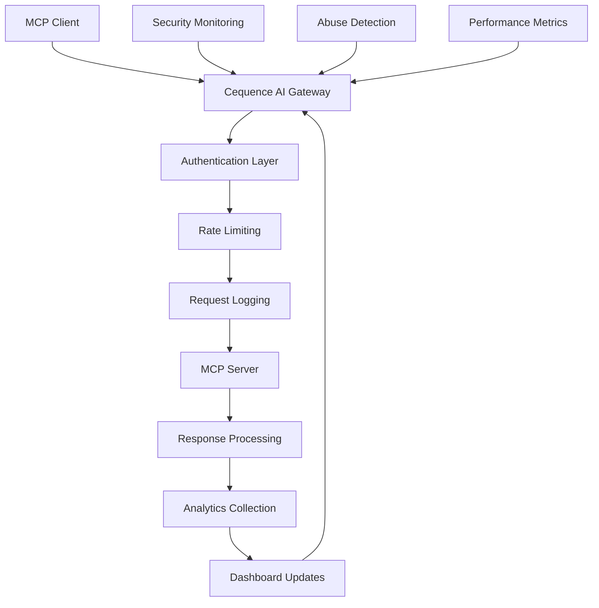

# 🌐 Cequence AI Gateway Integration

## 🎯 Objectives
- Configure Cequence AI Gateway for MCP server observability
- Implement request/response monitoring and analytics
- Set up rate limiting and abuse protection
- Enable real-time security monitoring
- Create comprehensive dashboards for demo presentation

## 🏗️ Cequence AI Gateway Architecture

### Integration Overview


### Key Capabilities
- **Request Proxying**: Seamless MCP protocol passthrough
- **Authentication Integration**: Works with Descope OAuth tokens
- **Real-time Monitoring**: Live request/response tracking
- **Security Analytics**: Threat detection and abuse prevention
- **Performance Insights**: Latency, throughput, and error metrics

## 🛠️ Cequence Dashboard Configuration

### Step 1: Gateway Setup
```markdown
- [ ] **Access Cequence Console**
  - [ ] Navigate to https://console.cequence.ai
  - [ ] Sign in with provided credentials
  - [ ] Locate "AI Gateway" section

- [ ] **Create New Gateway Instance**
  - [ ] Click "Create Gateway"
  - [ ] Name: "Autonomous Software Foundry MCP"
  - [ ] Description: "MCP server for autonomous code generation"
  - [ ] Region: Select closest to deployment
  - [ ] Environment: Development/Production

- [ ] **Configure Backend Service**
  - [ ] Backend URL: https://your-mcp-server.fly.dev
  - [ ] Protocol: HTTPS
  - [ ] Health Check Path: /health
  - [ ] Connection Timeout: 30 seconds
  - [ ] Read Timeout: 300 seconds (for long-running operations)
```

### Step 2: Authentication Configuration
```markdown
- [ ] **OAuth Integration**
  - [ ] Navigate to "Authentication" settings
  - [ ] Select "OAuth 2.0 Bearer Token"
  - [ ] Token Validation: Forward to backend
  - [ ] Header Name: Authorization
  - [ ] Token Prefix: Bearer

- [ ] **Descope Integration**
  - [ ] Add Descope JWKS endpoint: https://api.descope.com/v1/keys/{project_id}
  - [ ] Configure token validation rules:
    - Verify signature: Yes
    - Verify expiration: Yes
    - Verify audience: {your_project_id}
    - Required claims: sub, exp, permissions

- [ ] **Scope Validation**
  - [ ] Enable scope-based routing
  - [ ] Map tool endpoints to required scopes:
    - /tools/ping → tools:ping
    - /tools/generate → tools:generate
    - /tools/review → tools:review
    - /admin/* → admin:logs OR admin:config
```

### Step 3: Security Policies
```markdown
- [ ] **Rate Limiting**
  - [ ] Per-user limits:
    - 100 requests per minute (general tools)
    - 10 requests per minute (generation tools)
    - 5 requests per minute (admin tools)
  
  - [ ] Per-IP limits:
    - 500 requests per minute
    - 50 generation requests per hour
  
  - [ ] Burst allowance: 20 requests
  - [ ] Rate limit headers: Include in response

- [ ] **Abuse Protection**
  - [ ] Enable DDoS protection
  - [ ] Suspicious pattern detection:
    - Rapid authentication failures
    - Large payload attacks
    - Unusual request patterns
  
  - [ ] Auto-blocking thresholds:
    - 10 failed auth attempts = 5 minute block
    - 100 requests in 10 seconds = 1 minute block

- [ ] **Content Filtering**
  - [ ] Request size limits:
    - Maximum request body: 10MB
    - Maximum file upload: 50MB
    - Maximum generation prompt: 100KB
  
  - [ ] Response filtering:
    - Strip internal headers
    - Sanitize error messages
    - Remove debug information
```

## 🔧 Gateway Integration Code

### Enhanced Server Configuration
```python
# src/core/cequence_integration.py
"""
Cequence AI Gateway integration for enhanced observability
"""
import asyncio
import uuid
from typing import Dict, Any, Optional, List
from datetime import datetime
import httpx
import structlog
from fastapi import Request, Response
from fastapi.middleware.base import BaseHTTPMiddleware

from src.core.config import settings

logger = structlog.get_logger()


class CequenceConfig:
    """Cequence AI Gateway configuration"""
    ANALYTICS_ENDPOINT = "https://api.cequence.ai/v1/analytics"
    SECURITY_ENDPOINT = "https://api.cequence.ai/v1/security"
    METRICS_ENDPOINT = "https://api.cequence.ai/v1/metrics"


class CequenceAnalytics:
    """Enhanced analytics client for Cequence integration"""
    
    def __init__(self, gateway_id: str, api_key: str):
        self.gateway_id = gateway_id
        self.api_key = api_key
        self.http_client = httpx.AsyncClient(timeout=10.0)
        self._metrics_buffer: List[Dict[str, Any]] = []
        self._buffer_size = 100
        self._last_flush = datetime.utcnow()
    
    async def track_request(
        self, 
        request: Request,
        response: Response,
        correlation_id: str,
        auth_context: Optional[Dict[str, Any]] = None,
        processing_time_ms: float = 0
    ):
        """Track individual request metrics"""
        try:
            request_data = {
                "timestamp": datetime.utcnow().isoformat(),
                "correlation_id": correlation_id,
                "gateway_id": self.gateway_id,
                "request": {
                    "method": request.method,
                    "path": request.url.path,
                    "query_params": dict(request.query_params),
                    "headers": self._sanitize_headers(dict(request.headers)),
                    "client_ip": request.client.host if request.client else "unknown",
                    "user_agent": request.headers.get("user-agent", "unknown")
                },
                "response": {
                    "status_code": response.status_code,
                    "headers": self._sanitize_headers(dict(response.headers)),
                    "processing_time_ms": processing_time_ms
                },
                "authentication": auth_context or {},
                "security": {
                    "threats_detected": [],
                    "risk_score": self._calculate_risk_score(request, auth_context)
                }
            }
            
            # Add to buffer
            self._metrics_buffer.append(request_data)
            
            # Flush if buffer is full or enough time has passed
            if (len(self._metrics_buffer) >= self._buffer_size or 
                (datetime.utcnow() - self._last_flush).seconds > 60):
                await self._flush_metrics()
            
            logger.info(
                "request_tracked",
                correlation_id=correlation_id,
                path=request.url.path,
                status_code=response.status_code,
                processing_time_ms=processing_time_ms,
                user_id=auth_context.get("user_id") if auth_context else None
            )
            
        except Exception as e:
            logger.error(
                "request_tracking_failed",
                correlation_id=correlation_id,
                error=str(e)
            )
    
    async def track_agent_operation(
        self,
        operation_type: str,
        agent_type: str,
        correlation_id: str,
        duration_ms: float,
        success: bool,
        metadata: Optional[Dict[str, Any]] = None
    ):
        """Track agent-specific operations"""
        try:
            operation_data = {
                "timestamp": datetime.utcnow().isoformat(),
                "correlation_id": correlation_id,
                "gateway_id": self.gateway_id,
                "operation": {
                    "type": operation_type,
                    "agent_type": agent_type,
                    "duration_ms": duration_ms,
                    "success": success,
                    "metadata": metadata or {}
                }
            }
            
            await self._send_metrics([operation_data], endpoint="operations")
            
            logger.info(
                "agent_operation_tracked",
                operation_type=operation_type,
                agent_type=agent_type,
                correlation_id=correlation_id,
                duration_ms=duration_ms,
                success=success
            )
            
        except Exception as e:
            logger.error(
                "agent_operation_tracking_failed",
                correlation_id=correlation_id,
                error=str(e)
            )
    
    async def track_security_event(
        self,
        event_type: str,
        severity: str,
        description: str,
        correlation_id: str,
        client_ip: str,
        user_id: Optional[str] = None
    ):
        """Track security-related events"""
        try:
            security_event = {
                "timestamp": datetime.utcnow().isoformat(),
                "correlation_id": correlation_id,
                "gateway_id": self.gateway_id,
                "security_event": {
                    "type": event_type,
                    "severity": severity,
                    "description": description,
                    "client_ip": client_ip,
                    "user_id": user_id,
                    "risk_indicators": self._analyze_security_risk(event_type, client_ip)
                }
            }
            
            await self._send_metrics([security_event], endpoint="security")
            
            logger.warning(
                "security_event_tracked",
                event_type=event_type,
                severity=severity,
                correlation_id=correlation_id,
                client_ip=client_ip,
                user_id=user_id
            )
            
        except Exception as e:
            logger.error(
                "security_event_tracking_failed",
                correlation_id=correlation_id,
                error=str(e)
            )
    
    def _sanitize_headers(self, headers: Dict[str, str]) -> Dict[str, str]:
        """Remove sensitive headers from logging"""
        sensitive_headers = {
            "authorization", "cookie", "x-api-key", 
            "x-auth-token", "x-access-token"
        }
        
        return {
            key: "***REDACTED***" if key.lower() in sensitive_headers else value
            for key, value in headers.items()
        }
    
    def _calculate_risk_score(
        self, 
        request: Request, 
        auth_context: Optional[Dict[str, Any]]
    ) -> float:
        """Calculate risk score for the request"""
        score = 0.0
        
        # Check for admin operations
        if "/admin/" in request.url.path:
            score += 0.3
        
        # Check for generation operations
        if "/generate" in request.url.path:
            score += 0.2
        
        # Check authentication status
        if not auth_context:
            score += 0.5
        elif auth_context.get("is_machine"):
            score += 0.1  # Machine tokens are slightly riskier
        
        # Check request size
        content_length = request.headers.get("content-length")
        if content_length and int(content_length) > 1024 * 1024:  # 1MB+
            score += 0.2
        
        return min(score, 1.0)  # Cap at 1.0
    
    def _analyze_security_risk(self, event_type: str, client_ip: str) -> List[str]:
        """Analyze security risk indicators"""
        indicators = []
        
        if event_type in ["authentication_failure", "authorization_failure"]:
            indicators.append("auth_failure")
        
        if event_type == "rate_limit_exceeded":
            indicators.append("excessive_requests")
        
        # Check for known bad IP patterns (simplified)
        if client_ip.startswith("10.") or client_ip.startswith("192.168."):
            indicators.append("internal_network")
        elif client_ip.startswith("127."):
            indicators.append("localhost")
        
        return indicators
    
    async def _flush_metrics(self):
        """Flush accumulated metrics to Cequence"""
        if not self._metrics_buffer:
            return
        
        try:
            await self._send_metrics(self._metrics_buffer.copy())
            self._metrics_buffer.clear()
            self._last_flush = datetime.utcnow()
            
            logger.debug("metrics_flushed", count=len(self._metrics_buffer))
            
        except Exception as e:
            logger.error("metrics_flush_failed", error=str(e))
    
    async def _send_metrics(
        self, 
        metrics: List[Dict[str, Any]], 
        endpoint: str = "requests"
    ):
        """Send metrics to Cequence API"""
        try:
            url = f"{CequenceConfig.ANALYTICS_ENDPOINT}/{endpoint}"
            headers = {
                "Authorization": f"Bearer {self.api_key}",
                "Content-Type": "application/json"
            }
            
            payload = {
                "gateway_id": self.gateway_id,
                "metrics": metrics,
                "timestamp": datetime.utcnow().isoformat()
            }
            
            response = await self.http_client.post(
                url,
                json=payload,
                headers=headers
            )
            response.raise_for_status()
            
        except httpx.HTTPError as e:
            logger.error(
                "metrics_send_failed",
                endpoint=endpoint,
                error=str(e),
                metrics_count=len(metrics)
            )


class CequenceMiddleware(BaseHTTPMiddleware):
    """FastAPI middleware for Cequence integration"""
    
    def __init__(self, app, gateway_id: str, api_key: str):
        super().__init__(app)
        self.analytics = CequenceAnalytics(gateway_id, api_key)
    
    async def dispatch(self, request: Request, call_next):
        """Process request through Cequence analytics"""
        start_time = datetime.utcnow()
        correlation_id = str(uuid.uuid4())
        
        # Add correlation ID to request state
        request.state.correlation_id = correlation_id
        
        try:
            # Process request
            response = await call_next(request)
            
            # Calculate processing time
            processing_time = (datetime.utcnow() - start_time).total_seconds() * 1000
            
            # Get auth context if available
            auth_context = None
            if hasattr(request.state, 'auth_context'):
                auth_context = {
                    "user_id": request.state.auth_context.user_id,
                    "client_id": request.state.auth_context.client_id,
                    "is_machine": request.state.auth_context.is_machine,
                    "scopes": request.state.auth_context.scopes
                }
            
            # Track the request
            await self.analytics.track_request(
                request=request,
                response=response,
                correlation_id=correlation_id,
                auth_context=auth_context,
                processing_time_ms=processing_time
            )
            
            # Add correlation ID to response headers
            response.headers["X-Correlation-ID"] = correlation_id
            
            return response
            
        except Exception as e:
            # Track error
            await self.analytics.track_security_event(
                event_type="request_processing_error",
                severity="error",
                description=str(e),
                correlation_id=correlation_id,
                client_ip=request.client.host if request.client else "unknown"
            )
            
            raise


# Global analytics instance
cequence_analytics: Optional[CequenceAnalytics] = None


async def get_cequence_analytics() -> CequenceAnalytics:
    """Get singleton Cequence analytics instance"""
    global cequence_analytics
    
    if cequence_analytics is None:
        cequence_analytics = CequenceAnalytics(
            gateway_id=settings.cequence_gateway_id,
            api_key=settings.cequence_api_key
        )
    
    return cequence_analytics
```

### Updated Configuration
```python
# src/core/config.py - Add Cequence settings
class Settings(BaseSettings):
    # ... existing settings ...
    
    # Cequence AI Gateway
    cequence_gateway_id: Optional[str] = Field(None, description="Cequence Gateway ID")
    cequence_api_key: Optional[str] = Field(None, description="Cequence API Key")
    cequence_gateway_url: Optional[str] = Field(None, description="Cequence Gateway URL")
    
    # Analytics
    enable_analytics: bool = Field(default=True, description="Enable analytics collection")
    analytics_buffer_size: int = Field(default=100, description="Analytics buffer size")
    analytics_flush_interval: int = Field(default=60, description="Analytics flush interval (seconds)")
    
    # Security monitoring
    enable_security_monitoring: bool = Field(default=True, description="Enable security monitoring")
    max_request_size_mb: int = Field(default=10, description="Maximum request size in MB")
    rate_limit_per_minute: int = Field(default=100, description="Rate limit per minute per user")
```

### Enhanced Tool Implementation with Analytics
```python
# src/tools/monitored_tools.py
"""
MCP tools with Cequence analytics integration
"""
import time
from typing import Dict, Any
from fastapi import APIRouter, Depends, Request
import structlog

from src.middleware.auth_middleware import get_auth_context, require_scopes
from src.core.descope_auth import AuthContext
from src.core.cequence_integration import get_cequence_analytics

logger = structlog.get_logger()
router = APIRouter()


@router.post("/tools/generate_application")
async def generate_application_tool(
    request: Request,
    project_description: str,
    project_type: str = "fullstack",
    auth: AuthContext = Depends(require_scopes("tools:generate"))
) -> Dict[str, Any]:
    """
    Application generation tool with comprehensive monitoring
    
    Required scope: tools:generate
    """
    start_time = time.time()
    correlation_id = request.state.correlation_id
    analytics = await get_cequence_analytics()
    
    try:
        logger.info(
            "application_generation_started",
            user_id=auth.user_id,
            project_type=project_type,
            description_length=len(project_description),
            correlation_id=correlation_id
        )
        
        # Simulate application generation
        await asyncio.sleep(2)  # Placeholder for actual generation
        
        # Calculate processing time
        processing_time = (time.time() - start_time) * 1000
        
        # Track successful operation
        await analytics.track_agent_operation(
            operation_type="application_generation",
            agent_type="orchestrator",
            correlation_id=correlation_id,
            duration_ms=processing_time,
            success=True,
            metadata={
                "project_type": project_type,
                "description_length": len(project_description),
                "user_id": auth.user_id
            }
        )
        
        return {
            "status": "success",
            "project_id": correlation_id,
            "project_type": project_type,
            "estimated_completion": "5 minutes",
            "processing_time_ms": processing_time,
            "correlation_id": correlation_id
        }
        
    except Exception as e:
        processing_time = (time.time() - start_time) * 1000
        
        # Track failed operation
        await analytics.track_agent_operation(
            operation_type="application_generation",
            agent_type="orchestrator", 
            correlation_id=correlation_id,
            duration_ms=processing_time,
            success=False,
            metadata={
                "error": str(e),
                "user_id": auth.user_id
            }
        )
        
        # Track security event for unexpected errors
        await analytics.track_security_event(
            event_type="generation_error",
            severity="warning",
            description=f"Application generation failed: {str(e)}",
            correlation_id=correlation_id,
            client_ip=request.client.host if request.client else "unknown",
            user_id=auth.user_id
        )
        
        raise


@router.post("/tools/self_heal")
async def self_heal_tool(
    request: Request,
    project_id: str,
    issue_description: str,
    auth: AuthContext = Depends(require_scopes("tools:fix"))
) -> Dict[str, Any]:
    """
    Self-healing tool with detailed operation tracking
    
    Required scope: tools:fix
    """
    start_time = time.time()
    correlation_id = request.state.correlation_id
    analytics = await get_cequence_analytics()
    
    try:
        # Track healing attempt start
        await analytics.track_agent_operation(
            operation_type="self_healing_started",
            agent_type="reviewer",
            correlation_id=correlation_id,
            duration_ms=0,
            success=True,
            metadata={
                "project_id": project_id,
                "issue_type": "automated_detection",
                "user_id": auth.user_id
            }
        )
        
        # Simulate healing process
        await asyncio.sleep(3)  # Placeholder for actual healing
        
        processing_time = (time.time() - start_time) * 1000
        
        # Track successful healing
        await analytics.track_agent_operation(
            operation_type="self_healing_completed",
            agent_type="reviewer",
            correlation_id=correlation_id,
            duration_ms=processing_time,
            success=True,
            metadata={
                "project_id": project_id,
                "fixes_applied": 3,
                "tests_passed": 5,
                "user_id": auth.user_id
            }
        )
        
        return {
            "status": "healed",
            "project_id": project_id,
            "fixes_applied": 3,
            "tests_passed": 5,
            "processing_time_ms": processing_time,
            "correlation_id": correlation_id
        }
        
    except Exception as e:
        processing_time = (time.time() - start_time) * 1000
        
        # Track failed healing
        await analytics.track_agent_operation(
            operation_type="self_healing_failed",
            agent_type="reviewer",
            correlation_id=correlation_id,
            duration_ms=processing_time,
            success=False,
            metadata={
                "project_id": project_id,
                "error": str(e),
                "user_id": auth.user_id
            }
        )
        
        raise


@router.get("/analytics/dashboard_data")
async def dashboard_data(
    request: Request,
    auth: AuthContext = Depends(require_scopes("admin:logs"))
) -> Dict[str, Any]:
    """
    Provide dashboard data for demo presentation
    
    Required scope: admin:logs
    """
    correlation_id = request.state.correlation_id
    
    # Simulated dashboard metrics for demo
    return {
        "real_time_metrics": {
            "active_requests": 12,
            "requests_per_minute": 45,
            "average_response_time_ms": 234,
            "success_rate": 98.5,
            "active_agents": {
                "frontend": 2,
                "backend": 3,
                "reviewer": 1
            }
        },
        "security_status": {
            "threat_level": "low",
            "blocked_requests": 0,
            "rate_limited_requests": 2,
            "authentication_failures": 1
        },
        "generation_stats": {
            "total_projects_generated": 157,
            "successful_generations": 149,
            "self_healing_events": 23,
            "average_generation_time_seconds": 45
        },
        "top_users": [
            {"user_id": "software_foundry_demo", "requests": 89},
            {"user_id": "test_client_001", "requests": 23},
            {"user_id": "integration_test", "requests": 12}
        ],
        "correlation_id": correlation_id,
        "timestamp": datetime.utcnow().isoformat()
    }
```

## 🚀 Deployment Configuration

### Gateway Proxy Setup
```yaml
# cequence-gateway-config.yml
apiVersion: v1
kind: Config
metadata:
  name: autonomous-foundry-gateway
spec:
  gateway:
    name: "Autonomous Software Foundry"
    version: "1.0.0"
    
  upstream:
    url: "https://autonomous-foundry.fly.dev"
    health_check:
      path: "/health"
      interval: "30s"
      timeout: "10s"
    
  authentication:
    oauth2:
      enabled: true
      token_validation: "forward_to_backend"
      jwks_uri: "https://api.descope.com/v1/keys/{project_id}"
      
  rate_limiting:
    rules:
      - name: "general_tools"
        path: "/mcp/v1/tools/*"
        rate: "100/minute"
        burst: 20
        
      - name: "generation_tools" 
        path: "/mcp/v1/tools/generate*"
        rate: "10/minute"
        burst: 5
        
      - name: "admin_tools"
        path: "/mcp/v1/admin/*"
        rate: "20/minute"
        burst: 5
        
  security:
    ddos_protection: true
    threat_detection: true
    request_size_limit: "10MB"
    response_timeout: "300s"
    
  analytics:
    enabled: true
    real_time_metrics: true
    detailed_logging: true
    dashboard_enabled: true
```

### Environment Variables
```bash
# Add to .env
CEQUENCE_GATEWAY_ID=gw_xxxxxxxxxxxxxxxxxxxxx
CEQUENCE_API_KEY=ck_xxxxxxxxxxxxxxxxxxxxx
CEQUENCE_GATEWAY_URL=https://gateway.cequence.ai/autonomous-foundry

# Analytics settings
ENABLE_ANALYTICS=true
ANALYTICS_BUFFER_SIZE=100
ANALYTICS_FLUSH_INTERVAL=60

# Security monitoring
ENABLE_SECURITY_MONITORING=true
MAX_REQUEST_SIZE_MB=10
RATE_LIMIT_PER_MINUTE=100
```

### Updated Main Application
```python
# src/main.py - Add Cequence middleware
from src.core.cequence_integration import CequenceMiddleware

# Add middleware
if settings.cequence_gateway_id and settings.cequence_api_key:
    app.add_middleware(
        CequenceMiddleware,
        gateway_id=settings.cequence_gateway_id,
        api_key=settings.cequence_api_key
    )
    logger.info("Cequence AI Gateway middleware enabled")
else:
    logger.warning("Cequence AI Gateway not configured")
```

## 📊 Dashboard and Monitoring

### Real-time Metrics Dashboard
```html
<!-- demo_dashboard.html - For presentation -->
<!DOCTYPE html>
<html>
<head>
    <title>Autonomous Software Foundry - Live Metrics</title>
    <script src="https://cdn.jsdelivr.net/npm/chart.js"></script>
    <style>
        body { font-family: Arial, sans-serif; margin: 20px; }
        .metrics-grid { display: grid; grid-template-columns: 1fr 1fr; gap: 20px; }
        .metric-card { border: 1px solid #ddd; padding: 15px; border-radius: 8px; }
        .metric-value { font-size: 2em; font-weight: bold; color: #007acc; }
        .status-good { color: #28a745; }
        .status-warning { color: #ffc107; }
        .status-error { color: #dc3545; }
    </style>
</head>
<body>
    <h1>🏭 Autonomous Software Foundry - Live Metrics</h1>
    
    <div class="metrics-grid">
        <div class="metric-card">
            <h3>Active Requests</h3>
            <div id="active-requests" class="metric-value">--</div>
        </div>
        
        <div class="metric-card">
            <h3>Requests/Minute</h3>
            <div id="requests-per-minute" class="metric-value">--</div>
        </div>
        
        <div class="metric-card">
            <h3>Success Rate</h3>
            <div id="success-rate" class="metric-value status-good">--</div>
        </div>
        
        <div class="metric-card">
            <h3>Avg Response Time</h3>
            <div id="response-time" class="metric-value">-- ms</div>
        </div>
    </div>
    
    <div style="margin-top: 30px;">
        <h2>🤖 Active Agents</h2>
        <div id="agents-status"></div>
    </div>
    
    <div style="margin-top: 30px;">
        <h2>📈 Request Volume (Last Hour)</h2>
        <canvas id="request-chart" width="400" height="200"></canvas>
    </div>
    
    <script>
        // Real-time dashboard updates
        async function updateMetrics() {
            try {
                const response = await fetch('/analytics/dashboard_data', {
                    headers: {
                        'Authorization': 'Bearer ' + localStorage.getItem('demo_token')
                    }
                });
                
                if (!response.ok) throw new Error('Failed to fetch metrics');
                
                const data = await response.json();
                const metrics = data.real_time_metrics;
                
                // Update metric displays
                document.getElementById('active-requests').textContent = metrics.active_requests;
                document.getElementById('requests-per-minute').textContent = metrics.requests_per_minute;
                document.getElementById('success-rate').textContent = metrics.success_rate + '%';
                document.getElementById('response-time').textContent = metrics.average_response_time_ms + ' ms';
                
                // Update agents status
                const agentsHtml = Object.entries(metrics.active_agents)
                    .map(([type, count]) => `<span class="metric-card">${type}: ${count}</span>`)
                    .join('');
                document.getElementById('agents-status').innerHTML = agentsHtml;
                
            } catch (error) {
                console.error('Failed to update metrics:', error);
            }
        }
        
        // Initialize chart
        const ctx = document.getElementById('request-chart').getContext('2d');
        const chart = new Chart(ctx, {
            type: 'line',
            data: {
                labels: [],
                datasets: [{
                    label: 'Requests per Minute',
                    data: [],
                    borderColor: '#007acc',
                    tension: 0.1
                }]
            },
            options: {
                responsive: true,
                scales: {
                    y: { beginAtZero: true }
                }
            }
        });
        
        // Update every 5 seconds
        setInterval(updateMetrics, 5000);
        updateMetrics(); // Initial load
    </script>
</body>
</html>
```

## 🧪 Testing Gateway Integration

### Integration Test Suite
```python
# tests/test_cequence_integration.py
"""
Tests for Cequence AI Gateway integration
"""
import pytest
from unittest.mock import AsyncMock, patch
import httpx

from src.core.cequence_integration import CequenceAnalytics, CequenceMiddleware


class TestCequenceAnalytics:
    """Test Cequence analytics functionality"""
    
    @pytest.fixture
    def analytics_client(self):
        return CequenceAnalytics("test_gateway", "test_api_key")
    
    @pytest.mark.asyncio
    async def test_request_tracking(self, analytics_client):
        """Test request tracking functionality"""
        with patch.object(analytics_client.http_client, 'post') as mock_post:
            mock_response = AsyncMock()
            mock_response.raise_for_status.return_value = None
            mock_post.return_value = mock_response
            
            # Create mock request and response
            mock_request = AsyncMock()
            mock_request.method = "POST"
            mock_request.url.path = "/mcp/v1/tools/ping"
            mock_request.query_params = {}
            mock_request.headers = {"user-agent": "test-client"}
            mock_request.client.host = "127.0.0.1"
            
            mock_response = AsyncMock()
            mock_response.status_code = 200
            mock_response.headers = {"content-type": "application/json"}
            
            # Track request
            await analytics_client.track_request(
                request=mock_request,
                response=mock_response,
                correlation_id="test_correlation",
                processing_time_ms=150.0
            )
            
            # Verify tracking was called
            assert len(analytics_client._metrics_buffer) == 1
            metric = analytics_client._metrics_buffer[0]
            assert metric["correlation_id"] == "test_correlation"
            assert metric["request"]["method"] == "POST"
            assert metric["response"]["status_code"] == 200
    
    @pytest.mark.asyncio
    async def test_security_event_tracking(self, analytics_client):
        """Test security event tracking"""
        with patch.object(analytics_client, '_send_metrics') as mock_send:
            await analytics_client.track_security_event(
                event_type="authentication_failure",
                severity="warning", 
                description="Invalid token provided",
                correlation_id="test_correlation",
                client_ip="192.168.1.100",
                user_id="test_user"
            )
            
            mock_send.assert_called_once()
            call_args = mock_send.call_args
            
            # Verify security event structure
            events = call_args[0][0]
            assert len(events) == 1
            event = events[0]["security_event"]
            assert event["type"] == "authentication_failure"
            assert event["severity"] == "warning"
            assert event["client_ip"] == "192.168.1.100"
    
    def test_risk_score_calculation(self, analytics_client):
        """Test risk score calculation"""
        # Low risk request
        mock_request = AsyncMock()
        mock_request.url.path = "/health"
        mock_request.headers = {}
        
        score = analytics_client._calculate_risk_score(mock_request, {"is_machine": False})
        assert score == 0.0
        
        # High risk request
        mock_request.url.path = "/admin/config"
        mock_request.headers = {"content-length": "5000000"}  # 5MB
        
        score = analytics_client._calculate_risk_score(mock_request, None)  # No auth
        assert score > 0.5


@pytest.mark.asyncio
async def test_middleware_integration(test_client):
    """Test middleware integration with FastAPI"""
    # Test request tracking
    response = test_client.get("/health")
    assert response.status_code == 200
    
    # Verify correlation ID in response
    assert "X-Correlation-ID" in response.headers
    correlation_id = response.headers["X-Correlation-ID"]
    assert len(correlation_id) == 36  # UUID length
```

## ✅ Validation Checklist

```markdown
- [ ] **Gateway Configuration**
  - [ ] Cequence AI Gateway instance created and configured
  - [ ] Backend service connected and health checked
  - [ ] Authentication forwarding working correctly
  - [ ] Rate limiting policies configured and tested

- [ ] **Analytics Integration**
  - [ ] Request/response tracking implemented
  - [ ] Agent operation monitoring working
  - [ ] Security event tracking functional
  - [ ] Metrics buffer and flushing working correctly

- [ ] **Security Monitoring**
  - [ ] DDoS protection enabled and tested
  - [ ] Abuse detection patterns configured
  - [ ] Rate limiting working for different tool categories
  - [ ] Security events properly logged and tracked

- [ ] **Dashboard Functionality**
  - [ ] Real-time metrics updating correctly
  - [ ] Dashboard accessible and responsive
  - [ ] All metric types displaying properly
  - [ ] Historical data tracking working

- [ ] **Performance Testing**
  - [ ] Gateway introduces minimal latency
  - [ ] Analytics collection doesn't impact response times
  - [ ] Buffer flushing works under load
  - [ ] Metrics accurately reflect actual usage

- [ ] **Demo Preparation**
  - [ ] Dashboard configured for live demo
  - [ ] Test scenarios generate visible metrics
  - [ ] Security events can be demonstrated
  - [ ] Real-time updates work smoothly
```

## 🎬 Demo Script for Gateway Features

### Live Demo Sequence
```markdown
1. **Opening Dashboard View**
   - "Here's our live Cequence dashboard showing real-time metrics"
   - Point out active requests, response times, success rates

2. **Execute Basic Tool**
   - "Let me ping our MCP server through the gateway"
   - Show request appear in real-time on dashboard
   - Highlight correlation ID tracking

3. **Demonstrate Security**
   - "Now I'll make an unauthorized request"
   - Show security event detection in dashboard
   - Point out automatic blocking/rate limiting

4. **Show Agent Operations**
   - "Watch what happens when I generate an application"
   - Show agent operations being tracked separately
   - Highlight processing time and success tracking

5. **Self-Healing Demonstration**
   - "Here's our self-healing in action"
   - Show multiple agent operations coordinated
   - Point out detailed operation tracking

6. **Security Deep Dive**
   - "Every interaction is secured and observable"
   - Show authentication flow tracking
   - Demonstrate scope-based access control
```

---

**Next Steps**: Proceed to `05-mcp-server-core.md` for detailed MCP server implementation with all protocol features and tool definitions.